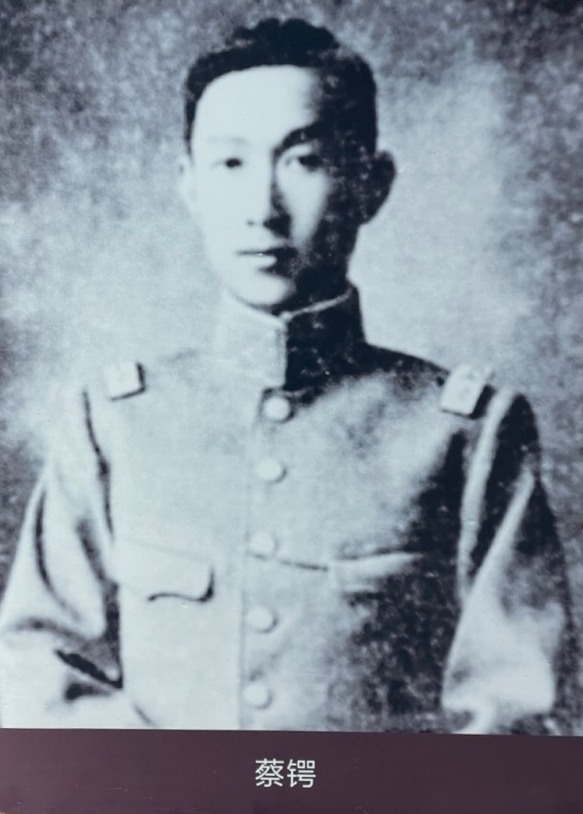
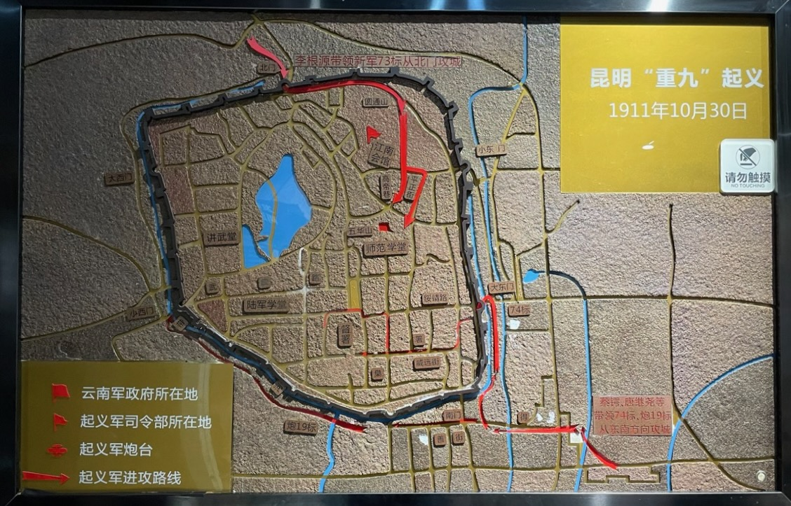
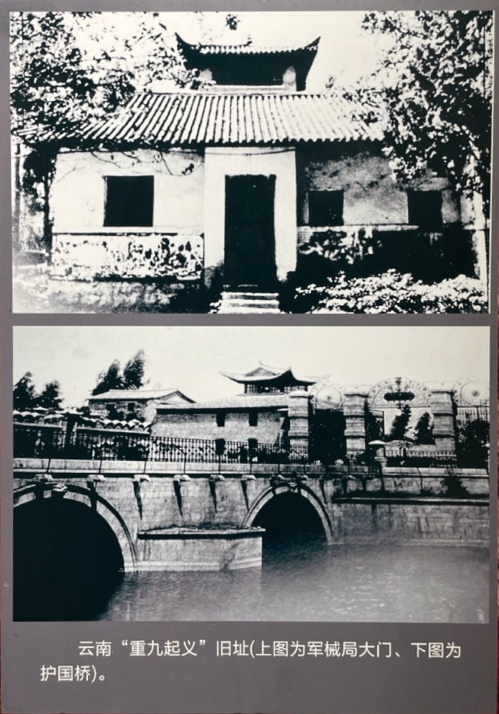
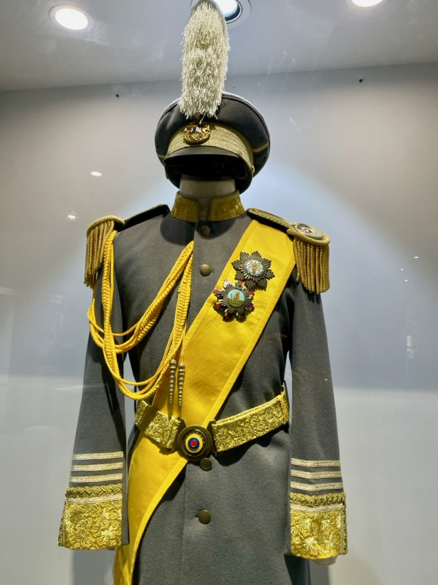
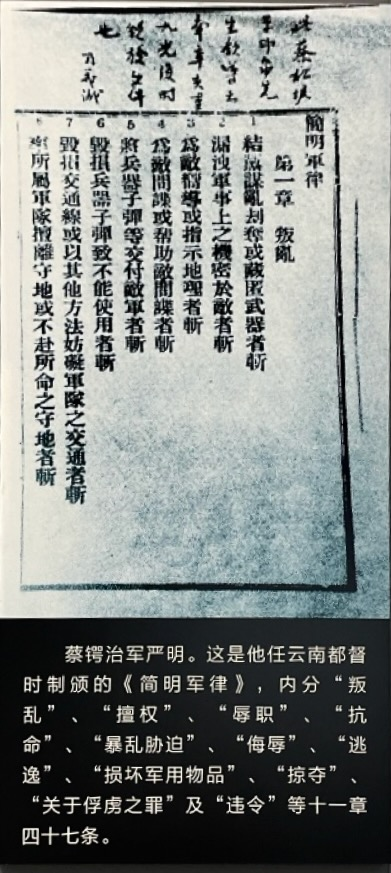

辛亥革命爆发后，蔡锷领导云南革命党，举行了重九起义。因为云南的清朝官员对清朝忠心耿耿，早有布置，所以革命党人的力量不足。因此，他们请蔡锷加入。唐继尧、李鸿祥、刘存厚等人主张并坚持推举蔡锷出来领导起义，于是蔡锷成为了辛亥昆明起义军临时总司令。

# 起义

起义因为意外，被提前发动了。蔡锷接到消息，立刻集合官兵，发表演说，举行起义。他说：钟统制疑本协及炮标目兵将作乱，今日已有命令到协，饬我限今夜将枪、炮机柄收缴后再行严加惩办。我辈军人无辜受累。满清专制数百年，纪纲不振，政以贿成，四万万同胞如坐涂炭。现在武昌首义，四处响应，皆欲扫除专制，复我民权，我辈军人何莫非国民一分子？与其被疑缴械，徒手待戮，何如持此利器，同起义军，革命清廷，驱逐汉奸，复我山河，兴我汉室之为愈耶！果能如此，诚汉族之荣，军界之光也。赞成者举手，三呼“革命军万岁”。

官兵们在操场上一齐举起了双手，三呼“革命军万岁”，以示赞成。

然后，起义军的另一位将领刘存厚又发表讲话，讲解对清朝官员的保护。他解释说：“此次革命实系改良政治、增进国民之幸福起见，非种族革命也。吾辈同志不独不分省界，即满清官佐亦当保护，俟大局定后，同享幸福。”大家又鼓掌赞成。

蔡锷然后下令整队，出发攻入昆明城。

此时，朱德跑过来向蔡锷报告：“二营左队队长（连长），带领两个排逃跑，我带领一排人紧紧追赶，包围了他们，追回了部队，但连长跑了。”

蔡锷立即命令说：“那就任命你为连长，指挥该队！”

起义军需要打败兵力上和他们势均力敌的另一种忠诚于清朝的军队。为了获得弹药，蔡锷的部队还攻下了军械局。

攻打五华山清军的时候，起义军付出了高昂的牺牲，其中有文鸿揆。文鸿揆在云南陆军讲武堂毕业后，在新军任排长。起义前一日，文得知母亲病逝的消息，急向营长李鸿祥请假奔丧。李鸿祥说：“孝敬父母，无可非议，我很同情。但起义就在明天，这是大事，安危成败，在此一举。你平素胸怀大志，家国大事，孰轻孰重，你再认真考虑。”他沉思后道：“对我来说，起义和丧事都是大事，但起义就在明日，更为迫切，我决定起义后再回家处理丧事。如为国捐躯，在黄泉之下，也无愧于老母了。”结果次日，文鸿揆等率部冲向北门。因约定时间未到，作为内应的讲武堂师生尚未开城门。文鸿揆当机立断，带士兵爬上城墙，杀死守城敌兵，打开城门，全军一拥而入。文鸿揆身先士卒，冲锋在前，在进攻五华山南之红栅子时，奋勇当先，破哨上山，露出半截身子勇猛射击敌人。不意被敌机关枪扫射，胸部中弹如蜂窝状，当场壮烈牺牲。

经过几日奋战，上百将士牺牲，起义最后取得了胜利。11 月 1 日，起义军民组织了“大中华国云南军都督府”。

蔡锷被推为云南军都督。下面是他的都督服。

军都督府成立后，即向全省声明：起义“宗旨在铲除专制政体，建设良善国家，使汉、回、满、蒙、藏、夷、苗各族结合一体，维护共和，以期巩固民权，恢张国力”。同时发布《讨满檄文》，重申同盟会的纲领。此后又派兵平定蒙自和楚雄的清军。

后人对整个起义过程记录如下：

川中铁路风潮起，公逆知中国局势之解决，将以此事为导线，即与同志诸人迭为密商，着手布置。以李鸿祥充七十三标管带，唐继尧、雷飙充七十四标管带，罗佩金充七十四标统带，李风楼充机关枪营管带，并于下级将校中，将同志者伺机位置，党人势力乃几与钟、王派势力相埒矣。

七月中旬，公以秋操计划，赴宜良踏看地形，八月中旬始归。其时川事益急，公召集同志，密议数次。有主张云南不宜举动，俟全局大定，再为拔赵易汉之谋，以避外人之乘机干涉者。公为云南宜速举以为东南各省倡，纵武汉失败，滇中亦可于半年之内，整顿军备，进退裕如，以此数月之中，川、黔可以得手，得此三省，以与满清争衡，胜负亦未可决。众多赞成，其议遂决，遂定期举事。并决定攻守计划，歃血为盟，誓不反顾。

钟、王已有所闻，戒备綦严，时派人尾随，侦公行动，诸难自由。八月下旬，钟欲撒惩谢、李诸人，经公面折其非，并函陈利害，乃免。

自武昌光复之耗至，风声更紧，而以子弹未领，豫备未周，荏苒数日。嗣闻武汉复经失守，腾越亦经起义，是日午后，发令委派临时官长，按照预定计划，分途布置，以李根源率七十三标攻围军械局、五华山，而巫家坝步、炮两标非公亲临，断难如意以动，乃赴巫家坝。午后十时顷，聚集两标将校，宣告举义宗旨，词严义正，每发一语，则群呼万岁。宣告既终，到校(场)擒满人容山、惠森二军官至，群欲处以死刑誓师。公谓吾辈今日此举，为倾倒满清恶劣政府，不宜戕杀其个人，汉、满、蒙、回、藏，皆属同胞，应一体看待。遂令暂拘，事后释放。

继复聚集日兵誓师，欢声雷动，分给子弹，整理装械。既毕，整队陆续出发，时正夜半，遥见城中火起，频闻枪声，知七十三标已入城，乃督军急趋至南城外车站。有巡防军两哨迎降，公稍为抚慰，仍命暂扎南城外，巡逻车栈一带，保护居民，防缉宵小。旋途遇马标于南校场(系奉钟调来城镇压者)，公以该标为来援，与该标将校握手欢呼，该标亦慑莫敢动。旋率军由大东门人城，以步、炮、机关枪各队分布东南城垣一带，待揭晓施行总攻击。并派队协攻军械局及五华山，设司令部于江南会馆，会步、炮各队协攻军械局、五华山、督署各处。步队所携子弹，人仅十五发，鏖战达旦，早经告罄，非得军械局，则子弹无从接济，乃以火药毁其围壁，众兵拥入。同时五华山、督署两处相继攻克。

公下命饬诸军分别占领诸要地，不得擅离。并严饬各军，不得妄戮一人，不得擅取民间一物。人民安堵，省局大定。乃于十一日组织军政府，分设部、司，择滇中时彦以为之长。一面通电各省及各地方官僚军队，伤令善保治安，勿得惊扰，一切人员悉仍其旧。十二、十六等日，临安遵令反正。

时龚心湛据蒙自，结连开广，滥招军队，冀图反抗。公任朱朝瑛为南防统领，赵复祥副之，命袭攻蒙自，与龚军遇于大哑又，一战破之，歼其督带孔毓琴，擒斩无算，余众溃降，遂长驱入蒙，龚遁去。以南防毗连越南，且防营势力颇厚，反侧未安，乃编成南征军一支队，以罗佩金率之赴蒙。开化镇夏文炳慑于兵威，亦率所部于十九日举旗反正。鹤丽镇张继良招集无赖，图谋叛抗，公命榆标严为戒备，相机剿办，并派骑兵邀截其军火于楚雄(禄丰)境，悉被捕获。张势穷，求放归，鹤庆绅执而复纵之去。省垣附近各属，则遣小支队分途巡视，宣布宗旨，抚辑居民，缉捕盗匪，旬日之间，全滇大定。

# 入川支援和退出

起义后，蔡锷派兵支援四川独立。云南军队进入了四川，一度站住脚，但随后和四川当地部队发生冲突，不得不又退回云南。下面是后人回忆：

时赵尔丰据蜀，川民涂炭，旅滇川省官商切词请遣师往援，公亦以四川据长江上游，若赵氏挟川中兵力财力，北连秦晋，东下武汉，西抚西藏，足以制民国之死命，乃搜集军实，编成一师，以韩建铎长之，分为两梯团，于九月下旬先后出发，分道并进。第一梯团以谢翼将之，第二梯团以李鸿祥将之，谢团取道昭通、叙州，李团取道毕节、泸州，拟会师于成都。师次叙、泸，赵氏闻风胆落，即行交出政权兵柄，另行组织政府。公即命两团暂驻兵叙、泸，协商川中军府，镇慑地方，维持治安，勿庸前进，以免启猜嫌而生恶感。时川中军府林立，政令分歧，会匪暴徒，遍地横行，李、谢诸将领迭电请积极的进行，代次扫荡廓清，另行组织川中统一机关，公切电阻止，饬令联络成、渝两军府协力剿办土匪，安辑民生，其有妄思割据，扰害地方者，则逼令取消，俟川事稍定，即行撤军还滇。川滇之能免争端，而未破裂者，公主持之力也。

时滇师驻叙、泸，川南一带，全境晏然。该处自铁路风潮起后，土雕蜂起，糜烂不堪，惟滇师弹压抚辑，兵威所及，居民皆安。匪徒志不得逞，乃散布蜚语，谓滇军有并川之意。川人不察，遂起猜嫌。加以滇将张开儒辱郭灿(由滇军府派充四川巡按使，前清任云南巡警道，蜀人)于昭通。合江之役，复误杀黄方(川南总司令，系重庆军府所派)，更触川人之怒。滇师则以川中军府林立，且多拥匪自卫，人民涂炭，四境骚然，辄欲同罪成都。两方恶感滋成，几致决裂。公切电排解，严饬滇军不得开衅，更约川、滇两军共图经营藏、卫，藉御外侮而泯内讧。川督报以藏事川可力任，无用代筹，公乃饬滇师撤还。

# 平定云南全境

此后，又派兵平定腾越、蒙自的叛军。下面是后人回忆：

先是九月初六日，张文光起义腾越，分兵下永昌，出大理，裹胁太滥，号称三十四营。其党陈云龙与大理军斗，各地骚然，乃命李师长根源率省军出巡迤西，而以赵藩充巡按使兼西道，会办迤西善后事宜。饬将腾永号称三十余营者切实淘汰，只准留编七营，以节饷糈而靖地方。李、赵抵腾后，被汰各营叛变于永昌，永城焚抢过半。经李师长督队堵剿，骈诛殆尽。并调张文光为大理提督。李根源请设殖边队，经营怒俅夷，以杜觊觎。公采其议，派兵深入夷地，拓地数百里。又请改士设流，公以才财两乏，且有投鼠忌器、为渊驱鱼之虑，命采渐进方针，无事急遽，宜从兴教育，修道路，办警察，务垦殖入手，设行政委员以领其事，将土司司法、财政收回，不改之改，较为有济。现已次第施行。

十月中旬，蒙自统领赵复祥因滥招新兵，匪类羼入，临标及新招之一营全体叛变，戕杀官长，焚劫市场，商埠亦被蹂躏，库储饱项，抢夺一空，将校以下，逃匿殆尽，南防震动，越南法兵调集沿边，势将借又侵人。公与法领交涉，谓蒙乱指日可平，铁路一带，当派兵沿途驻扎保护，决无他虞，法商所受损失，事后议偿。法领感公诚信，无异言。公一面电谕蒙自叛军速复旧状，无得擅动;一面电饬临安开广各军，严加防堵。并即由省派遣军队，保护由省至河又铁道一带，沿途驻扎。令朱朝瑛赴蒙抚慰叛军，严守个旧，命罗总长佩金单骑赴蒙，恺切宣慰，众心稍定。乃伤将蒙军陆续调省，分别淘汰，编为二营，将为首之李镇邦、龚裕和、郭耀龙、张志仁等二十余名先后置之法，军民为之肃然。

# 进入贵州

革命军和北洋军在武汉的战斗，并不顺利，因此，云南革命党决定出兵支援，由此进入了贵州。贵州独立后，唐继尧留在了贵州，任贵州都督。下面是后人回忆：

时汉阳失守，民军不利，南北议和，迁延不决，大局堪虞。公召集将领会议，决定以援川之师，循江东下，由宜昌登陆，进规襄阳，出潼关、武胜之后，截击清军，俾不得逞志于鄂陕，然后结合沿江之师，直捣燕廷。同时复编定北伐军四干，任命唐继尧为司令。原拟取道川省，并合第一师径赴中原，因黔省于反正后，措施乖方，执政诸人如张百麟、黄复清、赵德全等，滥引匪类，盘踞要津，张、黄等自充龙头，广开山堂，勒索民财。于是全省遍地皆匪，烧杀掳掠，无所不至。黔中绅耆举代表戴戡、周沆等来滇，切恳便道移师入黔，代清匪乱。公初以北伐为重，又思事涉嫌疑，不允所请。继经戴等—再哀恳，谓滇黔唇齿，黔乱滇必难安居，即湘、蜀亦受其影响。公乃命唐继尧率兵人黔，假以便宜行事之权，俟黔事略定，仍当移师北捣。唐入黔，剧战于黔垣，克之。黄早伏诛，张、赵遁去，余众悉降。黔人念唐拯救之功，举为都督，全黔大定。

# 入藏

此时，西藏又出现了问题。应中央政府要求，出兵入藏。下面是后人回忆：

五六月间，藏氛大发，川边告急，大总统命滇出师入藏，川督亦有电求援，公乃简殷承谳为征西司令，调拨陆防劲旅，于七月初旬开拔，前锋所及，克复盐井、必土，分师进规乡城、杂瑜、波密、遥解。军行秋毫无犯，番人望风投诚。巴塘围困几半年，闻滇军至，撤围以去。方拟分道进取，直抵拉萨，用竟全功。忽奉大总统迭电令饬班师，遂中道折回，论者深为惜之。

# 军纪

战争一起，各种势力错综复杂，生灵涂炭，非常考验蔡锷的能力。这段时间，蔡锷治军有方，指挥若定，完成了云南、贵州的革命。下面是当时蔡锷颁布的军纪。

# 小结

对这段生活，后人有如下的总结：辛亥武汉起义，君在云南任协统，乃密运机筹，联络军队，滇中全军应响，遂被推为都督，盖一日间事也。而省中旧派官僚无知之者，其办事之机警、活泼如此。云南既独立，君遂遣师攻四川，川中亦多君旧部，闻君举事，亦揭义旗以应，而四川光复。又贵州密迩云南，民军密图起事，而匪势纵横，几蹂躏全黔。君乃遣师平之，而贵州亦相继光复。黔士民以君保障之功不可磨没，且光复秩序比较各省亦无如云贵之严整者，因相率醵资，为君于滇置生祠，于黔则熔金铸像，世所称民不能忘者，当之盖无愧也。嗣二次革命事兴，君独具卓见，以为南北两方所为均有未当，因联合云、贵、湘、桂、川五省，欲居间调和一方。又电达中央，请以法理为正当解决。东南诸省，服其卓见，然膺袁政府之忌者实根于此。未儿，李烈钧军败窜海外，君之主张卒不得达。而政府因君有法理调停之忌，猜疑日甚。用诡为组织内阁之说，召君入京。(项城与君电，至有内阁一席，非君莫属之语。)又嘱任公加函敦促。君虽知项城之诈，然抗令不至，必祸贻滇省，遂牺牲一已，飘然北上矣。

 

| [Index](./) | [Previous](6-3-zenghu) | [Next](7-3-yunnan) |
