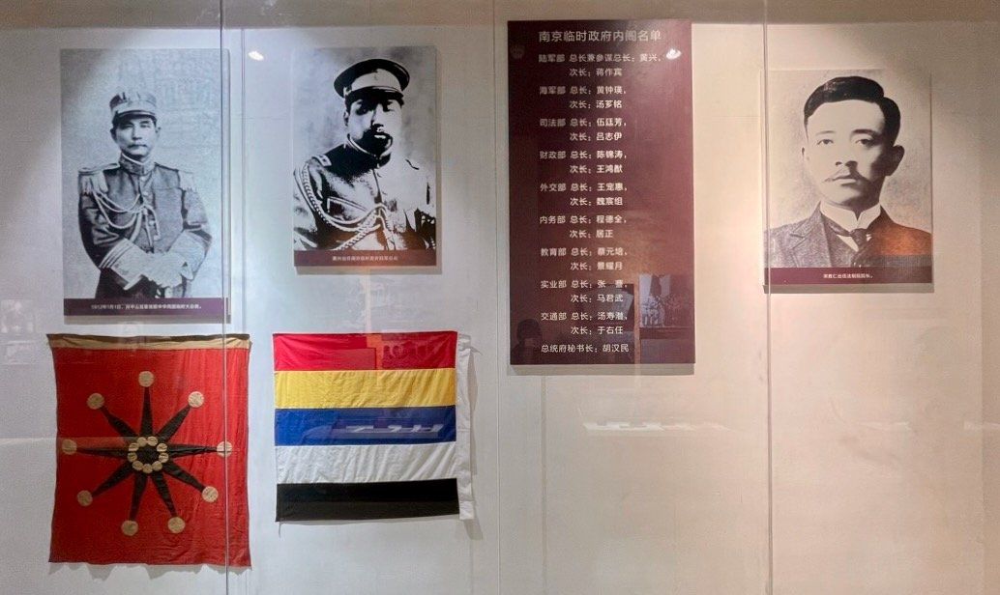
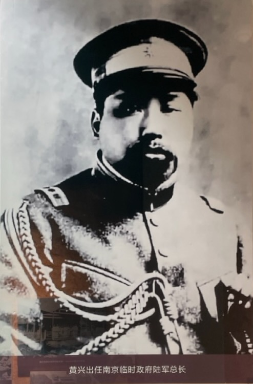
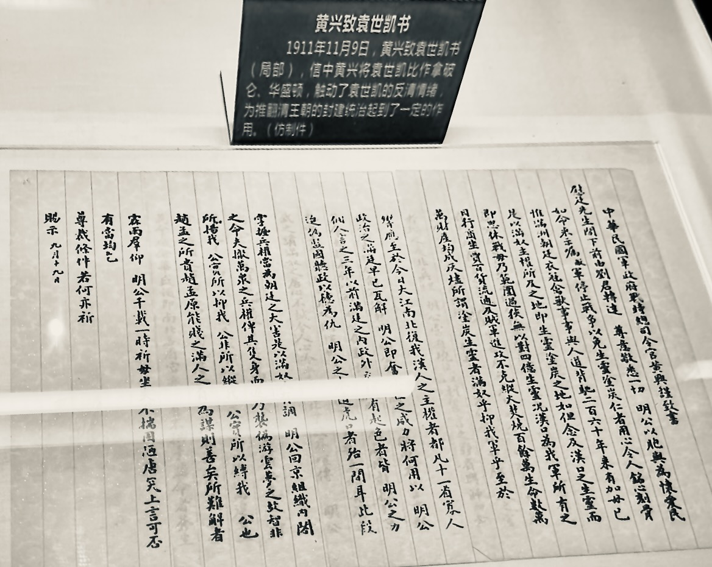
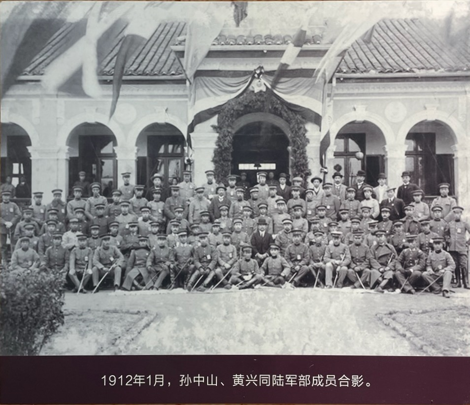
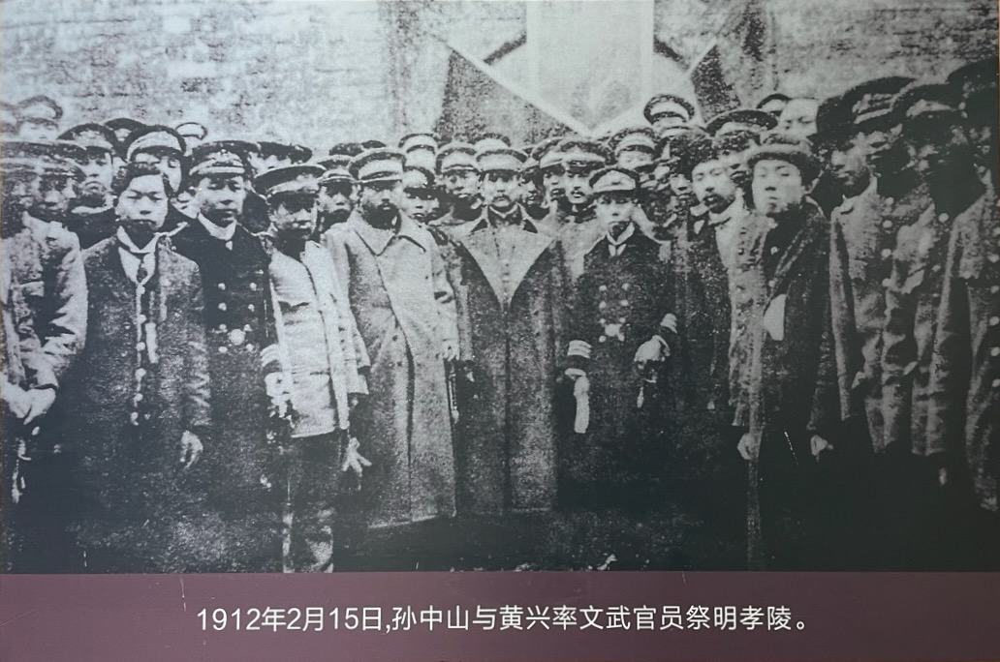
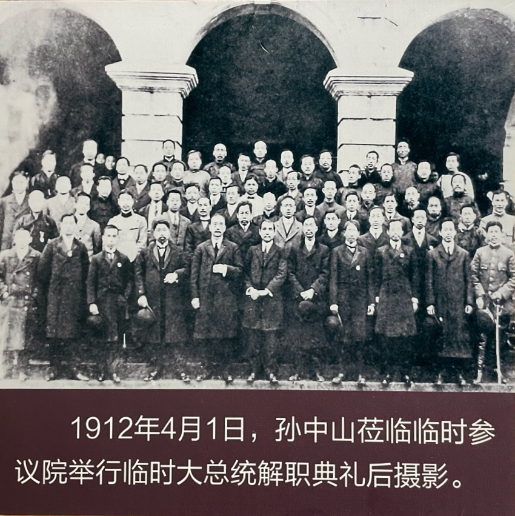
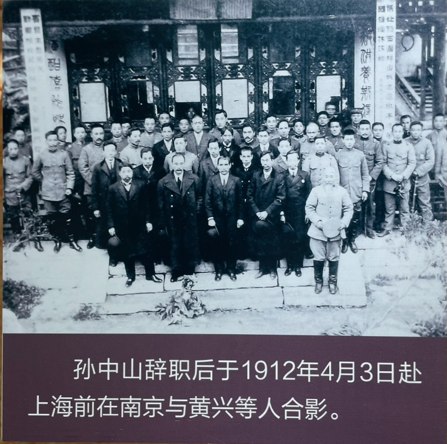
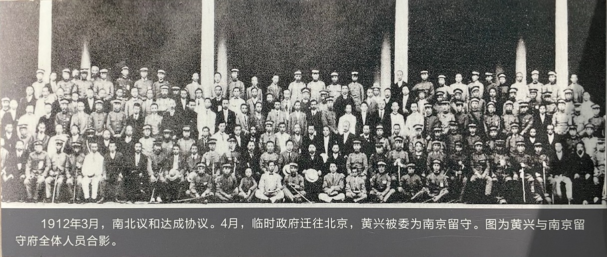
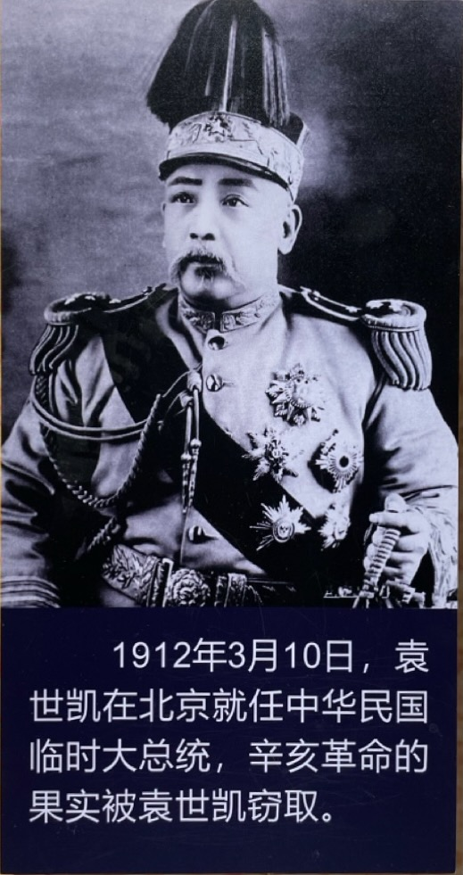
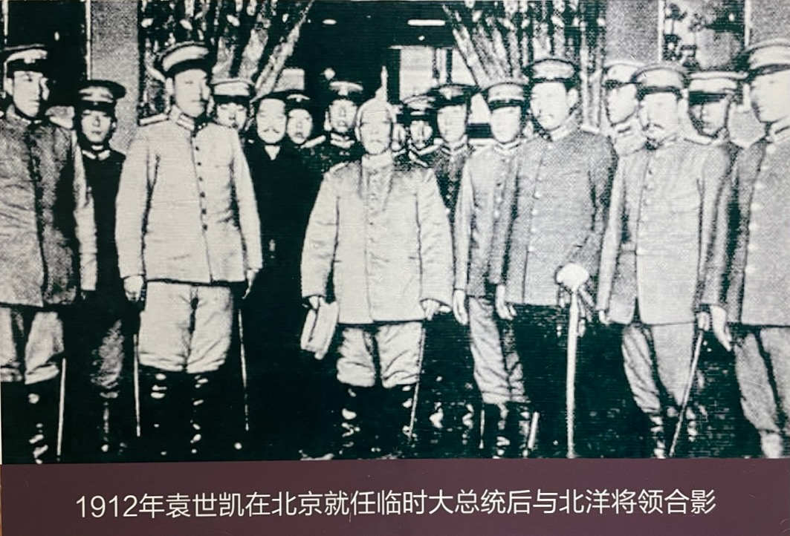

辛亥革命后，蔡锷坚决反对帝制，主张继续北伐。无奈武昌前线军事不利，蔡锷鞭长莫及。最后袁世凯成功地让清帝退位，自己取代孙中山，成为中华民国临时大总统。中国进入袁世凯的时代。

# 民国成立

1912 年 1 月 1 日，中华民国正式成立。孙中山任临时大总统。

黄兴任陆军总长

# 反对和谈

辛亥革命以来，武昌革命军一直在和袁世凯和谈。革命党通过各种渠道，鼓动袁世凯和谈，并反对清朝。下面是黄兴给袁世凯的信。

蔡锷反对和谈，主张乘胜追击，推翻清朝。1912 年 1 月 20 日，他致电孙中山、黄兴及各省都督说：“我军乘此朝气，何敌不克？乃甘受袁氏之愚，一再停战！旷日太久，糜饷劳师。试问彼于停战期内，西侵秦、晋，南攻颍、亳，朱家宝又已纵兵寿州，我再株守议和，大局必为所误。伏乞大总统赫然震怒，长驱北指，直捣虏廷。”

他说：君主国体已经在中国万不可行了，他愿意出兵北伐。1 月 26 日，他又致电孙中山、黎元洪及各省都督说：“现民国中央政府已成立，大总统已举定，民主、君主问题无复有研究之价值。此其一。国民会议，袁世凯欲于北京开议，又欲各省州县皆举代表，无非为狡展播弄之地步，以充彼战备，懈我军心。此其二。主张共和，殆全国一致，所反对者惟少数之满清奴隶耳。设开会议而坠袁之狡谋，定为君主国体，则各省必不肯承认，战祸终无已时。此其三。中国此时仍拥戴满清为君主，固理所必无，即别以汉人为君主，亦事势所不容。故君主国体为中国今日所万不能行，必强留存此物，将来仍难免第二、三次之革命。此其四。唐使（绍仪）签订之约，而袁不承认，方在停战期内，而北军袭取颍州，进攻陕州，在清廷亦并未决心和议。此其五。故此时直无和议可言，惟有诉诸兵力耳。至作战计划，孙、陈各都督所见甚伟，滇处僻远，未便遥度，惟有简率精兵，结联黔、蜀，长驱伊、洛，期共戮力中原。”

蔡锷的上述主张是对的，他对帝制的强烈反对也和他后面反对袁世凯称帝的行为相一致。

但此时袁世凯的部队非常强大，在前线的革命军难以取得进展，因此，蔡锷的主张并没有得到实行。

# 清帝退位

在袁世凯的斡旋下，清帝最终退位。1912 年 2 月 15 日，清帝退位三天后，孙中山率领临时政府文武官员赴明孝陵祭奠。

清帝退位后，孙中山按照和袁世凯的协议，辞职。

离开南京

黄兴也卸任陆军总长，南方革命军队逐渐解散，

# 袁世凯时代

中国自此进入袁世凯时代。袁世凯取代孙中山，成为临时大总统

袁世凯在北京，志得意满，带着他的北洋部下，开始了属于自己的时代。

 

| [Index](./) | [Previous](7-3-yunnan) | [Next](8-2-foryuan) |
