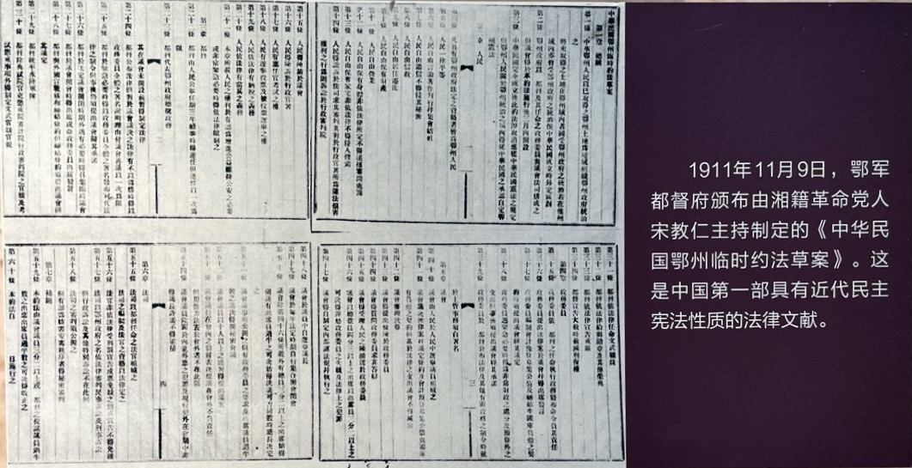
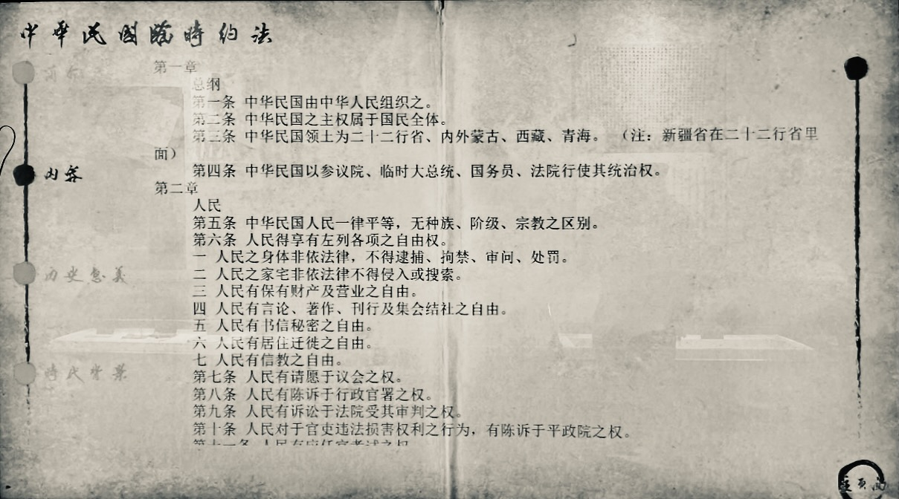
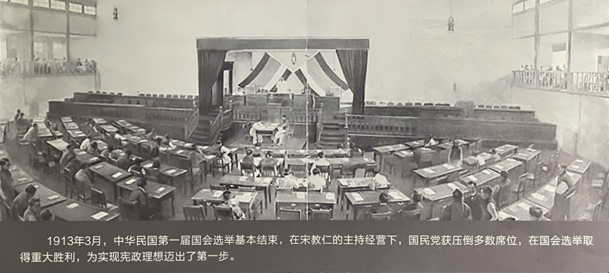
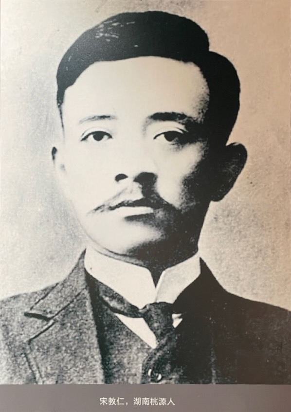
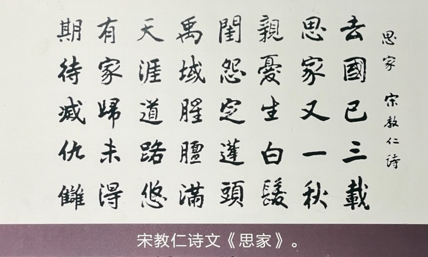
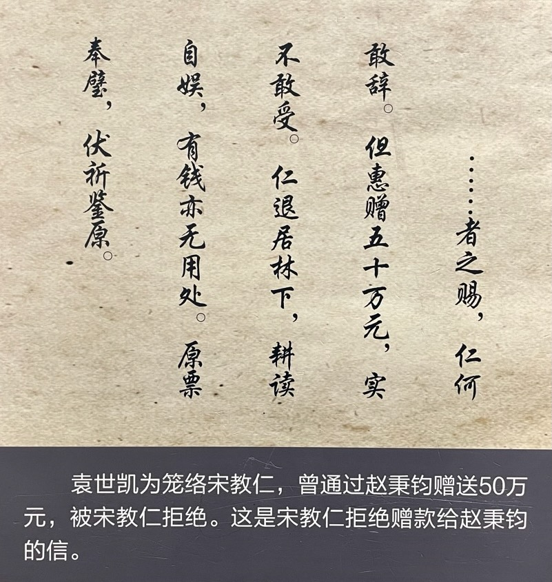
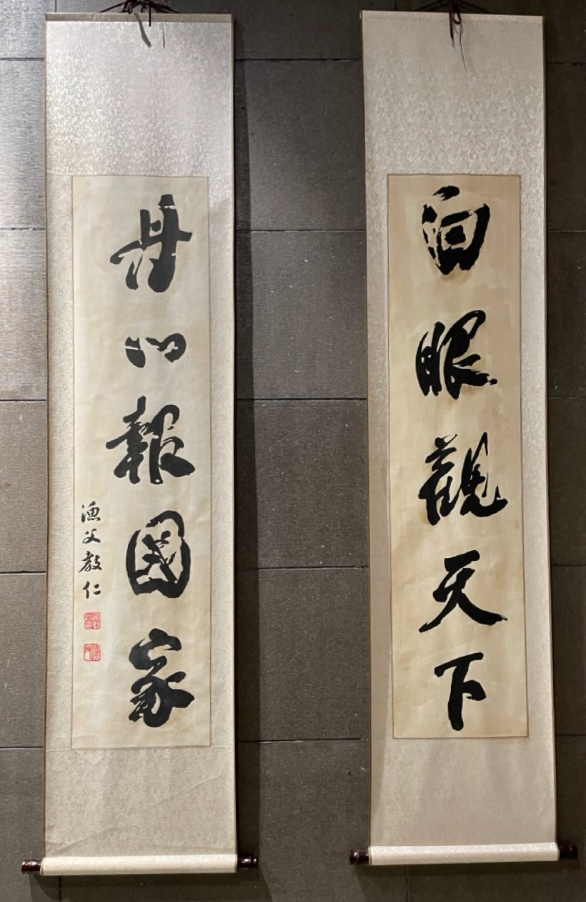

袁世凯成为临时大总统后，国家政权采用了一种半总统制的形式，导致内阁和总理的权力划分非常模糊，由此带来了内阁和总统两个职务之间的冲突。最终，宋教仁领导的国民党在国会选举中大获全胜，宋教仁准备推行内阁制，因此被担任临时大总统的袁世凯所不容。袁世凯试图贿赂宋教仁，没有成功，因此就用更狠的办法，把宋教仁暗杀了。

# 总统制还是内阁制

辛亥革命后，国家政权采用总统制还是内阁制，革命党内部就有分歧。1912 年 12 月 26 日，同盟会就此展开讨论，宋教仁主张内阁制，而孙中山主张总统制。

实践中，革命党首先选定了总统制。先于《临时约法》颁布的《临时政府组织大纲》采用的就是孙中山提议的总统制。

革命党发现总统位置将被移交给袁世凯后，又对选定的总统制进行补救，在《临时约法》中尽可能地赋予参议院和国务员权力，以限制总统的权力。《临时约法》模仿了法兰西第三共和国宪法。总统职权比较有限。

因此，袁世凯接手时的国家政体处于一种非常模糊的状态。有学者认为这是一种“半总统制”的政体。比如《临时约法》规定：临时大总统代表临时政府总揽政务，公布法律，统率全国海陆军，制定官制官规，任免文武官员等，但行使职权时，须有国务员副署。而任命国务员及外交大使公使须得参议院之同意。此种对行政任命权的严格限制，违背了公法学原理中的行政国家观念，严重影响行政效率。

左右摇摆、以致模糊的国家政体设置，给革命后的政治博弈带来很大的不确定性。此后，国家陷入各种势力的争执之中，宪法翻来覆去地换了很多次，印证了蔡锷的担忧：予读法兰西革命史，自拿破仑时代起至第三共和国成立止，其间法国宪法更变者计十九次，其重大之原因，皆因未有宪法，即先有党。其宪法皆由当时得势之党派所造成，及其党势一衰，而其所造之宪法，遂亦因而失其效力。甲仆乙起，循环不已，故良好之宪法终不能产出。

# 国会选举

无论是总统制还是内阁制，国会是一定要靠选举产生的。因此，1912 年 8 月，袁世凯颁布临时参议院制定的《中华民国国会组织法》和参众两院的选举法，开始在全国范围内选举国会议员。

国会选举非常成功。1912 年 12 月初至 1913 年 3 月，全国各地根据选举法选出了参众两院国会议员。登记选民四千万以上，占全国人口的 9.98%。选出的议员，主要包括政治活动家、自由职业者、原清朝官吏等。选举过程中还比较规范。选举结果得到了国内外的认可。

宋教仁领导的国民党在国会选举中取得了很好的成果，成为国会第一大党。为了这次选举，宋教仁领导国民党，设计了很好的竞选纲领，在选举过程中也组织有力，成功地成为了国会第一大党，约占议员总数的 45%。

# 宋教仁的梦想

宋教仁于是踌躇满志地准备按照他的理想，对国家进行基于议会的责任内阁制治理。

宋教仁是一位有志向、有才干、又有一些特立独行的革命党人。他对“法”有一种执念。他说：“讨论宪法，行政、立法、司法三权应如何分配，中央与地方之关系及权限应如何规定，是皆当依法理，据事实，以极细密心思研究者”。

他也很富感情。下面是他的诗：

宋教仁主张基于议会的责任内阁制，而不是总统制，是因为他觉得这样最能体现国民的意图，防止不良的政府。他说：“内阁不善而可以更迭之，总统不善则无术变易之，如必欲变易之，必致动摇国本”，因此，通过议会选举，实现政党责任内阁的更替，是治疗不良政府的医生。因为他极力推崇议会制度，所以政坛给他取了个绰号叫：“议会迷”。

因此，国民党在国会选举大胜后，宋教仁以为可以通过控制国会，顺理成章地推进自己的内阁制梦想了。

# 袁世凯对付宋教仁

宋教仁的责任内阁梦想危及了袁世凯的总统权力，因此袁世凯一定要解决他。袁世凯本来就对临时约法约束自己的权力，让自己的行政效率极低，很不满意。此时国会如果又和自己做对，那么他真的就什么也干不成了。因此袁世凯必须解决宋教仁带来的问题。

袁世凯采用的第一个方法就是收买。他给宋教仁送去重金。可是宋教仁不为所动。下面是宋教仁的回复。

收买不成，袁世凯就用更直接的方法，把宋教仁给暗杀了。他表面上不动声色，对宋教仁做出非常愿意合作的样子，诚邀宋教仁来北京。然后在宋教仁来到上海火车站，准备出发到北京之际，把他暗杀了。

袁世凯不愧是从满清的刀山火海中淌过来的最顶尖厚黑高手。他把宋教仁杀了后，宋教仁还毫不怀疑他，给他写信，讲述自己的嘱咐他开诚心、布公道，保障民权，确定宪法。全文如下：北京袁大总统鉴：仁本夜乘沪宁车赴京，敬谒钧座。十时四十五分在车站突被奸人自背后施枪弹，由腰上部入腹下部，势必至死。窃思仁自受教以来，即束身自爱，虽寡过之未获，从未结怨于私人。清政不良，起任改革，亦重人道、守公理，不敢有毫权之见存。今国基未固，民福不增，遽尔撒手，死有余恨。伏冀大总统开诚心、布公道，竭力保障民权；俾国家得确定不拔之宪法，则虽死之日，犹生之年。临死哀言，尚祈见纳。宋教仁。哿。

真的是：最顶尖的高手，是他把你卖了，你还替他数钱。

而宋教仁给于右任留下的遗书也令人泪下，他在要离开人世的时候，想到的是自己书、老母亲、对国家的责任、南北和平，以及自己受到的误解。遗嘱全文如下：今以三事奉告：一、所有在南京、北京及东京寄存之书籍，悉捐入南京图书馆；二、我本寒家，老母尚在，如我死后，请克强与公及诸故人为我照料；三、诸公皆当勉力进行，勿以我为念，而放弃责任心。我为调和南北事费尽心力，造谣者及一班人民不知原委，每多误解，我受痛苦也是应当，死亦何悔？

他这里说的误解，当然是他因为主张内阁制，而孙中山主张总统制，而招致的党内同志的误解，以及他为了选举，在政策上做的一些让步，引起的党内同志的误解。比如很多当年同志以为他主张内阁制，是因为自己想当总理。而他在选举时确定的国民党党纲中没有“男女平权”的内容，就导致革命女同志在大会上公开质问，并且抓住他扇耳光。真的是太难了。

而他这里说的“保障民权”、“确定不拔之宪法”、“调和南北”，就是要完成正式的宪法制订，因此完成自己的建立民主法治的共和国的梦想。

可惜，这一切都因为他的死，嘎然而止了。

下面是他的字，读起来，令人泪下！

 

| [Index](./) | [Previous](8-3-noparty) | [Next](9-4-erci) |
