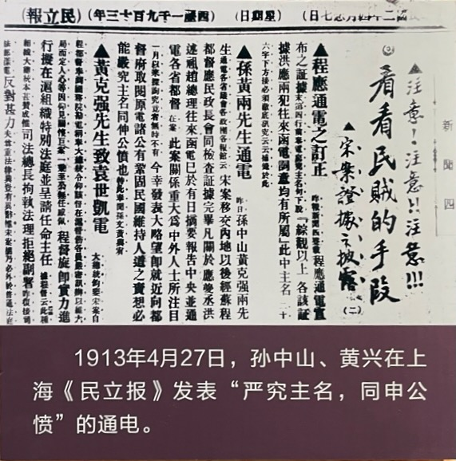
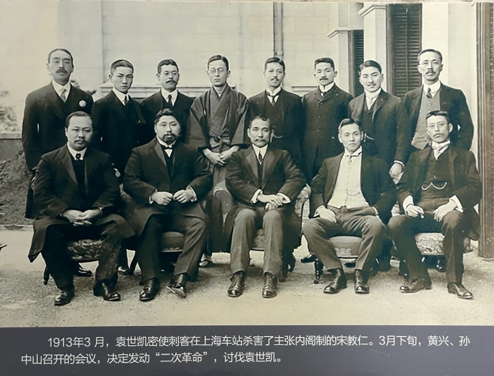
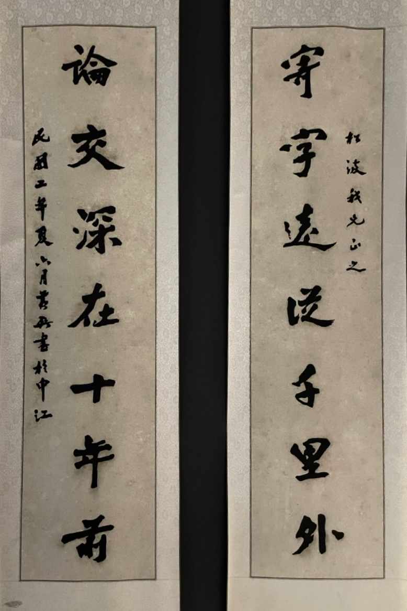
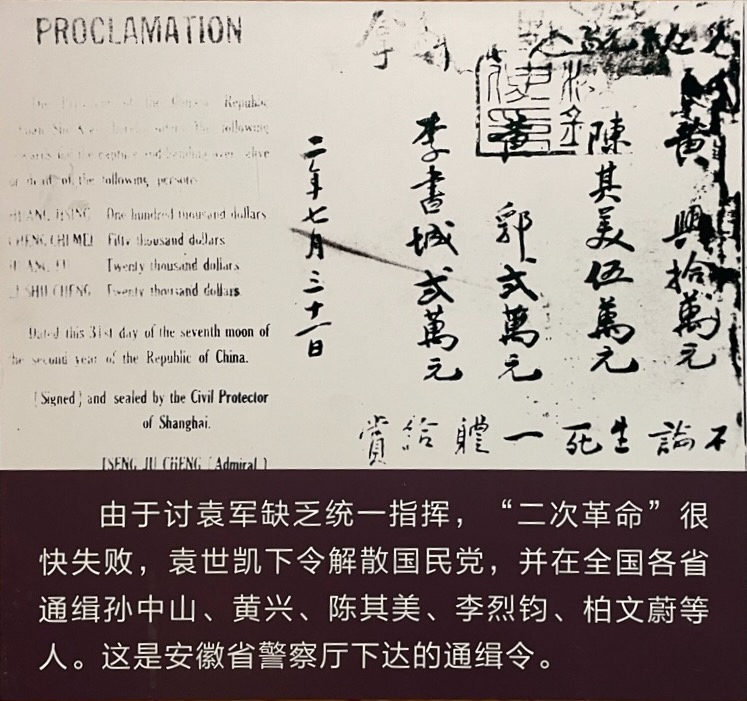

宋教仁被暗杀后，要不要武装反袁，有两种声音：

1. 以孙中山先生为代表，在任何证据都没有的情况下，就立刻认为是袁世凯做的，开始准备武力反袁
2. 像宋教仁在遗书中写的那样，认为并不一定是袁世凯做的，因此希望通过司法途径，先把问题调查清楚，然后在法律的范围内解决问题，不影响即将到来的国会、宪法和总统选举这些国家大事。

蔡锷属于第二种。宋教仁被刺杀后，他通电全国：“当在国步艰难，戕贼人才，实无天理。勿论虚实如何，自应彻底穷究，按法惩办，以彰法纪，而维人道。”他强调：“法庭开审，勿论案内案外之人，应以静候法庭之裁判为主，勿挟成见，勿尚意气，勿凭势力而坏法纪，勿造言词而乱听闻。”“查宋案应以法律为制裁，故审判之结果如何，自有法律判决。”

# 司法调查的困境

但是机缘巧合，凶手很快漏网，各种证据被发现，都指向袁世凯，显示出孙中山先生的直觉是对的。

但袁世凯反调查的本领也是无敌的。凶手在警察局离奇死亡，很多人证消失或者躲起来了，线索被掐断，司法审判步履维艰。事情眼看就要无疾而终了。

# 二次革命

这时候，孙中山、黄兴一边发表通电，要求追查凶手，一边准备进行武力反抗，起兵反袁。

这时候武装反袁的成功率微乎其微。袁世凯的势力如日中天，司法调查也没有伤及他在人民心中的威望，而革命党的武装部队基本上已经消散，同志也四散。因此，起义的力量注定是零敲碎打的，难以撼动袁世凯的地位。

但黄兴、孙中山还是义无反顾地发起了武装起义，就像黄兴当年带兵进攻广州总督府那样。这就是革命党人的气势。他们起兵了，向袁世凯讨一个公道。

宋教仁的死，黄兴最伤心。宋教仁是黄兴真正的兄弟。黄兴和宋教仁自年轻时就在一起。几十年里，一起出生入死，情同手足，是只求同年同月同日死的真正的兄弟。宋教仁在遗书中把自己的母亲托付给黄兴照顾，更证明了这一点。

因此，黄兴又开始四处奔走，以联络尽可能多的力量，起兵反袁。

# 蔡锷反对二次革命

武装反袁，黄兴当然会想到蔡锷。黄兴给蔡锷写信，希望蔡锷支持。黄兴并给蔡锷寄了这样一副对联：

“寄字远从千里外，论交深在十年前。”

这样的字，十年兄弟的情谊，谁看了后，能扛得住？可是蔡锷却就是像他曾经说的那样：‘卒然临之而不惊，无故加之而不怒’，“时机不到干不得，时机成熟时绝对支持。”。他硬是没有动。

相反，蔡锷继续表示对武装反袁的反对。他说：“同室操戈，自召分裂。谁为祸首，即属仇讎”。“国内战争，实出于万不得已，应以哀矜悱恻之意出之。同室操戈，兄弟阋墙，相煎太急，隐患良多。”“赣事不幸，竟致决裂。外人幸灾乐祸，正利用我有内乱，以遂其实行瓜分之毒计。万一不幸演此惨剧，嗟我同胞永世堕入奴隶，每念心碎。”他甚至说：“万一有人发难，当视为全国公敌”。二次革命发动后，他说：“暴烈派以破坏为事，苟可以达其目的，即牺牲全国而不恤。然其进锐，则其退速。今已一落千丈矣，其剿绝易易也”。

蔡锷给袁世凯发电报，表示自己对他的支持。7 月 17 日，他向袁世凯、黎元洪及北京政府发出“急电”说：“昨准参部寒、删两电，知赣事已决裂。积年痈毒，趁此一决，未始非福。..惟恳分饬皖、宁严防分窜，一面添重兵驰赴战地，分头截剿，早日扑灭，以免星火燎原。”

蔡锷说到做到，派自己的部队去攻击二次革命的部队。8 月，熊克武在四川重庆响应二次革命，宣布独立。蔡锷遵照袁世凯的指令，派兵入川会剿；只是由于“二次革命”很快失败，他的部队才没有与反袁军直接冲突。

# 二次革命的失败

结果，二次革命很快失败，黄兴、孙中山被通缉，又流亡海外。下面是对他们的通缉令：

虽然如此，但孙中山、黄兴为了兄弟，两肋插刀，赴汤蹈火，也是令我真心钦佩的。想想：如果不是他们前赴后继，如飞蛾扑火一般地不断攻击清政府，由此反衬了清政府的腐败无能，革命的队伍怎么会越来越壮大，革命的舆论场怎么会越来越强，辛亥革命又怎么可能发生呢？

 

| [Index](./) | [Previous](9-3-songan) | [Next](9-5-jinbu) |

