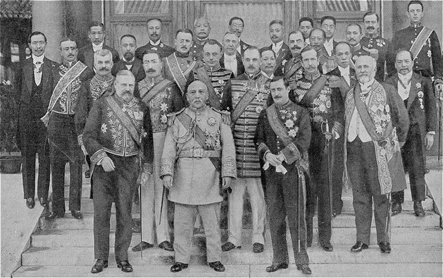

在袁世凯解决二次革命的过程中，梁启超领导的进步党提供了大力支持。

蔡锷虽然提出了不党主义，但在老师梁启超的要求下，也不得不加入进步党。梁启超在 1913 年组建进步党时，成员包括汤化龙、熊希龄等梁启超多年的老朋友，然后把蔡锷的名字也写了进去。对此，蔡锷解释道：老师把我加到了名单里，我不得不听从。

蔡锷支持袁世凯，反对二次革命，和梁启超此时主导的进步党支持袁世凯的策略分不开。他们之所以支持袁世凯，是因为他们希望袁世凯做华盛顿、拿破仑。大约有以下三个原因：

1. 袁世凯有华盛顿、拿破仑那样的实力、有能力。袁世凯成功地结束了清朝，从革命党手中接管了国民政府，又握有新军的兵权，显示出强大的能力和实力。所以，如果袁世凯能够像当年的华盛顿、拿破仑建立美利坚合众国和法兰西共和国那样，建立中华民国的共和国，确实是最可行的建立民主共和国的路径。这也是黄兴在辛亥革命后、南北和谈期间，给袁世凯写信的时候，用华盛顿的事迹鼓动袁世凯的原因。黄兴的信，可以说代表了当时大多数革命志士，包括梁启超、蔡锷的心声。

1. 袁世凯此时确实表现得像华盛顿、拿破仑，得到了一致的认可。袁世凯的表面功夫是做得极好的，基本上无懈可击。他对宋教仁、孙中山、黄兴、梁启超、蔡锷都表现得极为尊敬。比如宋教仁去世时，像给自己的同志似的给他留言。他邀请孙中山、黄兴来北京，完美接待，以致孙中山、黄兴毅然退出政坛，决定去修铁路。蔡锷到了北京后，袁世凯也是几乎每天都要和他讨论军机大事，表现得推心置腹，无所不谈的样子，因此蔡锷真心诚意地把袁世凯成为“主峰”。

1. 像孙中山在南京刚开始选定的那样，梁启超和蔡锷也倾向于总统制。他们认为，总统制能够保持国家的统一，就像梁启超在时务学堂和蔡锷等学生讨论过的那样，孔子是主张“大一统”的。这样才能更高效地完成国家的现代化建设。尤其是，梁启超他们此时还担心人民的民智未开，对把权力交给“暴民”很不放心。梁启超就说：民国初年的人民程度，“与日本维新时代相距非远”，“国人民智未开，不能骤行民主”；因此，梁启超反对搞责任内阁制，主张总统必须要拥有实权，希望袁世凯成为华盛顿。

所以，蔡锷虽然痛恨袁世凯当年出卖谭嗣同，但为了建立民主共和国，还是决定向前看，支持袁世凯。离滇前，在滇军营长以上军官集会的讲话中，就这样说：“现在总统袁世凯，原是我们的政敌，戊戌那年因为他临时告密，我们的师友，有的死、有的逃，现在想起来，犹有余痛。但衡量中国现在的情势，又非他不能维持。我此次入京，只有蠲除前嫌，帮助袁世凯渡过这一难关。”蔡锷表示：“袁是中国的一个人才，能把中国治理好。”“如果袁氏愿意的话，就让他做一个终身总统。”蔡锷在北京也很尊重袁世凯。他在给朋友的信中，总称袁世凯为“主峰”。

梁启超后来总结说：“当时很有点痴心妄想，想带着袁世凯上政治轨道，替国家做些建设事业”。

因此，进步党当时采取了支持中央的策略，认为这是符合世界之趋势的。1913 年 10 月 5 日，蔡锷被袁世凯调离北京前，在云南进步党支部召开的欢送会上有一个讲话说：“今进步党诸君为鄙人开会送别，鄙人特为诸君进一言：夫共和国家不可无政党，政党与国家虽非直接关系，而间接之影响于国家者，关系最为重大。一年来，党争激烈，牵动大局者已不一而足，然此亦必经之阶段无足异者。进步党应世界之趋势，为中央所倚重，社会所欢迎，似已立于健全之地位矣。”

1913 年 10 月 10 日，袁世凯、梁士诒、梁启超（第三排右二）等与各国使节觐见合影

# 反对“官僚派”

进步党内部对梁启超的一边倒的策略，也有不同的意见。二次革命失败后，梁启超非常高兴。此时，同在进步党的张东荪就发出警告：主张暴力革命的国民党败退之后，以袁世凯为首的官僚派将带来灾难。张东荪说：“国不亡于暴民，而必将亡于官僚”。蔡锷在离开云南时，也讲过这样的话。张东荪等议会民主派提醒梁启超要重视对袁世凯的监督，要以批判“暴民”的精神去监督政府。这无疑是对的。事实上，唇亡齿寒，当袁世凯对付完国民党之后，进步党也就被抛弃了。

蔡锷似乎也感受到了一边倒策略的问题，因此在内心里是提防袁世凯因循守旧，不思进取的。蔡锷在云南进步党支部召开的欢送会是说：“鄙人犹有虑者，今之政界分为二派，一曰暴烈派，一曰官僚派。暴烈派以破坏为能事，苟可以达其目的，即牺牲全国而不恤，然其进锐，则其退速，今已一落千丈矣，其剿绝易易也。所最难征伐者，官僚派耳。官僚派之臭味，其进也渐，其退也实难，根深蒂固，欲图征伐，诚非易事。党中有暴烈派，则酿乱固不待言；党中有官僚派，势必至萎靡不振，一切进行，障碍滋多，所谓因循等于残暴也。”

所以，他指出，在二次革命被扑灭之后，重点要转变到防止“官僚派”因循守旧上面来，继续推进民主共和国的建设。他说：“进步党今日应行做到之事，正须防止暴烈派，而洗涤官僚派。暴烈派之失败，虽以兵力为之；而进步党之鼓吹社会扶助政府者，其功亦诚不小。今进步党之所虑，惟在官僚派耳，望诸君尚其注意。”

于是，他到了北京。

 

| [Index](./) | [Previous](9-4-erci) | [Next](11-1-beijing) |

