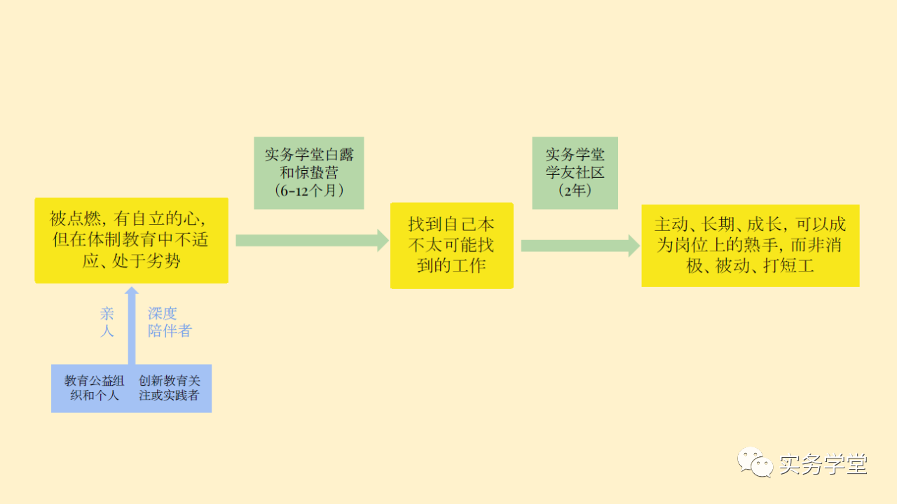

实务学堂是我支持的一家公益机构。它的目标：“支持青少年自立”深深地吸引了我。“自立”是全人教育的第一步，也是我们掌握“在世界上明智生活的艺术”的第一步。一个人只有自立与思考，才能学会有组织的生活，成为一个好人、有用的人。

实务学堂“支持青少年自立”有着扎实的落脚点，即孩子最后能够走上自己的职业路径。学堂的愿景是：“探索农村青少年职业发展新路径，为好的社会培养珍贵的普通人”。这是出身农村的我所关心的。因此，我是它的志愿者。

实务学堂目前在做的，是先用 5 个月时间，支持青少年“自立”，走上他们本来不敢想象的职业道路，以积极主动的状态去面对人生，然后用 2-3 年时间，陪伴他们成为“主动、长期、成长”的不同岗位上的熟手，成为“有用的人”。

实务学堂在做的，是一项创新。在我有限的对国际、国内公益机构的了解中，并没有发现另外一家机构在做类似的工作，尤其是在中国。首先，就“自立”来说，它在中国并不是家长心目中的急迫需求。虽然人们大多承认“自立”是一种可贵的品质，但在中国，因为强烈的不安全感，所以很多家长是坚决要“安排”、“照顾”自己孩子一生的。其次，在“职业教育”来说，要从“自立”开始进行职业教育，在很多人看来，时间太漫长了。十年树木，百年树人啊。以前就流行一种说法：一个孩子14岁以后就定型了。最近更有人说：从职业上来说，人只能筛选，不能培养。

实务学堂在做的，也是一件难事。比如，要在短期（如 5 个月）支持起来一个青少年“自立”，就很不容易。传统的“听话式”教育、亲人们长期的呵护、与外部世界的交流匮乏、信息隔绝，都带给孩子们各种各样阻碍他们“自立”的恐惧、意识和习惯。“等、靠、要”成为常态。要在短时间内克服这些习惯，养成新的习惯，很难。然后，还要让这些孩子走上他们本来不敢想象的职业道路，以积极主动的状态去面对人生。须知，实务学堂的学生主要是来自农村的青少年，他们在我国注重精英筛选等教育体系中，是被边缘化的。他们没有享受过很好的教育资源。他们在我国的教育体系中甚至是落水的那一批。欧阳老师说，很多同学见面的时候，身体都是缩着的。如此，如何带他们走上他们的职业道路，而且还能“积极主动地面对人生”。

本文从一个旁观者的角度，对实务学堂这一年来所做的，进行观察。目的有两个：1）引发学堂好友的讨论，为他们在新的训练营的计划和执行中提供参考；2）引发公益界同仁的讨论，互相砥砺，取长补短，共同奋斗。世上并没有路。一个人，或者一群人，看到了一个问题，发自内心地想解决这个问题，左冲右突，努力尝试，地上就有了一些痕迹。但是，因为在这个过程中，有各种各样的情况，有时候遇到了阻碍，还得折返回来，所以留在地上的痕迹，零散、细碎、杂乱，不容易辨识。本文的目的，就是整理这些分布在各种杂志、公众号、好友讨论、自己的亲身体验等各方面的痕迹，给后来人参考。希望大家沿着这些依稀的痕迹，各自奋斗，最后能够闯出一条自己的路。如此，则是这篇文章的价值。

全文组织如下：第一节介绍我在和学堂新生和毕业生的交流中，对学堂培养效果的观察；第二节和第三节分别就学堂工作的两个方面，即“学堂内培养”和“学堂外支持”，进行观察。其中重点是第二节对 5 个月的“学堂内培养”的观察，具体包括“认知习惯和通用素养培养”、“职场对齐”。第四节给出学堂总体培养氛围、学堂内培养、学堂外支持的三个实例，以提供更真实的观察视角。

### 1、学堂培养效果观察

23 年 4 月，欧阳在五周年庆上总结学堂五年来做到的：学生走向了他们本来不敢想象的职业道路，以积极主动的状态去面对人生。然后解释实现这一点的关键：改变大家对这个世界的认知【1】。

23 年 8 月，我拜访了学堂的老师和同学。通过和几位已毕业的同学和刚入学的同学的交谈，我发现他们的不同是明显的。

- 已毕业的同学，是“自立”的。她们有职业方面的方向感：有职业进阶的迫切愿望，知道自己目前掌握了哪些职业技能，也了解自己的优势和存在的问题。她们能够创开心扉，和外界交流，也善于交流：她们注意自己的穿着、仪容，在交谈中，和我有目光接触，能清楚地讲述内心的困惑，向我提出确切的问题，倾听我建议中的内容，并给出反馈。因此，对我的建议，她们能够根据自己的情况进行消化，形成自己的定见。结果是：我们大约半小时的讨论是有结果的，因此是富有成效的（芝倩，楚虹）。

- 新来的同学，尚未“自立”。他们对职业没有概念，不知道自己兴趣何在，也不知道如何寻找信息，如何交流。她们有强烈的改变现状的想法和勇气（比如悦悦同学），但不知道该如何起步。她们对“学习”有一种很强的挫折感，生怕自己学不会（比如苗苗同学）。他们很聪明，愿意探索，但是没有方向（小河）。对我的建议，他们表示可以试一试，但很犹豫，没有把握。结果是：我们的讨论并未展开（苗苗，小河），或者展开后，结论是开放性的，尚待进一步探索（悦悦）。

这种对比意味着学堂对已毕业的同学的陪伴是有效的：学堂改变了大家对自己的认知，帮助了大家“自立”，提高了大家的沟通、表达、思考、探索能力，并且走向职场。欧阳在 2023 年 3 月参加第七届教育公益组织双年会的“社会组织服务职业教育的挑战与反思”圆桌论坛时，提到：成功的职业教育首先是能够自立，学堂在2022年转型，由三年制转做半年一期的学习营，以走向职场为准绳，让同学们明确自身的目标，让目标呈现出分阶段趋势，不断调整，好踏出职业生涯的第一步【2】。从已经毕业的同学的身上，我看到这一目标的初步实现。

学堂是如何做到的？如下图所示，为了实现学生“自立”，“走向职场”的目标，学堂采用了时长 5 个月的“学堂内培养”和时长 2-3 年的“学堂外支持”的架构。

目前，时长 5 个月的“学堂内培养”已经完成了 1 届，而时长 2-3 年的“学堂外支持”正在进行中。下面是我的观察。

### 2、学堂内培养

学堂内培养采用的培养方法是：培养最底层的认知习惯、通用素养，然后支持青少年尽早进入真实职场和世界，尽早自立【3】。具体来说，就是培养他们的个人主动性，让他们有意愿和能力为自己负责，学会探索自己的目标，描述自己的目标，然后制定计划，一步一步实现自己的目标。有了这个关键能力，后面他们就能走自己的路【18】。具体内容如下图所示：

这包括两个层面：1）重塑认知习惯，培养通用素养；2）尽早加入真实职场。下面分别介绍我在这两个层面的观察。

#### 2.1 认知习惯和通用素养培养

我们首先来看“重塑认知习惯，培养通用素养”这部分。它包括四个方面：a）“激发自觉，重塑习惯”；b）“依靠提问，而非教授”，培养学生的主动发现问题、沟通表达、主动学习、解决问题的能力；c）面向问题的探索式项目制学习；d）建立自信。下面分别介绍这四部分的观察。

一、“激发自觉，重塑习惯”

这里的“习惯”，具体来说是指《高效能人士的七个习惯》，其中包括：积极主动、以终为始、要事第一、双赢思维、不断更新。和这些习惯相悖的，是学堂发现的孩子们的一些消极的习惯，比如：消极被动、得过且过、自私自利的习惯。职业上，表现为“打短工”、“做一天和尚撞一天钟”的状态。生活中，表现为孤立、不负责任的状态。

为了重塑学生的这些习惯，学堂进行了两方面的工作：

- 以《高效能人士的七个习惯》为课本，开展了系列课程和刻意练习，让同学们理解这掌握这些习惯
- 通过 OKR 目标管理法，帮助学生明确自己目标，把握自己的生活，从而让孩子们将积极主动、以终为始、要事第一的习惯付诸实行

目前看起来，这些方法是有效的。而且，这些方法是通用的，值得每一个人学习。

二、“依靠提问，而非教授”

这是学堂的一项重要转变。以前，学堂采用的是类似传统学校的课堂式教学方法。而现在，采用“依靠提问，而非教授”后，学堂把“提问”作为主要的教学和培养工具。这是因为学堂发现提问在以下四个方面的意义：

第一，提问、追问、思考和解答问题，是交流和表达的主要方式。提问、交流，让学生们学会表达、沟通、理解、思考。欧阳指出，佛陀就是这样教人的【3】。这种方法也有很古老的哲学传统，如苏格拉底方法。而且，很多问题，必须要给予澄清，才能明确后面的培养方式和道路。比如，学生一来到学堂，欧阳都会问他们：为什么来？要学什么？为什么？人际间很多的交往，也是从提问开始的，比如：你看过这个电影吗？学会随意地提问，让我们打破社恐的僵局。此外，提问也能让同学们改变自己的思维方式和刻板印象【15】。

第二，提出问题，是一个人自立的开始。苏格拉底说：教育的核心是“You think and ask questions”（你思考，并提问）。为了鼓励孩子们提出自己的问题，实务学堂改变了传统的灌输的教学方式，贯彻孔子的“不愤不启，不悱不发”，首先不是“教”，而是激励、鼓励、等待学生出现问题。为此，学堂的老师首先要迈过自己心理上“对学生负责”的门槛。他们说，到了白露营，老师们开始“摆烂”：要是营员真的不关心这些问题，就不要出去参访吧，或者，如果营员自己不提问，那就空手而归吧【4】。而学堂的学生也要迈过自己的心理门槛，不再害怕提问，比如恩惠就说：“我害怕老师把我吃了”【13】。通过无数次的“你关心什么问题呢？为什么你关心这个问题呢？你打算怎么解答？你有什么困难，需要什么支持？”“你们各自对职业、职场、人生，真正关心的问题是什么呢？”等问题，老师们支持着学生们提出自己的问题。为了让同学们理解“问题”的重要性，欧阳跟学生说：如果这个问题真的是你想要得到的，对你很重要，那它就值100万，你应该努力去得到。但如果它不值得100万，你真正需要的信息，到底是什么呢？你要先花时间，知道自己关心什么、该关心什么。

第三，提出问题，为学生的主动学习，打开了大门。学生提出了自己觉得有意义的问题，必然会想要学习如何解决这个问题。于是，就可以顺理成章地支持学生通过互联网、ChatGPT 等渠道检索答案，修正自己的问题，再次探究，或者找到合适的人，想办法请求对方解答自己的问题。在这个过程中，学堂就可以开展相应的沟通能力、职业技能的教学。欧阳和张鑫都强调：只有在营员认为这些已经成为自己的“需要”后，老师才可以做具体支持。

第四，自己的“提问”获得的回答，最能触动孩子们的心弦。这些问题是孩子们真正想了解的。比如，孩子们去参访面包店时，营员最后向店员和老板提出了自己关心的问题：在职场上，如何和人打交道？他得到了回答，其他营员也被这个回答触动。面包店的店员和老板都说：“每个人的相处都是平等的。”“和同事、老板、客人的相处，都是一样的。比如，你们今天是学生，或者暂时没什么社会地位，我们对待你们都像家人一样、客人一样，都是平等的。不管年龄、长相、经验，一定要自信。任何的关系只有这样，才是正常的关系。包括以后有男女朋友，永远要记住，关系是平等的。如果被‘吃住’了，做再多努力，都会更辛苦，或者让人受伤。每个人的感受都是一样的，打你和打我，一样是痛的。”老板Agnes对他们说。营员们之所以被触动，是这番回答，触碰到了他们自己真正的“心病”：不能平等地看待他人，畏惧他人。这样的沟通，因为是孩子们引发的，最触动他们的心弦。否则，沟通就是很难、很令人恐惧而不值得期待的事。

对“依靠提问”方法的掌握，改变了孩子们的生活。比如，习惯了面对问题、掌握了解决问题的方法之后，学生们敢于直面生活中的问题了。比如有个营员意识到自己似乎经常得罪人，他决定直面这个问题，主动找到我和几个朋友，问大家：“我是不是有什么不好的说话、做事方式，容易冒犯到你？”“我有时处理不好自己的情绪，该怎么办？”我们常说：提出问题是解决问题的一半。因此，学生能够提出问题了，那么问题的解决也就基本上完成了【4】。

三、面向问题的探索式项目制学习

在 5 个月中，以问题为核心，组织了四种探索式项目学习：“探索自我”，“探索社区”，“探索职业”，“自主探索”四个项目模块。在每个模块中都包括了“引入”、“选题”、“探究”、“创造”、“分享”等子模块。每个模块都需要学生提出问题，展开研究，形成报告。在这个过程中，学堂花费大量时间跟孩子共同探索他们的目标和职业。然后顺着他们的目标，或是他们想要解决的问题，给他们一些方法和支持，由他们自己去解决问题，去实现目标，去真实地生活和做事。通过这种方法，学堂让孩子们适应了“提出问题、解决问题”的工作和生活方式。

在上述过程中，写作和交流的训练也自然地完成了。因为在提出、沟通、解决问题的过程中，学生为了得到答案，写一条准确、得体的信息，描述好问题，及时回复对方的信息，尽可能理解、记录好对方的回答，就都变得必要了。在白露营的后半段，很多营员就主动提出了要提高自己的写作能力，发起了一个写作兴趣小组，欧阳担任了指导老师（惊蛰营也已发起阅读和写作兴趣小组，张鑫老师指导）。

特别是，在解决问题的探索过程中，学生们学会了“追问”。首先，如上所述，老师在不断地追问学生。欧阳老师说：重要的是，让孩子们学会追问自己【3】。其次，在一些“采访”的任务中，一个很重要的技巧也是“追问”。通过这方面的教学，学堂也教会了同学们如何追问采访的对象。在这个过程中，孩子们学会了如何通过多轮对话，深入地理解别人，获得自己的启发。如前所述，在我对已毕业同学的观察中，学堂这么做是有成效的。

四、建立自信，目标拆分，学会求助

学堂发现来学堂的孩子不光年龄偏小，而且自信心不足。但他们如果在学堂尝试过一些事，或是在学堂老师的帮助下，在走向职场或社会的过程中尝试过一些事，自信心会很不一样。因此，学堂尤其鼓励他们去尝试一些总觉得自己不太行的事。比如让他们自己联系企业，去拜访，去采访。他们可能会磨磨蹭蹭一两周都没走出去，但只要走出去了，收获就很不一样【18】。

其次是帮助他们做一些目标的拆分。一个目标可能乍看上去无法实现，但能不能把它拆成几件小事，一件一件去做？【18】

再有就是告诉他们，有困难可以求助。但真实世界里不是总有老师可以提供帮助，所以我们特别鼓励他们向同龄人求助【18】。

这些方法都很简单，就是相信自己，拆解问题，制定目标，寻求帮助。经过反复练习，然后去做一些原本觉得不太能做的事。总之，这些活动让孩子们建立了自信，学会了沟通，找到了改善自己的方向、方式和方法。这就是我前面提到的、在已经毕业的孩子们身上看到的。

#### 2.2 职场对齐

虽然提过认知习惯和通用素养培养，学生们有了一定的走向社会的能力，但是，要让学生们从心理和生理上都具备走出校门，走入社会，成为一个“主动、长期、成长”的职场专业人士，成为岗位上的熟手、而非消极、被动、打短工，还需要把他们在心理上和职场进行对齐。这包括三方面的工作：1）明确工作的意义；2）OKR 职场目标设定和执行；3）职场项目实习。

一、明确工作对意义

提过实践，我们发现对齐的第一步是，请学生们回答：为什么要“工作”？这个看起来可以不假思索就回答的问题，却坑了我们差不多一年的时间【5】。具体来说，在我们培养了一届学生，将他们送上了工作岗位之后，我们却哭笑不得地发现：很多学生对工作，或者说“普通工作”的愿望其实并不强烈。有的同学来学校，只是在别的地方不适应，因此来尝试一下，体验一种不同的生活。有的同学和家长觉得“普通工作”（比如咖啡师）的价值不大，只想着找一份轻松稳定的工作，因此很容易轻易地放弃一个手头的工作【16】。有的同学担心自己不能胜任一个推荐的工作，因此非常焦虑，发挥失常，也很容易放弃机会。总之同学们对工作的意义并不清楚，很容易造成“半推半就的人生”。

为了回答这个问题，学堂组织了专门的研讨。通过学堂毕业生分享、企业资深人力资源专家讲座，大家讨论了什么是工作，以及工作的价值，最后发现了如下工作的价值：

- 报酬，财务上的自足
- 个人成长，知识经验能力上的隐性回报，精神上的自立，这包括：
  - 艺璇分享说：“坚持下来，到第三年时，自己已经变得不一样。在自己遇到问题时，尝试转换积极主动的视角，豁然开朗。她感悟到，原来，以前听到那么多道理，比如“积极主动”的原则，以为自己懂了，只有真的实践过，才知道以前根本没有懂【6】
  - 艾克分享说：“边工作边学习，才真正对技术有了更深理解，可以真正应付工作职责【7】
  - 资深人力资源专家刘欣舟老师分享说：“职业初期，知识、经验、能力的增长速度，远超过收入的增长速度。换言之，个人成长的回报远大于财务回报。”“这些（能力等）隐性回报能够帮助我们在不远的未来获得更多的薪水和更好的发展。”【8】
  - 资深人力资源专家曹蔚老师分享说：“努力让自己的专业能力达到岗位所需，并继续不断提升，是初入职场最重要的事。”【9】
- 服务他人和社会
  - 同学们访谈的面包师说：一个面包师，不只是创造了好的面包，还为顾客提供好的生活和幸福感。一个服务员也可以创造，比如面对顾客的负面情绪，自己转变思维，洞察对方的正面需求，从而解决问题，也给对方带来好的感受。还有，很多琐碎的工作，也可以施加创造力：把它们的流程捋得更顺、更清晰【10】。
- 走出家门、校门，与世界建立更广、更深的连接

和这些前辈的讨论，让学生理解了工作的意义，确立了要工作的决心。

二、OKR 职场目标设定和执行

在这个过程中，学生也理解了什么是职场，了解了职场的一般规律。分析了自己的能力和职场需求的匹配度，然后，通过“探索职业”确定职业目标，通过 OKR 目标设定，展开职业技能学习。学堂在这个过程中提供支持。

OKR 的全称是 Objectives and Key Results，目标和关键成果，常应用于企业管理。学堂每周一更新 OKR，做这周的计划，后面复盘，让学生去分享这一周的进度。这些目标都是“真实的问题”，比如一位在电商实习的孩子的问题是：找衣服花的时间很长，这样压力很大，会担心当天的货发不完，另外夏天库房很热，如果找衣服花很多时间，要热死了。这就是一个“真实的问题”，解决它就是一个切实的目标。于是这个孩子就做了很多研究，想了很多办法，在这个过程中很有成就感。这样就锻炼了自信，培养了职业素养和能力【18】。

为了实现目标，获得关键成果，同学们需要必要的职业素养和能力培训。我看到了以下三种具体的培训课程：

首先，是钱老师为大家带来的职业探索课，包括三部分内容：
- 投资和消费：我们的资产包括金钱、人脉和时间。要利用它们进行投资。要有“觉知”，主动追问自己每个行为、决定背后的需求。要尽量“投资”。要努力提高自己，让自己变成一个值得投资的人；
- 职场：选择职业道路需要考量四个要素：自己热爱的、自己擅长的、世界买单的、世界需要的。进入职场的关键在于要将自己的热爱、擅长与市场结合，能够提供有价值的产品和服务与他人进行等价交换，让世界为自己的能力买单；
- 资产负债表：企业、人生都有自己的资产负债表。对它们要有“觉知”【12】。

其次，是欣舟老师的简历指导课。老师从表达、篇幅、重点、角度等方面仔细地教同学们如何写出高质量的简历，并与部分学员进行了线上模拟面试。

最后，是旭东律师的法律课。老师给学员们在线分享了劳动法相关知识，为他们答疑解惑，比如提到了劳动关系的建立、劳动合同的签署等注意事项【19】。

这些实用的课程，因为和同学们自己制定的 OKR 有直接的关联，因此目标清晰，支持了同学们的目标达成。

三、职场项目实习

为了培养学生的职业能力，在课程的中期和结束，设计了“中期展示和复盘”、“结营展示和复盘”两大项目制输出和交流活动。在每次活动中都包括了“策划”、“筹备”、“展示”、“复盘”等子模块。此外，学堂内还提供“广本童行”、“学堂开放日策划”等各种职业项目，供同学们进行实战练习。

#### 2.3 小结

总之，通过上述认知习惯和通用素养培养、职场对齐、职场项目实习活动，学生们打开了自我，建立了与世界的连接，学会了“依靠提问”的交流和研究方式，“激发自觉，重塑习惯”，养成了好的生活和工作习惯，锻炼了沟通表达和学习能力，掌握了基于 OKR 的个人目标设定和执行的方法，学习了写作、项目策划、执行，坚定了找工作的决心，并最终经历了找工作、面试、实习、入职的真实的过程。这个培养过程就完成了。这是我看到的这半年来，学堂内学习的进展情况。

### 3、学堂外支持

5 个月的学堂内培养后，时长 2-3 年的学堂外支持就开始了。

在工作中成长，是学堂展开“学堂外支持”的基本思想。这基于欧阳的认识：学校，即便是曾经的实务学堂这样不完全封闭的地方，也离现实世界、真实职场太远了一些。真实的世界，才是他们需要的。

这一认识，基于学堂实践的结果。学堂发现，学生毕业时，对自己即将肩负责任，对一个还比较陌生的工作环境、团队，都有些恐惧，也不相信自己是否能胜任。既然如此，既然学生一定会紧张，那么学堂就变成：在学堂呆半年，就自己去找工作，然后有两年时间，学堂就陪着他。他害怕时，就鼓励他，是不是，这样的适应过程，也早就过去了？

“学堂外支持”采用的具体方式是“学友社区”，即：在学生独立寻找或走上工作岗位后，通过每周线上组会、线下聚会、咨询，建立“学友社区”，持续提供支持，目标是学生能够成为“主动、长期、成长”，成为岗位上的熟手、而非消极、被动、打短工。

我支持这种方式。我看过欧阳给我发来的一个腾讯会议的截屏，上线的有十几位同学。我叮嘱一位和我会面的毕业的同学：开心地参会，和大家讨论啊。另一位同学说：我虽然毕业了，但常回来看看，因为这里有特别好的老师和同学。

### 4、示例

为了了解学堂是如何具体运作的，以及它的效果（包括导师和学生的状态），下面是三方面的例子：

1. 学堂环境、教学、师生状态的实例。这是 23 年 5 月学堂开放日的学堂公众号上的报道，其中包括了上面提到的很多方面内容，非常详细【11】。

2. 同学在学堂内学习的实例：小娟的演讲《从逃避到不惧，我发现自己也能做成一些事情》【14】，其中描述了她在学堂内学习中，在社区探索、职业探索、学堂短视频制作岗位应聘等环节中的经历。她详细描述了她从中学到了什么，如何克服困难的。特别是，她介绍了她如何在“自主探索”中意识到自己还是很喜欢小孩，也喜欢大自然。所以，选择了探索儿童自然教育行业，并找到了一份这样的实习。

3. 同学毕业后接受学堂外支持的实例：这里有三个例子。

- 一位在电商实习的孩子，学堂支持她复盘自己在仓库管理员、清洗员等职位上遇到的问题，提高自己的专业水平，最后得到了老板的赏识
- 一位在教育科技公司做产品经理的孩子，学堂支持她梳理工作中遇到的问题是什么，怎么面对。两年以后，她成了团队里很重要的角色，也变得很自信，知道自己积累了多少行业资源和技能【16】
- 有个孩子最近刚进职场，跟老板说放暑假了，要请两周假回老家。老板说，你能不能少请一点？他回来问我，老板是不是PUA他？学堂帮他分析后，认为这是小团队，两个星期太长，职场也没有暑假。他后来就理解了，干脆没有请假了【17】

### 5、结论

本文首先简要介绍了我在和学堂新生和毕业生的交流中，对学堂培养效果的观察，然后分别介绍了学堂在“学堂内培养”和“学堂外支持”两方面的理念、组织和内容，最后给出了三个实例，希望以此帮助大家了解实务学堂最近的工作，获得启发。

### 参考链接

1. 实务学堂，携手并肩，向拾而行｜实务学堂五周年庆回顾，2023-04-20，链接：https://mp.weixin.qq.com/s/Ur5zMxrdw4bZFkChibmwDQ

2. 实务学堂，实务学堂月报：许多师友来相会，2023-04-25，链接：https://mp.weixin.qq.com/s/wd1lBBwCxM3BWBlno3yEZQ

3. 实务学堂，学校不是职业教育的最好场景｜答实务学堂为什么转型，2023-04-29，链接：https://mp.weixin.qq.com/s/8XtlYJj-wuhotWU6JJ_bVA

4. 实务学堂，翻越认知壁垒：沟通｜教育短篇07，2023-02-08，链接：https://mp.weixin.qq.com/s/Ax3po1-6OLa7UkHD_Vpmlw

5. 实务学堂，找到工作，是学生和家长的需求吗｜教育短篇03，2023-01-14，链接：https://mp.weixin.qq.com/s/onIyaRwINtrl73hoGYDK6A

6. 王艺璇，从实习到现在，什么让我得以自立｜毕业生分享，2022-12-15，链接：https://mp.weixin.qq.com/s/sn0lKheb2aiMJA44FSh_Nw

7. 陈一帅，从毕业生谈实务学堂的全人教育，2022-12-29，链接：https://mp.weixin.qq.com/s/_ZG269VjFlZ2aVUEIuxXdQ

8. 刘欣舟，资深HR谈招聘，企业选个人还是个人选企业？｜职业沙龙，2022-11-12，链接：https://mp.weixin.qq.com/s/dKaIyUyUUOXXGdQi_SWjgQ

9. 曹蔚，职业初期最重要的三件事，2022-11-21，链接：https://mp.weixin.qq.com/s/c_EpDQkohsQzLH-gIQO30w

10. 实务学堂，职业博物馆/ 职业探索中我选择面包师，2022-12-02，链接：https://mp.weixin.qq.com/s/VZUYCDo4d9DfjUV-vmoZmg

11. 实务学堂，来看看你喜欢的实务学堂｜开放日回顾和新邀请，2023-05-25，链接：https://mp.weixin.qq.com/s/rshPQtK_Sdo9YA3XMSkJcA

12. 实务学堂，实务学堂月报：惊蛰营员有什么新收获？2023-05-31，链接：https://mp.weixin.qq.com/s/fnaxC9tzu841rZX2y-4Hqw

13. 崔恩惠，做项目经理是糟糕透顶的体验｜学堂五周年庆 学生演讲，2023-04-19，链接：https://mp.weixin.qq.com/s/tPgei9Z9sxzEK63pzdpBpA

14. 李小娟，从逃避到不惧，我发现自己也能做成一些事情｜学生演讲，2023-01-12，链接：https://mp.weixin.qq.com/s/xWkSx0B2d7q15CsrbPIZkA

15. 朱腾跃，我的一个月｜学堂五周年庆 学生演讲，2023-04-19，链接：https://mp.weixin.qq.com/s/3ouG-ZIHmd0CnmgsQ6RU-A

16. 欧阳艳琴，为什么说，追求“轻松稳定”已经成为年轻人的精神鸦片，三联生活周刊 2023-06-22，链接：https://mp.weixin.qq.com/s/AMKeEKGXf7GQEKfN3CWsGg

17. 斯通纳，中考被劝退：除了读高中，他们还有什么路，新周刊 2023-06-24，https://mp.weixin.qq.com/s/veiFQB2-oGXfPkYaB5f96A

18. 没有出身、学历加持，他们如何走出自己的路
实务学堂 2023-07-06 20:29，链接：https://mp.weixin.qq.com/s/dk6K5WMyXG3Fw7O_fc4x-g

19. 实务学堂月报：14位惊蛰营学员毕业了！实务学堂 2023-07-10，链接：https://mp.weixin.qq.com/s/pnlMhuqoLh0VgtiwGaAeoA

 

|[Index](../../) | [Previous](5-shiwu)| |[Next](7-summer)|
