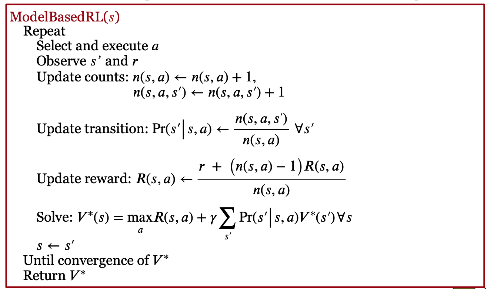
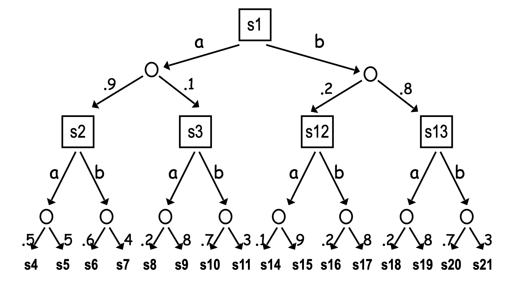

Model-free RL 的问题是：需要大量的取样。这些采样需要平衡“利用”和“探索”。因为要进行“探索”，所以其采样的效率是不高的，因此需要海量的实验。

Model-based RL 可以改进这个问题：它在每次实验后，更新 Transition 和/或 Reward 模型，然后基于模型，做 Value Iteration 或者 Policy Iteration。下图显示了做 Value Iteration 的 Model-based RL：

如上图所示，每次实验后，我们会根据实验结果，首先更新 Transition 和 Reward 模型，然后做 Value Iteration，更新各个状态的 V。

上面算法的 Transition 和 Reward 模型的更新非常简单，就是做统计平均。这对于 s 数比较少的情况下，是合适的，但是，当 s 的数量很大（比如机器人的控制、游戏），就不适用了。

因此，我们用函数近似的方法来获得它们。这有两种方法：

第一种是线性模型：用一个高斯分布，来近似 Transition 模型。该高斯分布的均值为 S 的向量 x 的 w 线性加权；

第二种是非线性模型。这包括基于高斯过程（Gaussian Process）的随机模型和基于神经元网络的确定模型。

利用上述模型对 Transition 和 Reward 模型进行梯度下降优化后，我们可以基于更新后的模型，产生样本，然后基于这些样本，做 Gradient Q-learning，更新 Q 函数。注意，这时，只是采样部分的 s 和 a 的”经验“（Experience），进行更新。这叫 “Partial Planning”。该算法如下图所示：

Model-based RL (with Q-learning)

注意，Partial Planning 是基于模型“生成”样本，这和我们前面说过的 Replay Buffer 不一样。Replay Buffer 是真实的样本存起来。因此，Replay buffer 只能基于历史，而 Partial Plannning 能够通过模型，扩展到其它 s 和 a 的组合情况。因此，泛化能力要比 Replay Buffer 更强一些。

Partial Planning 有一些改进，比如 Dyna-Q 方法。它和 Partial Planning 从模型生成的样本中学习 Q 不同，Dyna-Q 直接从实验中学习 Q。

还有一种重要的方法，即蒙特卡洛树搜索：它不从随机状态开始 Plan，而是从当前状态开始 Plan，构造搜索树。如下图所示。

因为搜索的空间巨大（比如对围棋游戏的搜索），所以，在搜索过程中，采取三种方法：

首先，对叶子节点，用默认策略的值，作为它的 Q；
其次，对 Chance 节点，基于 Transition 模型进行采样，近似获得 Q；
最后，对决策节点，仅仅扩展最有潜力的 Action，然后用这个 Action 的 Q 值作为 V 值。

### AlphaGo

AlphaGo 横空出世，用深度 RL 训练围棋机器人，打败了世界冠军。它就用到了基于 Model 的学习。具体来说，它包括四步：首先，利用棋谱，进行有监督的学习，训练 Policy 网络；然后，它用这个 Policy 网络，做 Policy Gradient；然后，用 Value 网络，做 Value Gradient；最后，它基于 Policy 和 Value 网络，做蒙特卡洛树搜索。

## 课程材料

- 滑铁卢 CS486 人工智能 Model-based Reinforcement Learning slides
- 滑铁卢 CS885 Model based Bayesian RL slides
- Silver RL 2015 Lec 8: Integrating Learning and Planning [website](https://www.davidsilver.uk/teaching/), [video](https://www.youtube.com/watch?v=2pWv7GOvuf0)
- DeepMind UCL Hadovan RL 2021 
  - Lec 8 Model Based Reinforcement Learning
  - Lec 10 Approximate Dynamic Programming
- Berkeley CS285 
  - Lec 10: Optimal Control and Planning, [slides](https://rail.eecs.berkeley.edu/deeprlcourse/), [Youtube Video](https://www.youtube.com/playlist?list=PL_iWQOsE6TfVYGEGiAOMaOzzv41Jfm_Ps)
  - Lec 11: Model-Based Reinforcement Learning, [slides](https://rail.eecs.berkeley.edu/deeprlcourse/), [Youtube Video](https://www.youtube.com/playlist?list=PL_iWQOsE6TfVYGEGiAOMaOzzv41Jfm_Ps)
  - Lec 12: Model-Based Policy Learning, [slides](https://rail.eecs.berkeley.edu/deeprlcourse/), [Youtube Video](https://www.youtube.com/playlist?list=PL_iWQOsE6TfVYGEGiAOMaOzzv41Jfm_Ps)
- Berkeley Deep RL Bootcamp 2017, Lecture 9 Model-based RL -- Chelsea Finn ([video](https://youtu.be/iC2a7M9voYU) | [slides](https://drive.google.com/file/d/0BxXI_RttTZAhRTBqQmc5R0pGQlE/view?usp=sharing&resourcekey=0-iPmbJTrQ8-BoCFdRKPh4rQ))

## 课本材料

- [SutBar] Chap. 8

## 练习

- 伯克利 CS285 HW 4: Model-based reinforcement learning, [Website](https://rail.eecs.berkeley.edu/deeprlcourse/)

## 论文

滑铁卢论文
- Michael O’Gordon Duff’s PhD Thesis (2002)
- Vlassis, Ghavamzadeh, Mannor, Poupart, Bayesian Reinforcement Learning (Chapter in Reinforcement Learning: State-of-the-Art), Springer Verlag, 2012

斯坦福 CS 224r 论文： Model-Based RL
- Deep Dynamics Models for Learning Dexterous Manipulation. Nagabandi et al. (2020)
- Model-Based Policy Optimization. Janner et al. (2019)

 

|[Index](index) | [Previous](18-irl) | [Next](20-offline-rl) |
