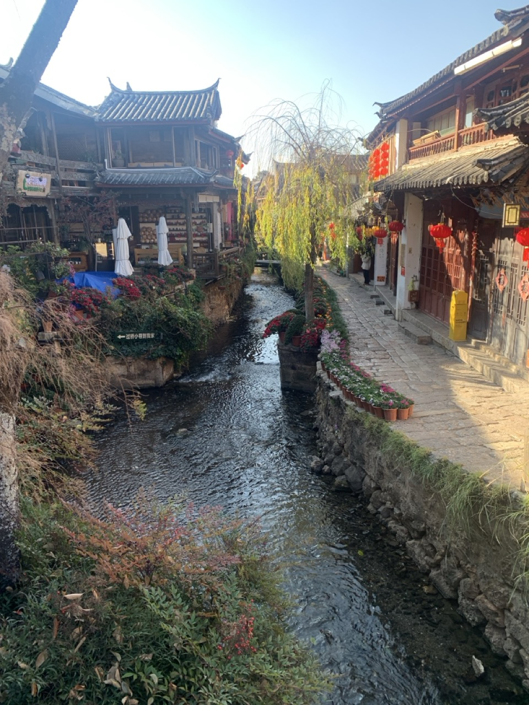
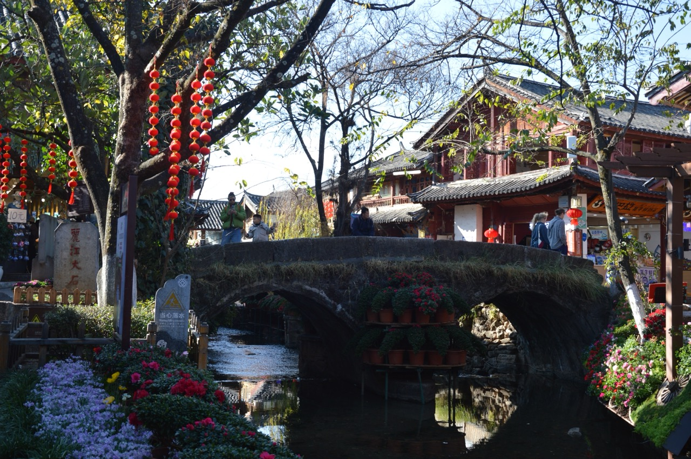
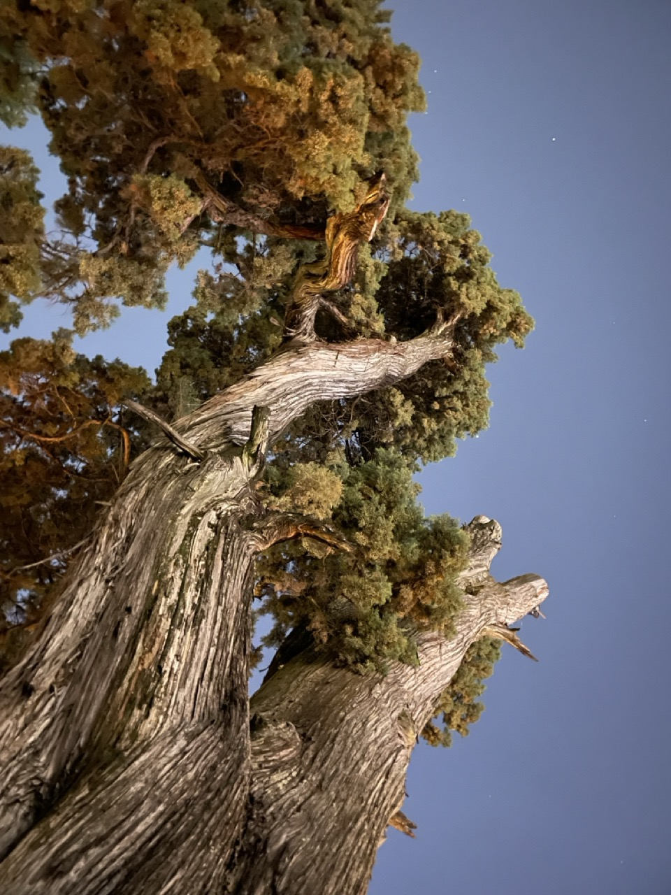
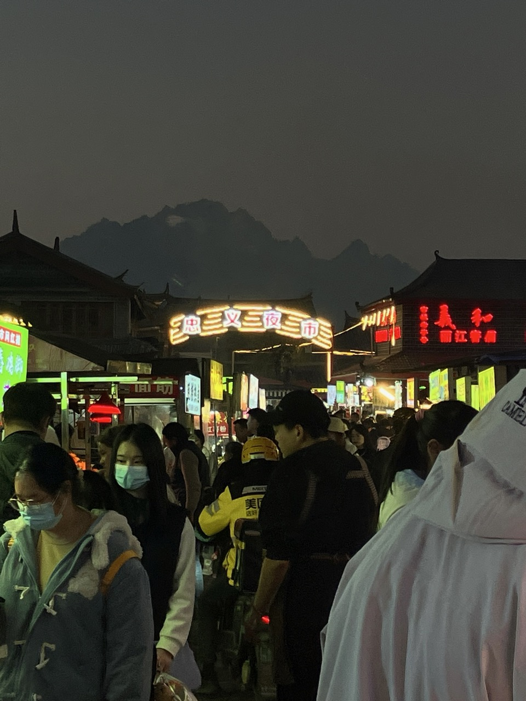
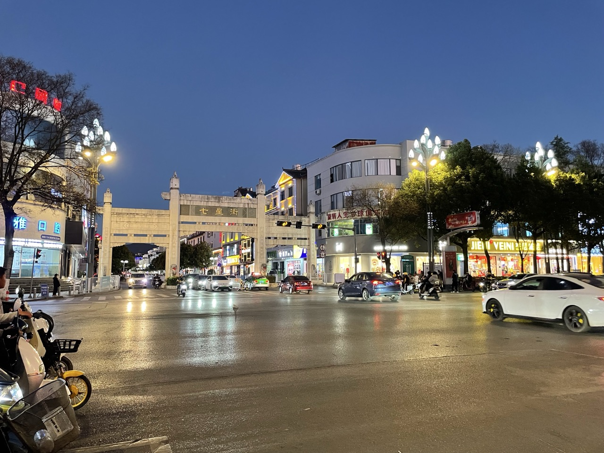

家人选择住在红太阳广场旁边，这样的话，去黑龙潭、新城、古城都很近。这个优点非常重要。

## 古城

探访古城的最佳时间是清晨。下面是我们看到的此时的古城：

我们遇到一对老年夫妇。他们头上戴着花，拖着行李箱，走走停停，在小溪和花丛中互相拍照，很有意思。

我们还遇到了三个小朋友。她们穿着古城志愿者的红马甲，拿着工具，在捡拾道路上的垃圾。

我们听到小鸟的叫声和小溪潺潺的流水声。

太阳升起后，各种音乐和叫卖声就此起彼伏，路上挤得水泄不通了。

晚上，我们避开人群，来到狮子山顶这株 520 岁的古树身边，看到它，非常震撼。如下图：

## 忠义市场

路过忠义夜市，我们进去凑个热闹。如下图：

忠义市场这是本地人的集市。里面各种水果小吃种类丰富，价格实惠，其中不乏几十年的老铺，很有意思。

## 新城

我们也去了新城。满街的店铺，密密麻麻。七星街似乎是丽江商业的主街。服装店、超市、购物中心，买东西非常方便，它的入口如下图所示：

就像任何一个南方的城市一样。

 

|[Index](./) | [Previous](0-intro)| [Next](3-mufu)|

