因为住在黑龙潭附近，过去只需要5分钟，所以我们一共去了黑龙潭三次：两次看日照金山，一次看东巴博物馆，从容、深入地探访了黑龙潭和象山。

来丽江的第一个心愿就是看日照金山。家人平时很难早起。但到了丽江的第一天晚上，就跃跃欲试地问：明天几点起？听到她这么问，我们都很兴奋。

随着太阳升起，在水波的映照下，玉龙雪山从头到脚，一点点披上温暖的金色，让我陶醉，如下图：

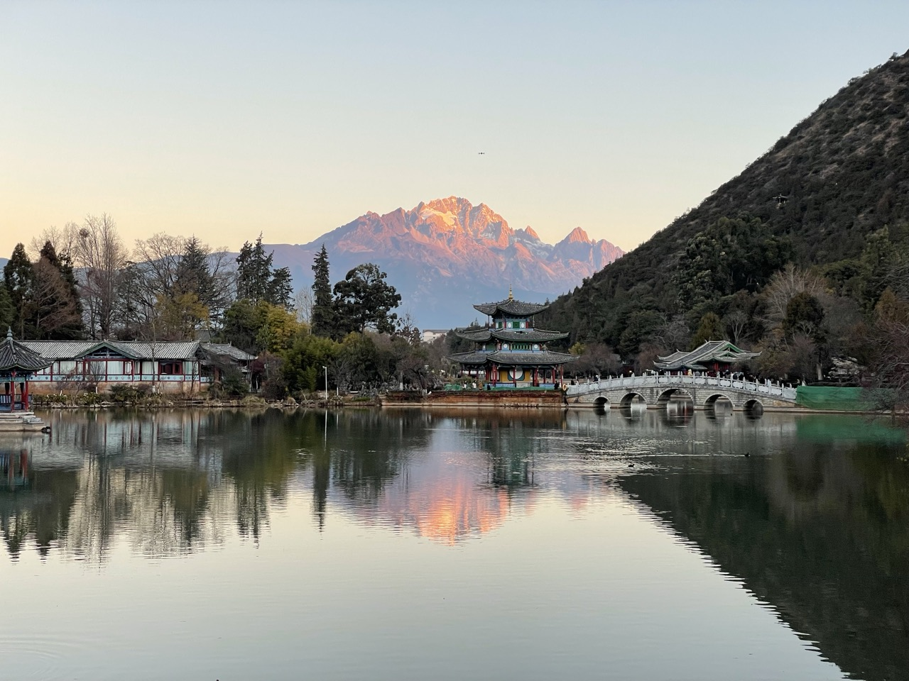

除了看日照金山，黑龙潭本身是一个具有很古老历史文化的地方，值得一游。如上图所示，在玉龙雪山的前面，是五凤楼。徐霞客来丽江时就住在楼里。它有三叠⼋⾓飞檐，每个⽅向的檐⾓都像展翅欲飞的凤凰，所以叫“五凤楼”。

日照金山之后，我们首先走到上图中的小桥桥头，看到了一株盛开的、清香扑鼻的梅花，如下图：

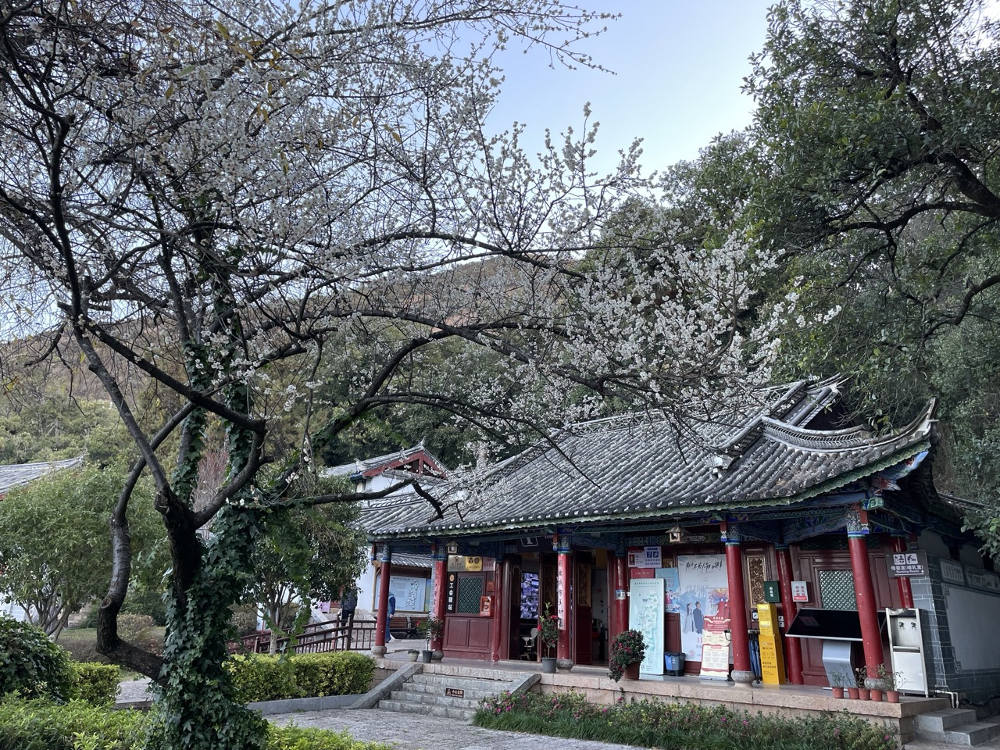

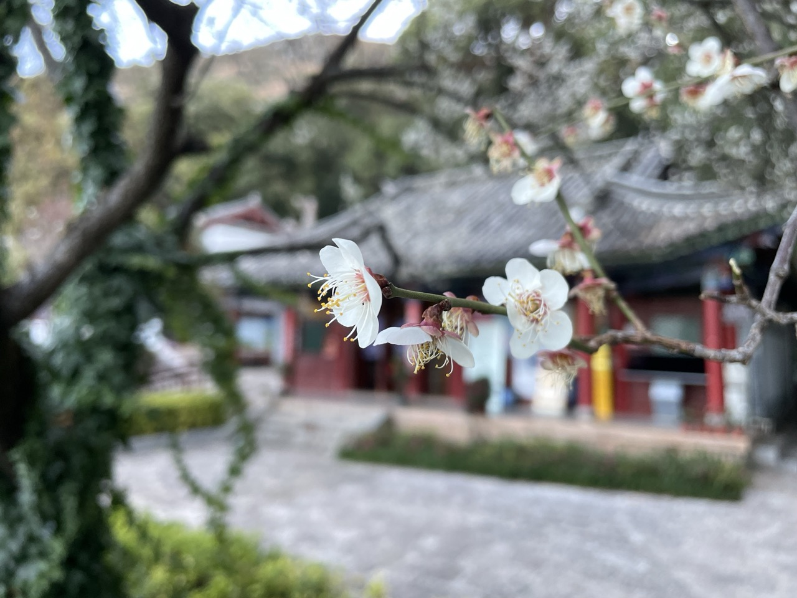

我们都很喜欢这一株梅花，在它的下面停了很久。这是我今年见到的第一株梅花。没有想到这里的梅花在春节就开花了。怪不得大家说云南是四季如春。

在桥头有晨练的老人在做类似八段锦的健身运动。我跟着他们舒展了一下筋骨。

这时，一位路过的年轻小伙子停下来问我：你看到日照金山了吗？我说我看到了。他说什么样？我就打开手机给他看。原来他从公园的北门进来的，而看日照金山的最好的位置是在南门，所以他没有赶上。

你能发我照片吗？他问。

怎么发？我问。

加我微信？他说。

我犹豫了一下，心里闪过最近缅北电诈团伙的新闻，想：他会不会是以此为借口，然后把我作为他的私域流量，进行运营？

我看了一下他的眼神，感觉不象，就加了他的微信，把照片发给他。后面看他的朋友圈，发现他是一位象徐霞客一样的旅行者，我就放心了。然后反思自己是不是对在北京时接到的各种骚扰电话、微信反应过度了。我现在在丽江哎。一个人愿意一大早走出来，感受雪山和大地，应该是真诚的吧。我想。

在清新的空气中，我们路过一棵横躺在地上，已经被湿漉漉的苔藓铺满了的大树。如下图：

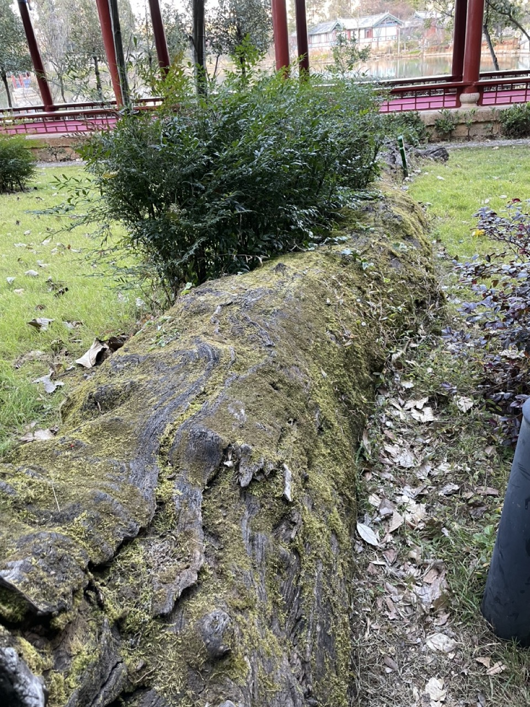

它躺在这里应该好多年了，我想。

路过湖边另外一棵大树，我留意了挂牌上显示的它的年龄：250 年。我抬头看它的树冠，很喜欢它叶子的形状。如下图：

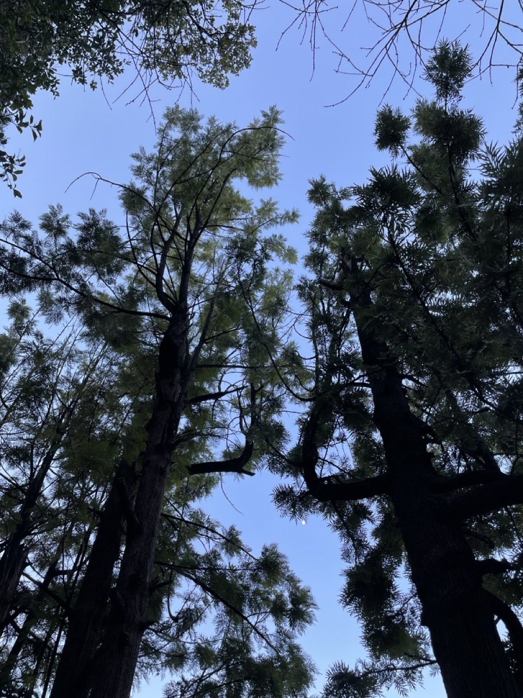

月亮正好从两棵树的中间露出脸来，如下图：

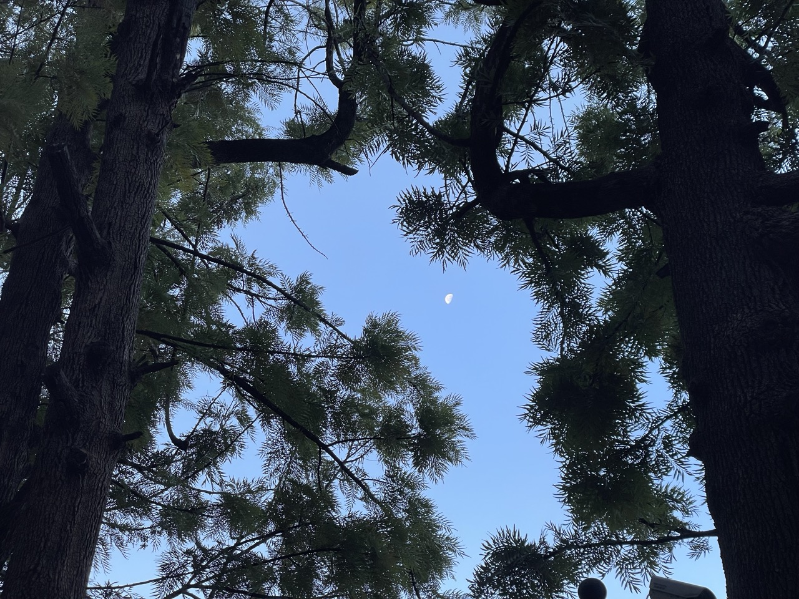

我感到宁静。这个时候和家人在一起，我感到很满足。从北京出发时，家人问我想做什么。我说我什么也不想，就想找一个地方，静静地坐着，什么也不做。现在我的这个想法变成现实了。我很高兴。

从黑龙潭回来后，家人意犹未尽，说：我们再去一次。于是，第二天一早，我们又去了。

这次，我们看到云雾缭绕，把玉龙雪山藏起来了。我们没有放弃，继续等着。随着太阳的升起，云开始变薄，雪山露出来了。如下图：

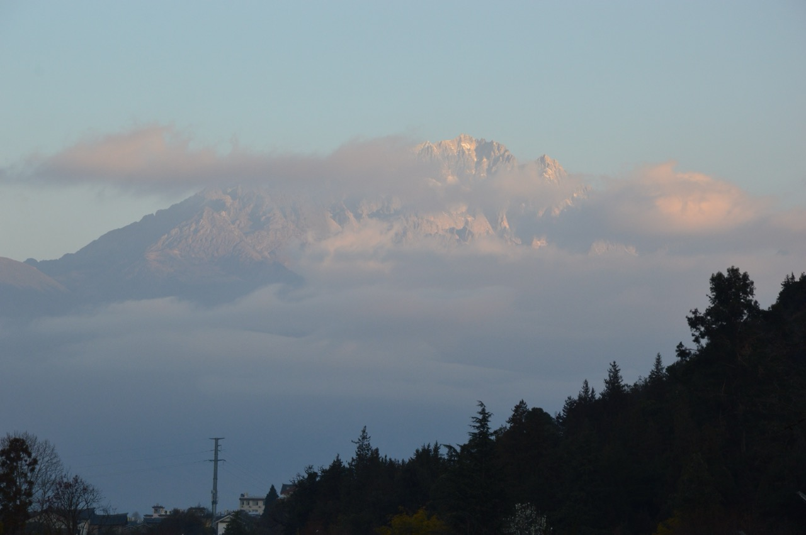

如上图所示，我发现玉龙雪山的这种犹抱琵琶半遮面的姿态，更加迷人。太妙了。

家人走到前面的桥上去了。我在公园地图上看到一个叫“梅园”的地方，我就往这个地方走去。走进梅园，发现里面正在整理地面，并没有梅花，而旁边有一扇小门，是上山的路。

走上小路，迎面一位穿着运动装的男士正下山。看来这是一条登山步道。我就往山上走去。

山上都是松树，空气清新。走到半路，我能看到松树隐映下的山下的古寺，如下图：

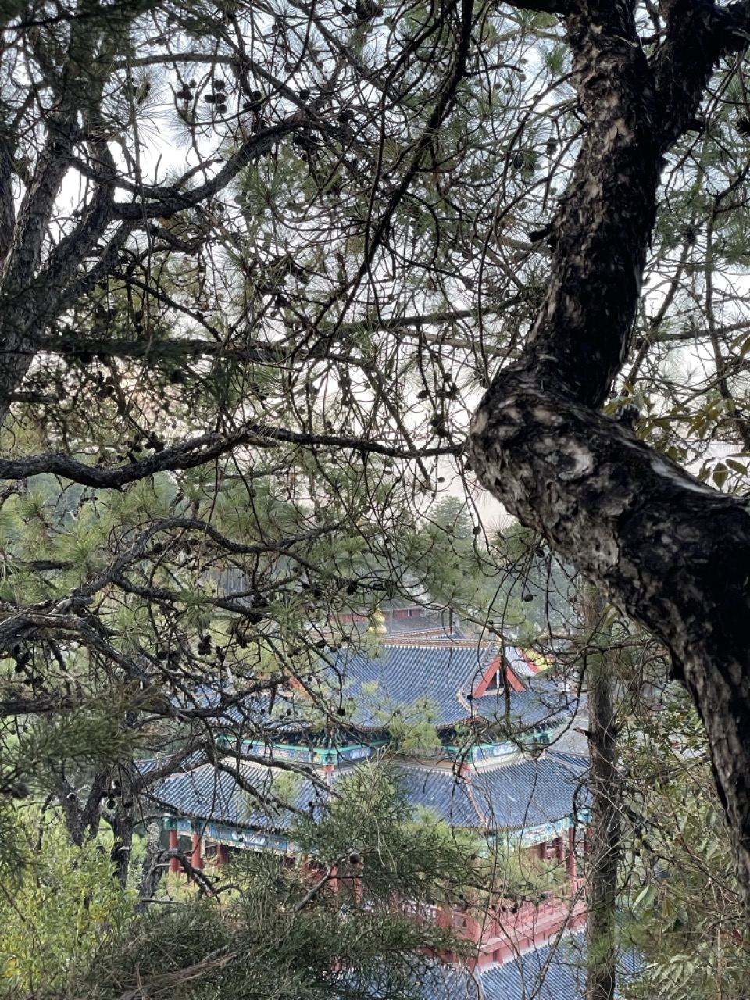

再往上走，能看到远处朝阳中的丽江城区，如下图：

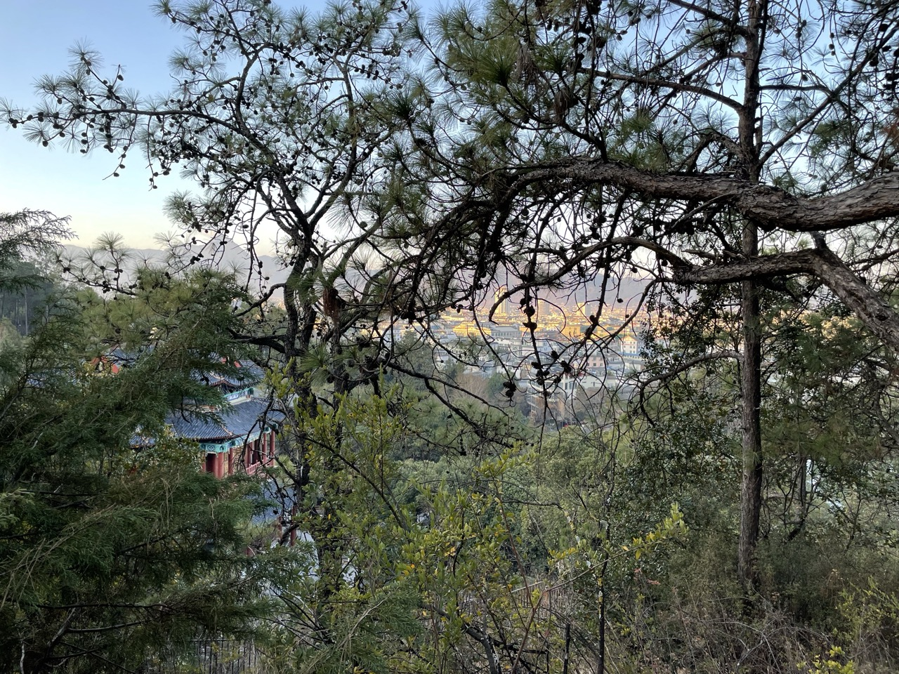

再往上，走到太阳照到的地方，视野就开阔起来，能够看到群山怀抱中的整个丽江。

在西南面，白云飘在山顶上，如下图：

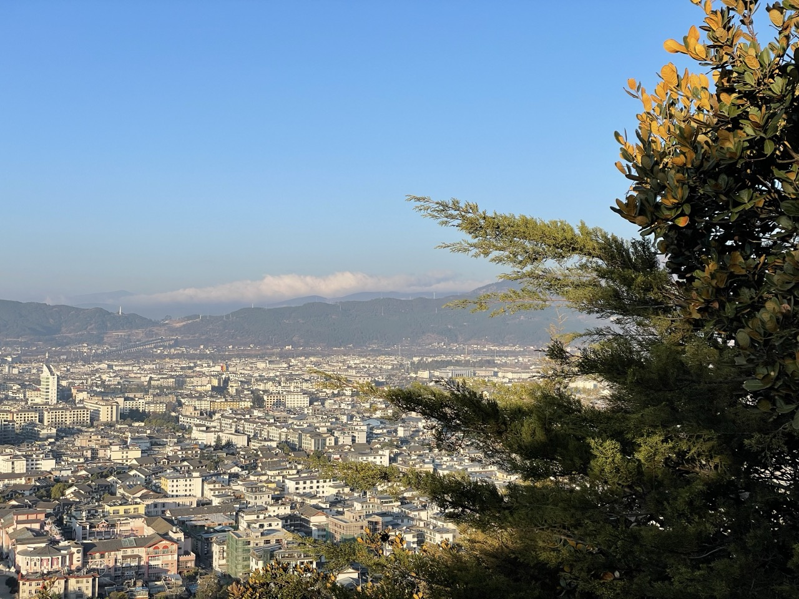

在南面，有一座象金字塔的山峰，上面还飘着旗云，如下图：

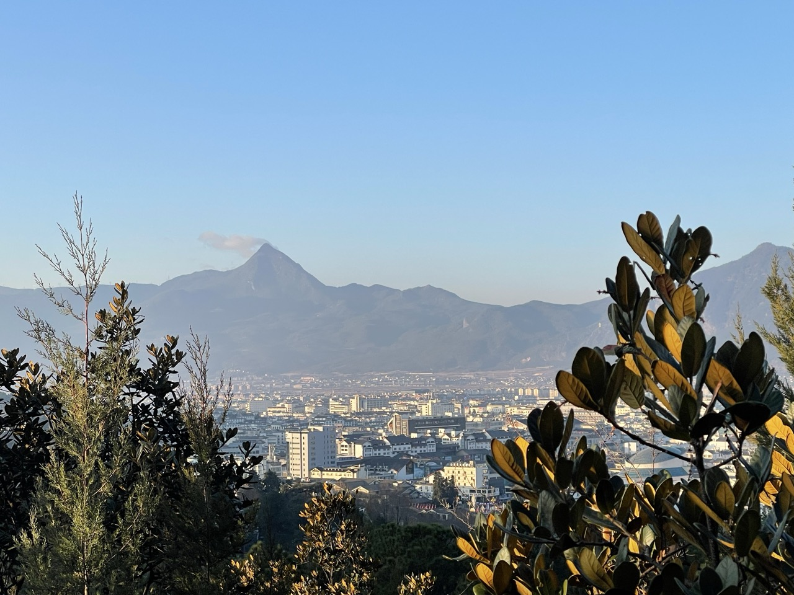

而东南面，丽江古城正安睡在狮子山脚下的薄雾中，那么安宁，如下图：

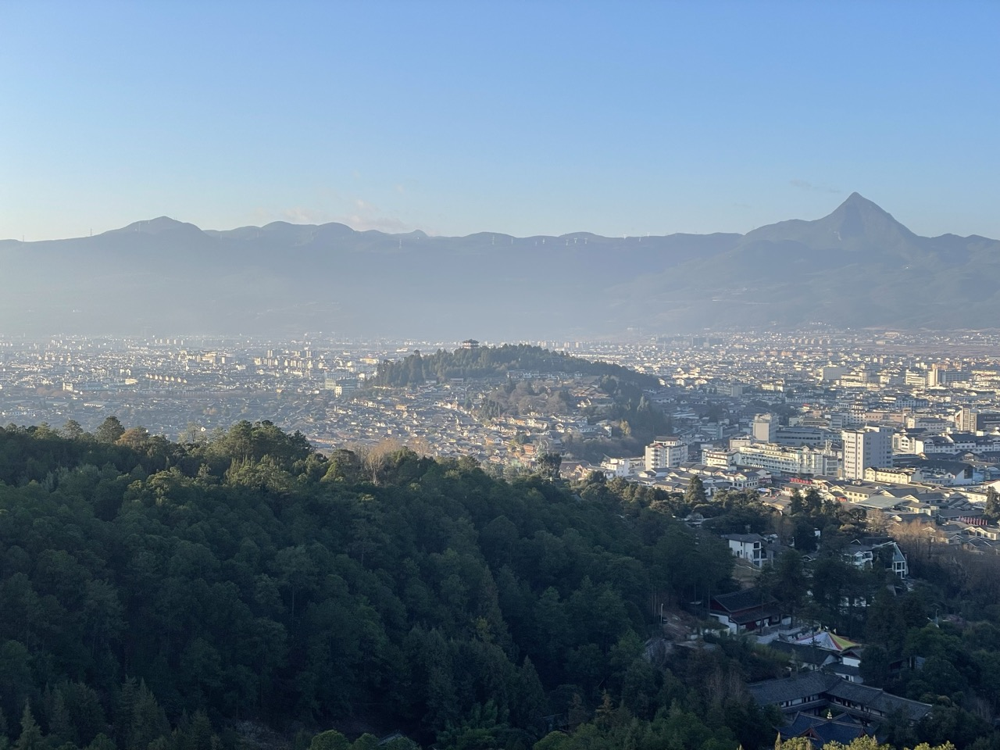

山谷中郁郁葱葱的树木，让我想起在京都岚山看到的葱翠的树林。绝景啊，我想。

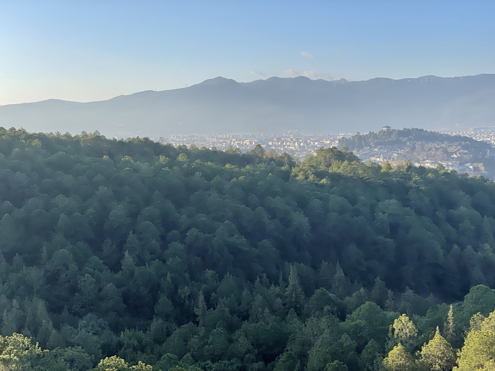

这时，在太阳升起的方向，一位妈妈带着两个孩子沿着上山的路向我走来。孩子走在前面，妈妈在后面提醒着，要慢一点走。如下图：

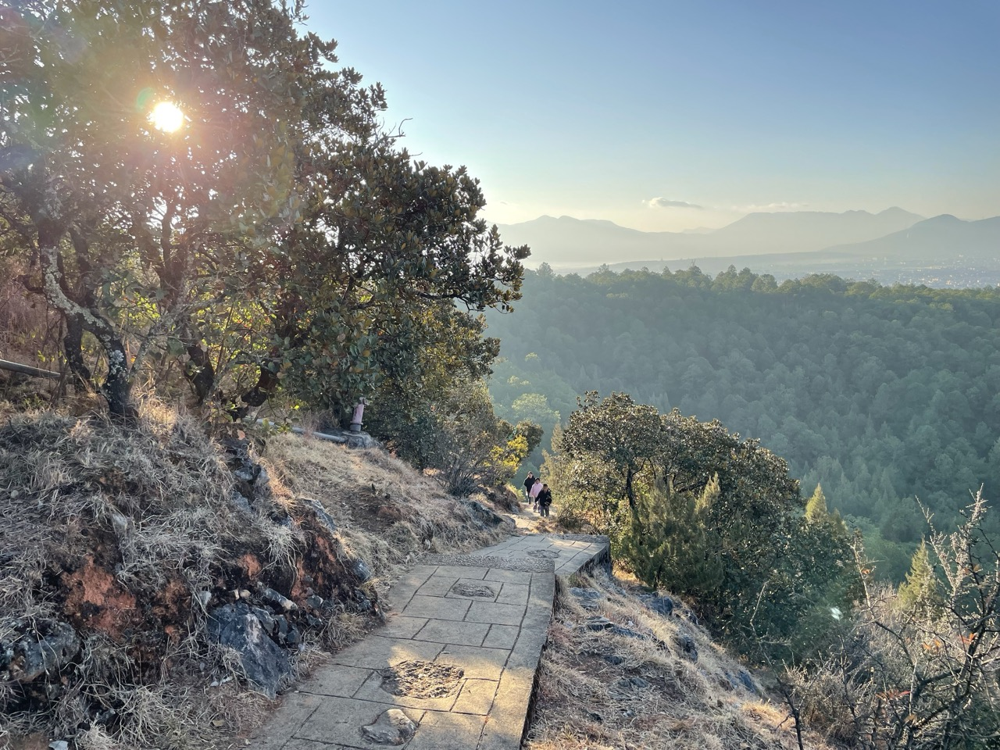

她们走过我的身边时，我想：她们怎么会这么早，来爬这座山。多少年后，这两位孩子，想起妈妈的时候，会不会还记得这一个清晨？

我给山下的家人打视频通话，分享我看到的。我然后用手机对着下面的湖边，把摄像头放大到最高倍数，依稀看到了站在湖边的她们。我要她们向山上看，向她们挥手。

一片宁静中，我沐浴着阳光，看着眼前的丽江，呼吸着清新的空气，感到旅行就是如此。

第三次进黑龙潭是为了看东巴博物馆。博物馆5点关门。我看了前面的文化遗产的展厅，就关门了，因此没有看完。

在这里我看到 2003 年中国青年报的报道《[失去了他们，我们拿什么和世界对话](https://zqb.cyol.com/content/2003-09/09/content_729983.htm)》，其中云南省社科院副院长、著名民族学家杨福泉博士介绍了东巴古籍文献保护的艰辛，东巴文化下一代培养的不易。他提到福特基会会曾经资助过“纳西族文化传人培养”项目，大自然保护协会曾经资助过年轻东巴培养项目。项目培养的东巴和秀东还随杨福泉赴美国华盛顿州瓦拉瓦拉市惠特曼学院和加州匹茨尔学院，参加了为期半年的“中国西南纳西族文化学年”文化教育交流活动。期间在绿草如茵、飞鸟啁啾的校园里，举行了一次“署古”（祭大自然之神）仪式。我很高兴。

回到北京，我发现《孤独的星球》上还说：在黑龙潭有件趣事可做，就是逗鱼。这⾥的鱼会嗑⽠⼦，记住，得是葵花⼦。很有意思。

虽然这次没有逗，但没关系，相信我还会回来的。

 

|[Index](./) | [Previous](5-xuxiak)| [Next](13-bicycle)|
