《孤独星球》推荐的骑行线路，从大研古城一路通往束河、白沙。我喜欢骑车，这条路线简直为我量身定做。

感谢阿里巴巴集团、支付宝和哈喽单车。我发现它正好在我们的骑行线路上划了一道窄窄的服务区，让我们可以从古城一直骑到白沙。

骑行道宽阔平整，划线清晰。与北京不同的是，道路两旁松柏成荫，远处雪山清晰可见，空气清新得让人不自觉地加快了脚踏板的频率。如下图所示：

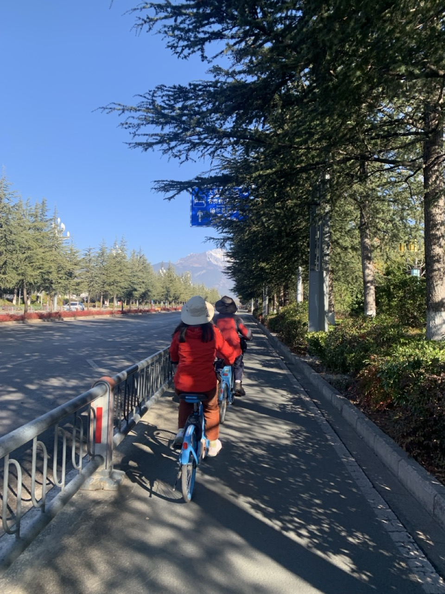

一路上没有其他人骑自行车车。一辆电动车超过我们。坐在上面的看起来也是旅行者的年轻人们对我们说；真厉害。

## 束河

到了束河，拐进一些无名的小巷，有时候会遇到意外静谧的角落，如下图：

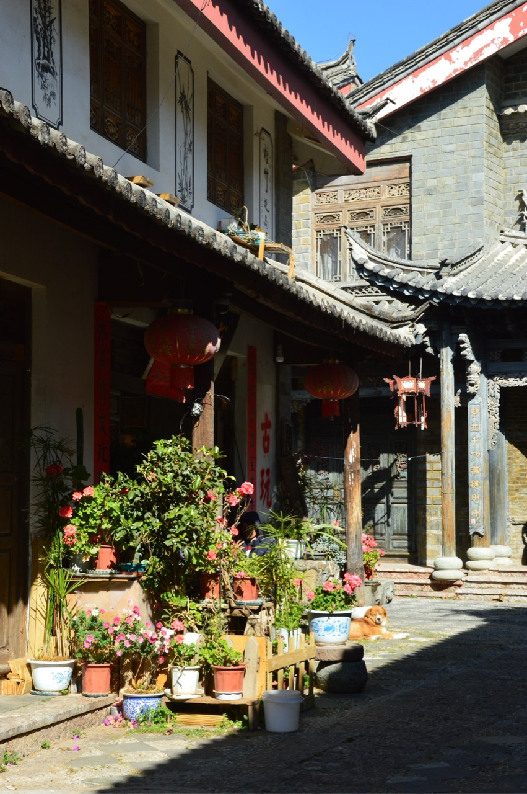

我找到《孤独的星球》上介绍骑行线路时提到的“拐柳巷”。我想，书上特地提到这条巷，一定有原因。它的入口如下图：

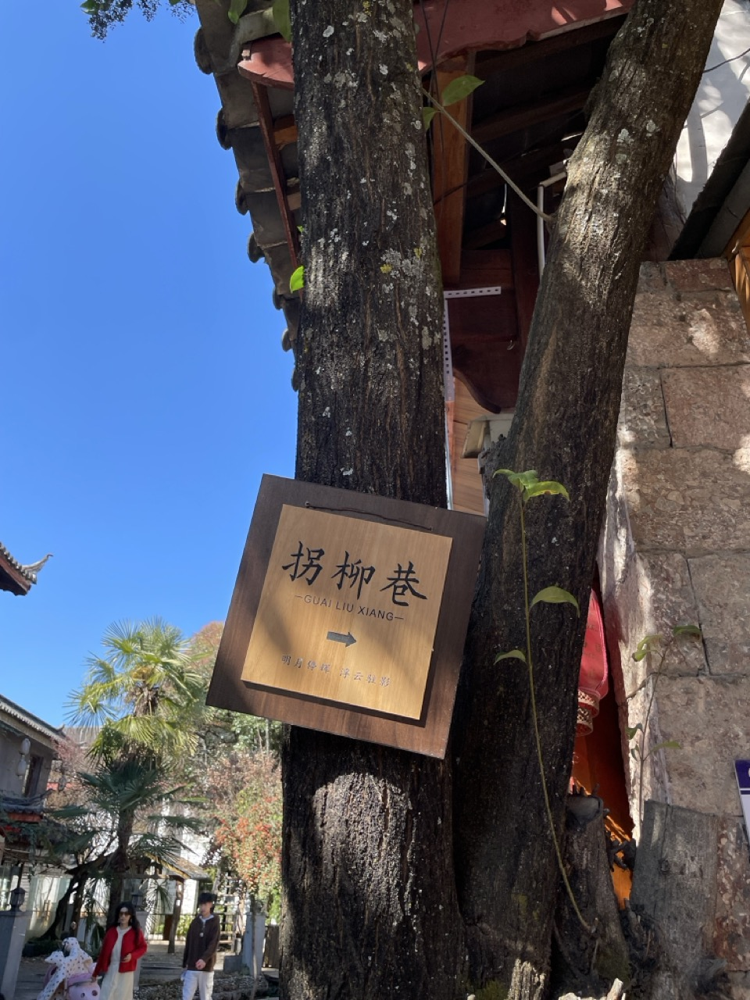

拐进“拐柳巷”，发现它果然有点不一样：周围变得安静，两边的房子设计精妙，有一股溪水冲入巷中，然后顺着小巷流淌。

在一处溪水婉转的地方，我们停了下来，看着阳光打在流淌的溪水上面后，被反射到旁边的石头上，在石头上流动、变幻。我们看着光影在石头上变幻，时间像是静止了。

就呆着，什么也不做，这就是我的目标。

中午时分，家人说饿了。我们就一路找到了 2014 年版《孤独的星球》推荐的束河餐厅：呆呆妈妈私房菜。

到了餐厅门口一看，大门敞开着。如下图：

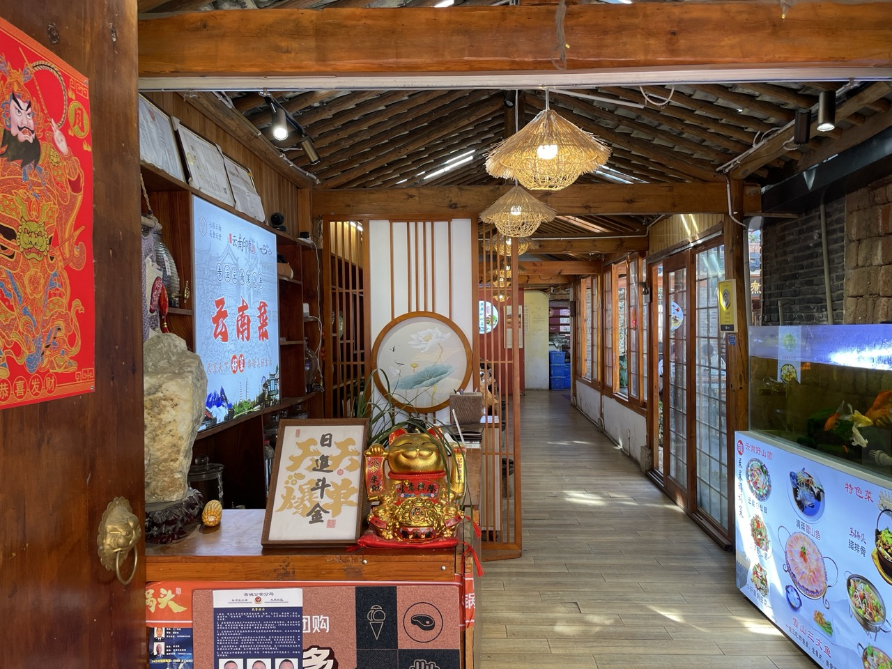

走进去，没有一个客人。老板正蹲在阳光下的院子里喂猫。看到我们，高兴地说：来了？请坐！

看到店里一个客人都没有，我心里七上八下：会不会踩雷？

先点菜。看网上大家推荐“纳西烤鱼”。我犹豫地问：有鱼吗？心里想：即使有，估计也不新鲜。

老板说：现在没有，但打个电话，5 分钟后就送来了。我松了一口气，因为这样的话，至少是一条活鱼。

点完菜，老板就忙去了。我走到厨房门口一看，发现虽然人气还没有恢复，但厨房里干净、有序。

我发现这是一个两层的院子。走到楼上，我看到二层还有好几个关着门的包间，里面餐桌椅随意地摆放着，显示很久没有用过了。

阳光很好。玉龙雪山的山顶从院前的屋瓦后露出了一个角。

吃饭了。纳西烤鱼炸得酥脆，味道很好，上面的花生米也是新鲜炸出来的。另外的一道豆腐也烧得很好，如下图：

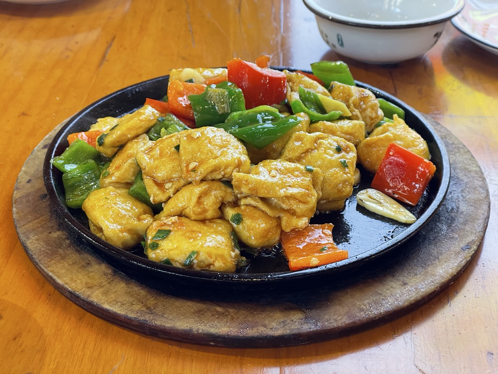

《资治通鉴》说：看一个人，要看他在飞黄腾达的时候都和什么人交往，也要看他在跌入谷底时坚持不做什么。看到店家在这样的处境下对餐厅的品质还是选择不敷衍，我觉得可以。

厨房外面是店主和孩子的书房，有点凌乱。大人书桌旁的墙上挂着一副字，孩子桌前也有一个镜框，里面写着字，如下图：

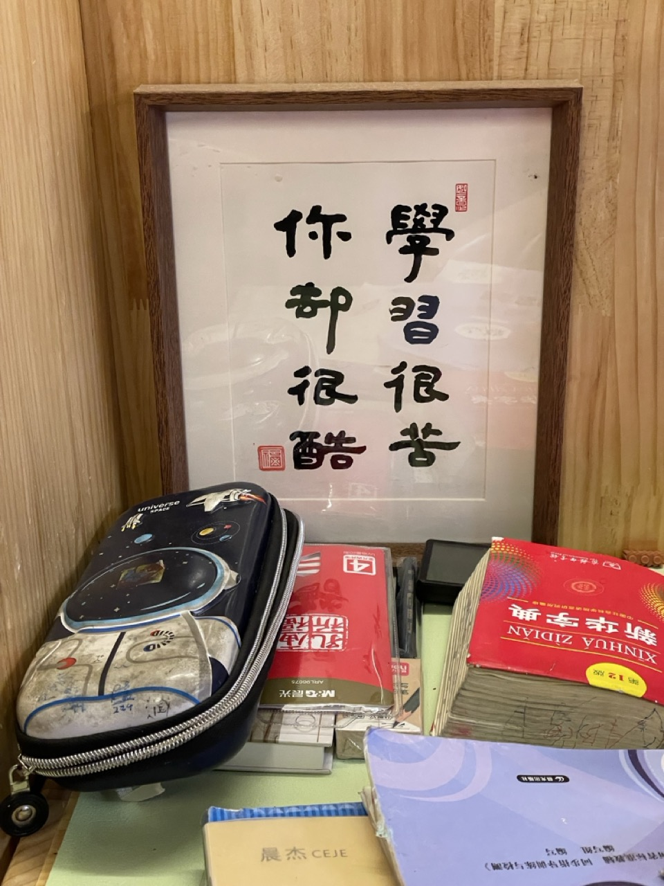

这八个字让我五味杂陈。苦，是这些年的坚持。这几年来，店家应该经历过从辉煌到绝境的整个过程了的。这个过程中的苦，怕只有他们自己才知道。酷，则是逆境中依然保有的自我。不管世界怎么变幻，不随波逐流，一直秉承自己的内心，用这种方式度过苦难。

店家的孩子和她的朋友在店里跑进跑出。我站在店门口，看到一个孩子从远处沿着小巷跑来，如下图：

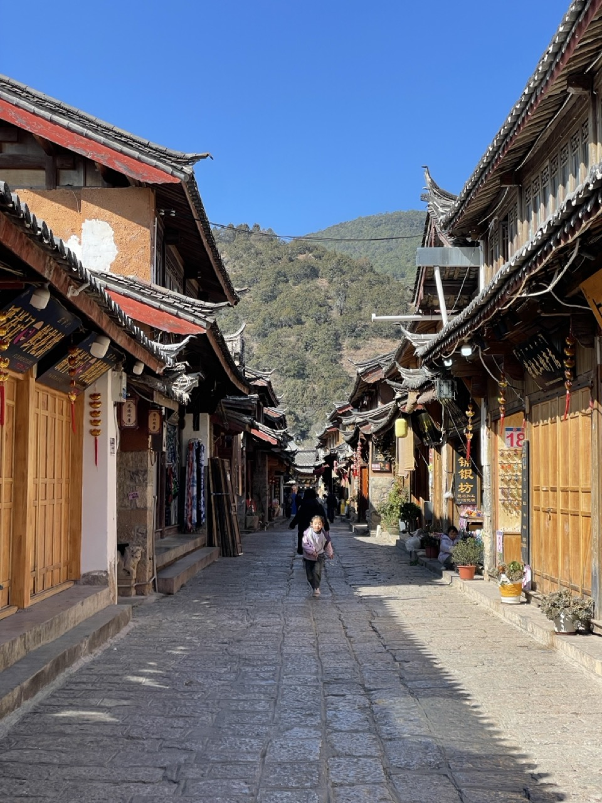

看着她幼小的身影和奔跑的样子，我突然明白了他们为什么仍在这里 —— 这不是他们的生意，而是他们的生活。

我看了看店家孩子摆在桌上的作业，很想对她说些什么，又不知道该说什么，就在心里说：后会有期吧。

## 白沙

午饭后，我们继续开启哈啰单车，向白沙骑去。如下图：

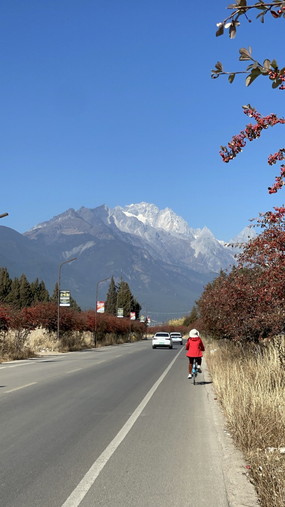

骑行越往北，视野越开阔。雪山就在前方，田野在脚下。路边的牛群低头吃草，风吹过来，带着青草气息，如下图：

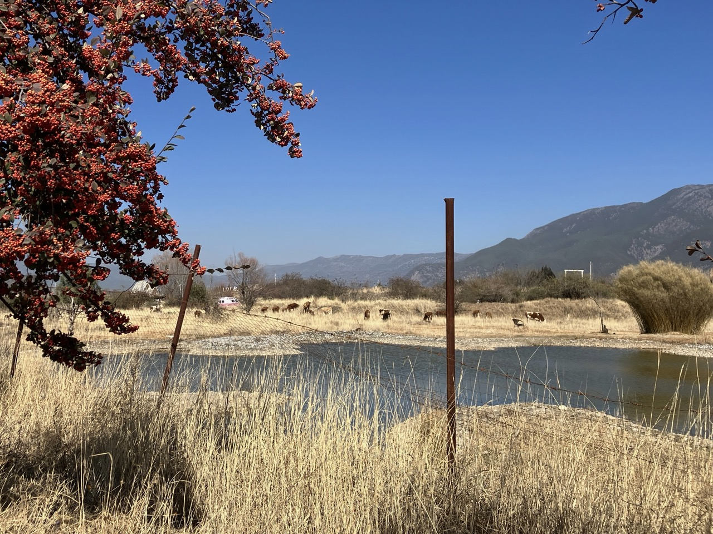

接近白沙以后，路上的机动车多了起来。道路因为负荷大，也常常出现断裂，没有前面的路那么平整。到了白沙后，交通拥挤，我们就只有推着车走了。

找到一个哈啰单车上标记的停车点，发现这个点已经变成了一个花坛。于是就试着在附近路边用手机关锁，结果成功了。看来在这里，哈啰单车的定位还是不太精确。

到白沙壁画的门口买票。售票员友好地提醒家人可以买学生票。

走进白沙壁画，里面很安静。如下图：

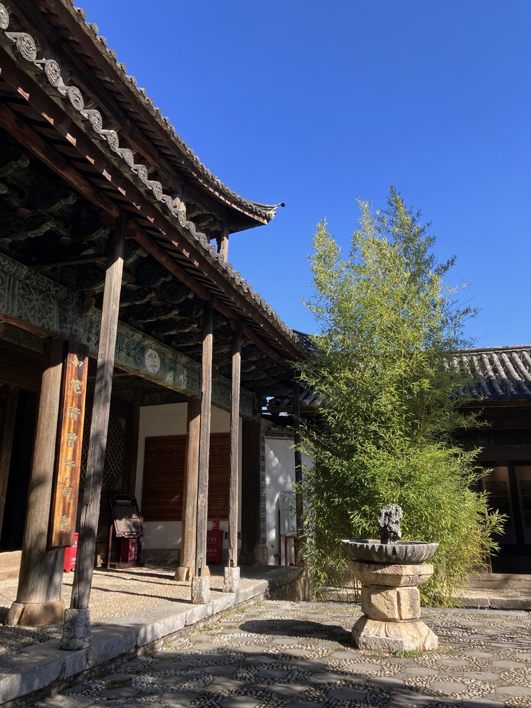

柏树高耸。我们在树下坐了很久，听风穿过树冠。偶尔传来几声鸟鸣，像是把这片院子与尘世隔开。

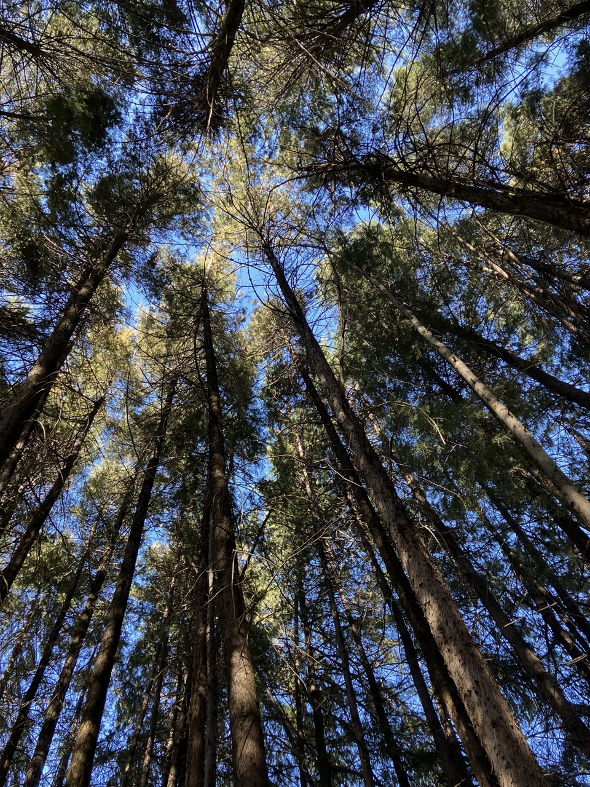

后来我们发现这就是《木府传奇》中多吉大师为阿勒邱、徐霞客疗伤的地方。

从白沙往雪山方向还可以骑行到玉湖。洛克就住在玉湖村。但这段路就有一些上坡了。因为属于亲子骑行，要控制骑行的难度，我们就没有再骑了。

返程时，我们坐上慢速公交。等公交车的时候，我们发现有两种车：一种是旅行专线，直达丽江，快一些，10 元；一种是普通公交车，一路上停很多站，所以慢一些，3 元。等了很久，因此车站候车的乘客越来越多。我开始担心挤不上车。结果，两种车一起来了。大家都挤上了快车。我们看到没什么人上慢车，就上了慢车。

坐在车上，我发现坐慢车很适合我们。慢车上都是本地人。报站的时候，先用纳西族语，然后再用汉语。我听着陌生的纳西话，觉得好像出了国似的，进入一个陌生的世界。这让我想起《消失的地平线》一书中描述的神奇国度。也许我就来到了这个地方？

我想起刚才对无法上车的担心。我以前之所以畏惧旅行，就是因为旅行中充满了不确定性，而城市里的生活消除的就是这种不确定性。也因此，我习惯了日复一日的循规蹈矩的生活。

那旅行在外，我有什么可以依赖、凭借的呢？我只能相信这个世界，相信车最终会来，相信自己随便登上哪辆车，都会到达终点。

从古城到束河，再到白沙，10 公里的骑行道，阳光、雪山、田野和清风一路相随。这是一条真正适合家庭的骑行路线。

因此，我称它为“此生必骑”。

 

|[Index](./) | [Previous](11-heilongtan)| [Next](15-yulong)|
