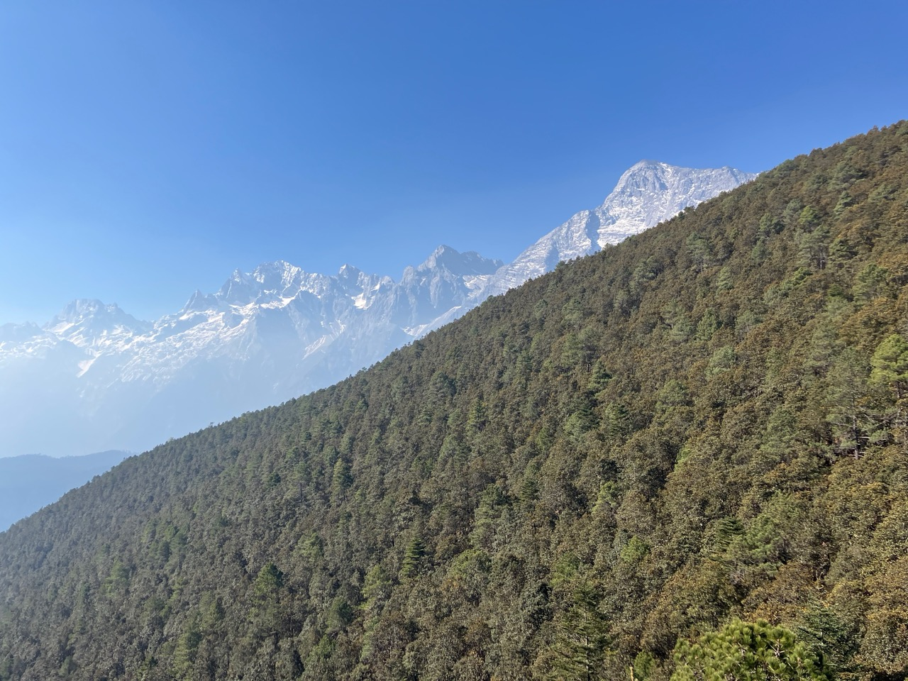
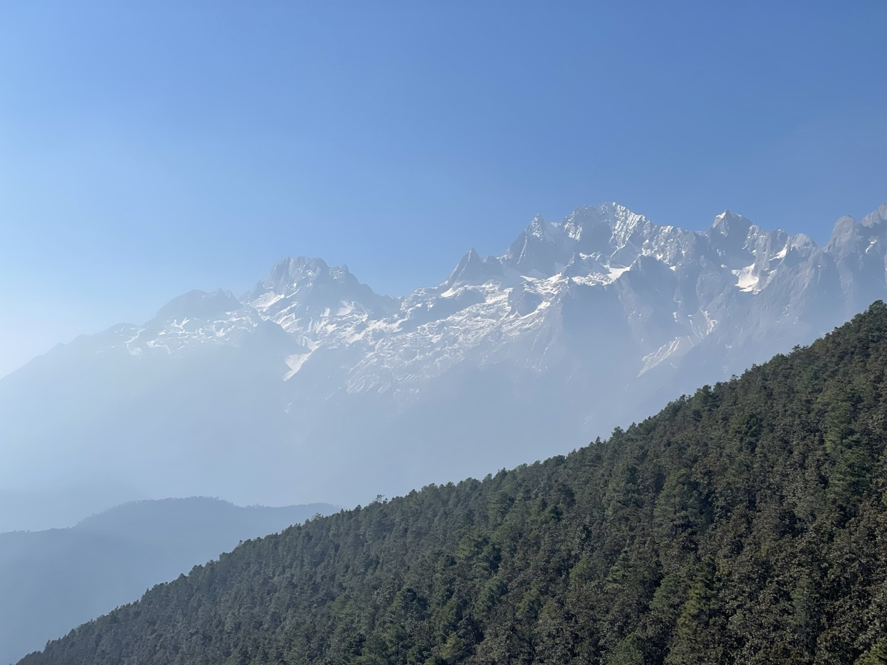

家人在北京的时候，就长时间地跟踪研究了每天玉龙雪山大索道的售票情况，发现早上的票基本上是秒光的。家人推测说应该是大家要一早去看日照金山。但中午的票还是有一些。到了丽江之后，发现中午的票也是秒光了，可能是因为大家都放假来了吧。

因为我的目标是找个地方呆着，什么也不干，所以去哪里其实并不重要，所以我们很高兴地买了牦牛坪索道的票。

上索道的时候，和一位小伙子共坐一车。和他聊天，当他说出 YOLO 这个人工智能模型的名字时，我就知道我和他有共同语言。于是，我向他推荐了吴恩达老师的人工智能教程。他立刻在空中掏出手机，打开 B 站应用，搜出我推荐的课程视频。这种求知的渴望，让我对他刮目相看。

这时，玉龙雪山突然出现在我们左边森林的后面，如下图：

它那么壮丽，让我猝不及防。我顾不得讨论人工智能了，和小伙子说：快，我给你拍照！

然后我再拉近手机的镜头，让雪山离自己更近一些，如下图：

我的心中充满了喜悦。我对小伙子说：我们国家真的什么都有。你看这风景，阿尔卑斯也不过如此吧。

小伙子表示同意。他说：特别是基础设施，比如高速公路，就特别好。我前面刚从大理租了一辆车，带着我姐姐和弟弟，沿着高速，开到了香格里拉，在那里看了梅里雪山的日照金山回来。

他打开手机，让我看他拍的梅里雪山的日照金山照片。这就是我们在 B 站上看过，因此造成了这次丽江之旅的梅里雪山的日照金山；也是我们因为高反和天气的风险而决定此次跳过的日照金山。没想到我在牦牛坪的索道上看到了。难道这是梅里雪山的扎瓦博格听到了我的心愿，因此安排这个小伙子把它的身影送到我的身边？

我在这里没有放牦牛坪看到的玉龙雪山的照片，原因很简单：用照片拍不出它的壮丽。因为牦牛坪离玉龙雪山很近，所以玉龙雪山就在我的面前，高耸入云；又因为在牦牛坪能够看到玉龙雪山的所有13座山峰，所以我面前的是一道山脉。因此，玉龙雪山是在我面前绵延180度的一道直立云天的屏障。它完全超出了相机的能力，即使是全景照片也无济于事，因此，我把它留给大家到现场去亲身体会那种深深的震撼。

牦牛坪的路是环线。家人让我们沿着顺时针方向走。后来，我发现这么走的话，上山时，雪山一路上都在我们的左边陪伴，因此不会觉得寂寞；而如何选择逆时针方向走，那么上山时，山会被左边的高山草甸挡着，因此看不到。这时，因为高原氧气稀薄，走起来就格外枯燥、辛苦。

我们下山时，就迎面碰上两个逆时针上山的高中生模样的小姑娘。她们一前一后，一言不发，一步一喘，垂头丧气地往前走着，给我留下深刻印象。她们从我身边走过后，我突然明白了什么叫“生无可恋”，也理解了为什么我在大学课堂上常常看到学生们的这种表情。

我忍不住回头对家人说：我们往山上走的时候，是很容易生无可恋啊！

那位小姑娘也听到了，回头朝我笑。我就也笑着问她：是吧？加油啊！她点点头，回头向前。

我很感谢一路上遇到的这些年轻人。

 

|[Index](./) | [Previous](13-bicycle)| [Next](17-hutiaoxia)|
