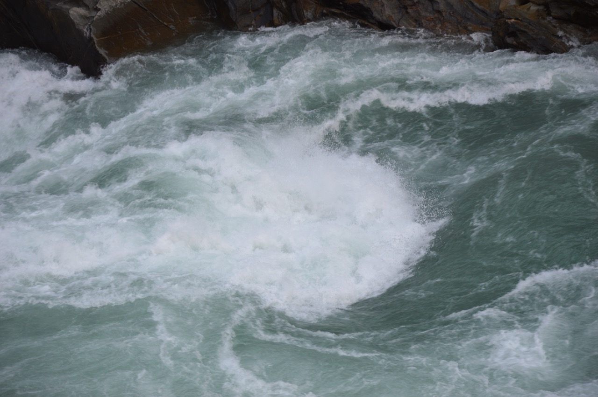
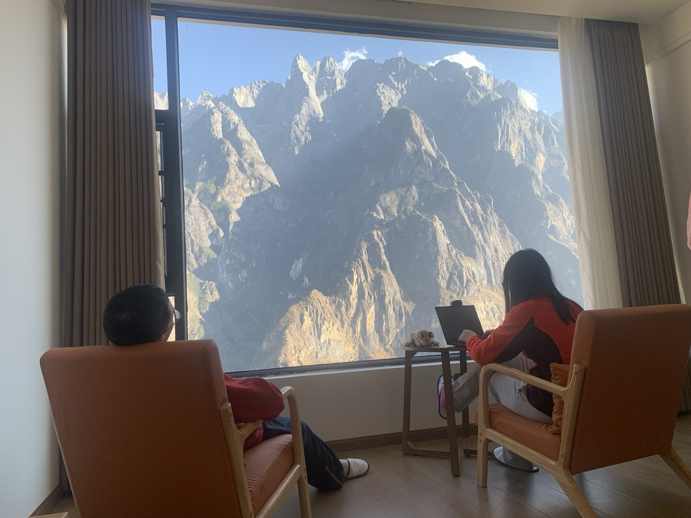
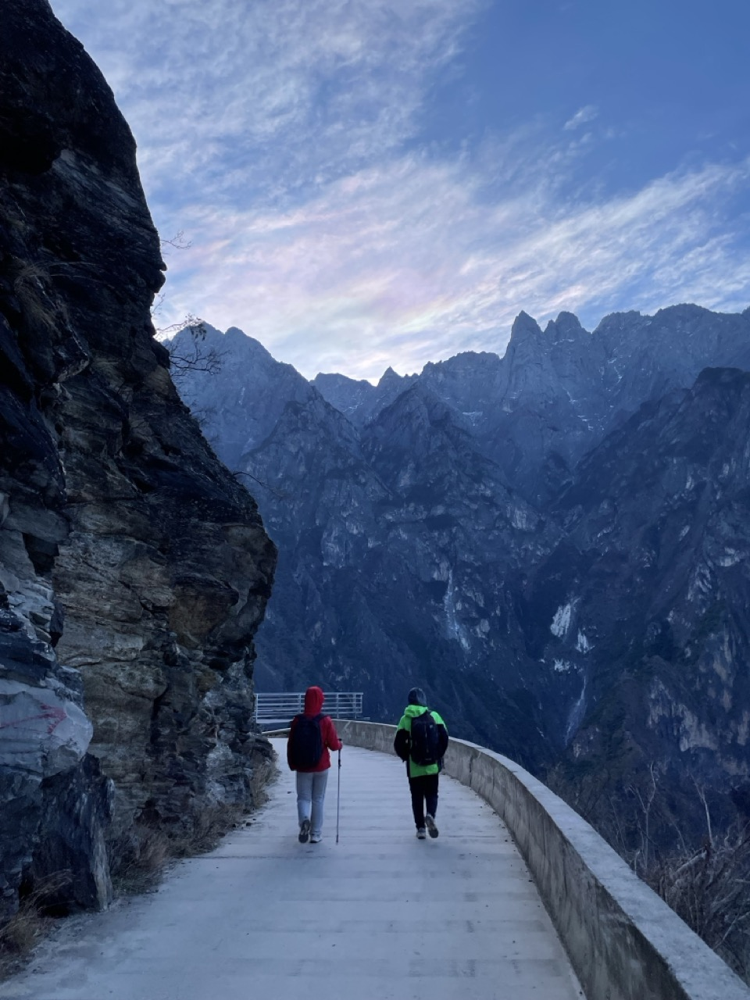

来到虎跳峡，我期待的不只是自然的壮阔景象，也希望和家人一起，在这条世界闻名的峡谷徒步路上，经历一点磨砺。

两天往返。第一天从丽江坐班车到上虎跳景区。看了上虎跳后，包车到茶马客栈，开始徒步。傍晚走到中途客栈所在地区，住下。第二天接着走到 Tinas。体验了一段下虎跳道路的艰险后，回到 Tinas。午饭，休息后，坐 Tinas 班车回到丽江。

## 上虎跳

上虎跳奔涌的江水，让我至今难忘，如下图所示：

上游是巨大的虎跳石。金沙江被虎跳石一分为二，如下图所示：

这块巨石的位置和尺寸都恰到好处。它这一挡，上游水位提高，碧绿的江水不得不从两边飞流而出。一左一右的景象如下面的两图所示：

这两注巨大的水流冲入下面的峡谷，被水面下的巨石阻挡，激起巨大的回旋和浪花，如下图所示：

我举起相机，把浪花拉近，观察她们的细节，被她们的极致美丽深深吸引和震撼。它们不断变幻，奔腾向前，什么也不能阻挡。这让我感受到巨大的能量、历史潮流势不可挡、生命本原的洪荒；它们洁白、清澈、纯洁和无暇。这洗涤、滋润了我的心灵，让我的心底也感受到一股清流、一种天真。我忘记了每天城市生活中听到、看到、想到的那些生命中不可承受之重。我也想变成一粒水珠，汇入它们，和大家一起跳跃、洗刷、欢叫，不顾一切，只听到自己的声音和朋友的共鸣。这是大自然最原始的力量。

这些浪花让我理解了丽江古城为什么会把小学语文课本中的《一滴水经过丽江》全文刻在大门口的石头上。这篇藏族作家阿来的作品，记述了一滴水如何自玉龙雪山流过丽江，流过旷野，最后跃入金沙江。我原来觉得这篇文章多么幼稚，现在我明白了它反映的是生命的本源。

## 徒步

从上虎跳上来时，一位大姐在后面追上我，递给我登山杖顶部的塑料头，说：这是你的，掉了！我一看，真是。笑着感谢她。

接着包车去徒步的起点。我给茶马客栈的老板打电话，问她有没有班车从上虎跳过去。她说没有，只能包车过来。我就问了问包车大约多少钱。

停车坪里等候的几位包车司机看到我们拿着登山杖，就问我们要不要包车。我问多少钱。其中一位说了价格，比客栈老板说的高。我笑了，说平时没这么高吧？他晃着头说：要过年咯，大家都想过一个好年吧？我想了想，觉得也是，就提了一点。然后朝他使了一个眼色，说：走？他就走了。路上我问他：平时忙不过来吧？他说：哪里咯！他问我们要不要去客栈。如果不去客栈的话，那么他可以往前多开一段路，把我们直接送到徒步的起点，如下图所示：

告别时，司机给我留下电话，说：任何地方，提前30分钟打电话，他就可以来接。拿着电话，我就放心了：中间走不动，就可以找到车下撤。

于是我们就开始了从茶马客栈到 Tinas 客栈的徒步。整个路线大约 10 公里，如下图所示：

如上图所示，我们是从整个徒步路线的中间：茶马客栈开始的。茶马客栈前面有“28 道拐”这段路。因为是亲子家庭旅行，需要控制难度，而这段路比较难走，所以我们就跳过了。实际上完整的路线是从虎跳峡镇的桥头下车，到达纳西雅阁客栈，爬过这个直上直下的 28 道拐，再到茶马客栈。我们跳过了纳西雅阁和茶马客栈。《孤独的星球》对它们的评价都很高，只能留给下次再体会了。

## 茶马客栈到中途客栈

从茶马客栈往前走的路，比较平坦。峡谷景色壮丽。往后看，阳光反射在江面上，旁边就是谷底的盘山路，如下图所示：

往前，可以看到沿盘山公路爬山的小汽车，如下图所示：

峡谷中的风有时很大，像要把我们吹跑似的。一只鹰就这样悬停在空中，借着上升气流稳稳不动，如下图所示：

沿着峭壁上的小路往前走。走在路上，并不觉得特别，但后面的人看起来，因为旁边就是万丈深渊，就很惊险，如下图所示：

走在峭壁边的小路上，前方是直插云天的绝壁，脚下是深不见底的峡谷。一个背包，一根登山杖，一个人向前走，世界只剩下呼吸与脚步，如下图所示：

## 中途客栈

傍晚的时候，到了中途客栈所在地区。这里有很多客栈，住宿方便。客栈的客房一般都有一个正对着玉龙雪山的落地窗。从落地窗望出去，山峰就在眼前。如下图所示：

我躺在床上，看云在山顶变幻：一会像小兔，一会像乌龟。什么也不做，仅仅看云，这正是我此行想要的，如下图所示：

大家轮流坐在著名的“爽死你阳台”留念，如下图所示：

我一个人坐在客栈的院子里，看玉龙雪山的日照金山。

夕阳下的玉龙雪山，首先披上了一层霞衣。如下图所示：

随着太阳落山，霞衣慢慢向上褪去，如下图所示：

最后变成一幅山水画，如下图所示：

如上图所示，此时，山崖背对太阳的地方形成的黑影，正像中国山水画上常见的山石皴。原来写意的山水画也有写实的成分。

晚上，我们抬头，看天上的星星。能够很容易地分辨出猎户座。

第二天一早，我们看到火红的早霞挂在雪山之巅，如下图所示：

在中途客栈的阳台回头，还可以看到哈巴雪山的日照金山，如下图所示：

## 从中途客栈到 Tinas

早饭后，离开中途客栈继续赶路。这时前面的玉龙雪山山顶出现了七彩云。如下图所示：

七彩云是由冰雪晶体在太阳的照射下形成的。它一路陪伴我们，直到终点。走在路上，往右边一看，就是一片五光十色的绚烂，如下图所示：

回望中途客栈所在的村落，客栈林立。如下图所示：

谷底仍留着一座孤零零的传统四合院，如下图所示：

我很感谢中途客栈所在地区新建的条件舒适的客栈，同时也很希望传统四合院房子能够被珍惜和保留。

往前走，石头的路面比较崎岖，如下图所示：

经过一个拐弯处，能看到峡谷底部碧绿的江水，如下图所示：

江水在峡谷中静静地流淌，旁边的玉龙雪山山顶与它有近4000米的高度差，对比十分明显，如下图所示：

往前看，感觉十分惊险，如下图所示：

路过一道瀑布，如下图所示：

瀑布扬起的水雾打到了我们脸上。家人手舞足蹈地喊：真是太爽了！

然后开始下山，如下图所示：

到了一个岔路口。往右是去“张老师客栈”，往前是去 Tinas。我们选择去 Tinas。

走出不远，就迎来了一个挑战：一段布满乱石的下山路。如下图所示：

这应该是雨水冲刷形成的一个乱石谷，如下图所示：

为了减轻家人的负担，我把家人包里的笔记本电脑、水杯等重东西都换到了我的包里。我掂量了包，笑着说：这下可以体验重装徒步了。体验下来，因为有登山杖的帮忙，感觉还可以。

走过这段艰难的路，后面就好走了，如下图所示：

回望峡谷的入口方向，发现我们已经接近公路了，如下图所示：

看到了树上由当地居民挂的一线天徒步接送车电话指示牌，如下图所示：

往下走一点，就到 Tinas 了。它的另一个名字叫中峡国际青年旅舍，就在马路旁边。在这里，我们发现有去丽江的班车。

## 一线天

停在 Tinas 门口的班车把我们送到下一线天的路口。一线天入口的坡度接近 45 度，之字形下到谷底至少要三小时。我们走了 300 米，看看表：已是下午一点。我们笑着掉头 —— 留点力气，下次再来。如下图所示：

上图所示的这段，靠近公路，还比较缓的。往谷底走的之字型路更加陡峭，简直是直上直下。我们都累得不行了。幸好我有登山杖：我把登山杖往前面一插，用双手抓住手柄，用力往下按，把自己的身体提上来，以减轻膝盖的压力。

爬上公路后，我想：前面 10 公里的休闲式徒步，让我饱享了大自然的壮美，现在又体验了一线天垂直爬升的自虐式徒步，圆满了。最有意义的当然是和家人在一起。《国家地理》杂志没有夸张：这里确实是“此生必徒”。

到了公路上，正好送我们过来的班车又送下一波客人到了。我们爬上车，司机师傅开心地问我们：峡谷里的风太大，所以上来了吧？

## Tinas

我们然后在 Tinas 整理行装，吃午饭，坐在院子里休息，实在是累得动不了了。风非常大，把院子里的红旗都吹破了，如下图所示：

到车站买回丽江的票。售票员说 2 点的票已经卖完了，让我们先买 3 点的票。我们可以留下电话，如果 2 点的车发车时还有座，就叫我们。2 点的时候，我的电话响了。就这样回到了丽江。

## 小结

虽然已经从虎跳峡回来几周了，但坐在中途客栈院子里，看着对面的玉龙雪山，随着日落而变幻颜色的场景，还是如在眼前。

徒步的路上，遇到了很多年轻人。有时候他们在前，有时他们在后。再见时，不用说话，对一下眼神，就算打过招呼了。而那一路陪伴我们的七彩祥云，据说是祥瑞之兆。

大自然、旅人、人与人之间的默契，就是如此了。

## 实用贴士

我们经历后，发现有价值的几个注意事项：
- 在丽江的超市可以买到很宽边的遮阳帽。它们能紧紧地包住头，还有系带的绳子，因此不容易被风吹走，非常适合虎跳峡徒步。
- 护膝、登山杖、登山鞋非常有帮助。我们是临时在丽江民主路上的一个体育用品店买的登山杖，帮了大忙。
- 手电筒。晚上出来看星星的时候，路有点黑，可以照亮。
- 穿冲锋衣，而不要穿羽绒服，因为太阳之下，穿羽绒服非常热，闷着也难受。可以带一个小的羽绒内胆。昼夜温差大，晚上的时候可以加上。
- 防晒霜和润唇膏是必备品，峡谷阳光强烈、空气干燥。
- 从丽江买去虎跳峡的车票，有一种优惠的往返票。但如上所述，我们是从 Tinas 回的丽江，所以就用不上。

 

|[Index](./) | [Previous](15-yulong)| [Next](21-food)|
