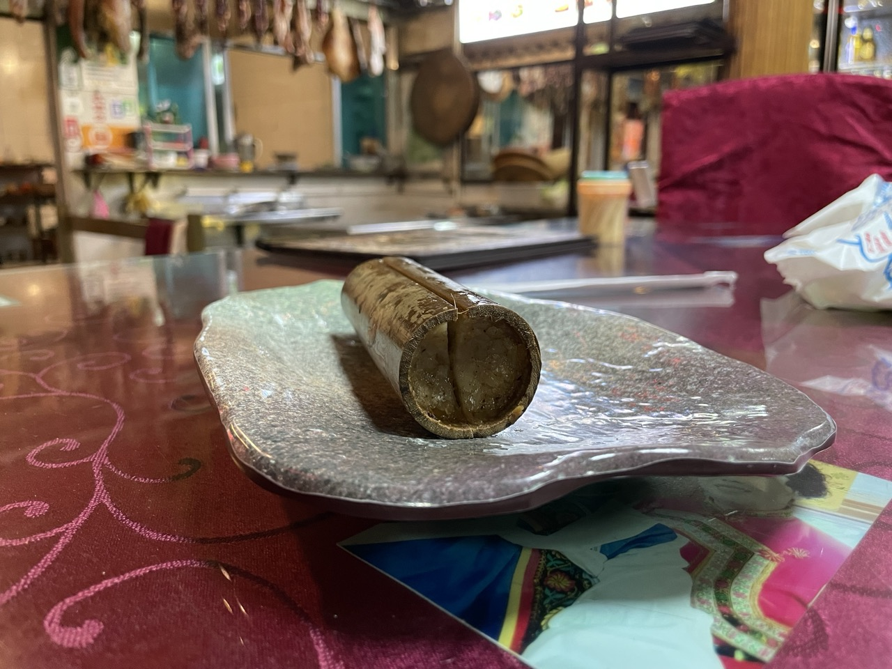
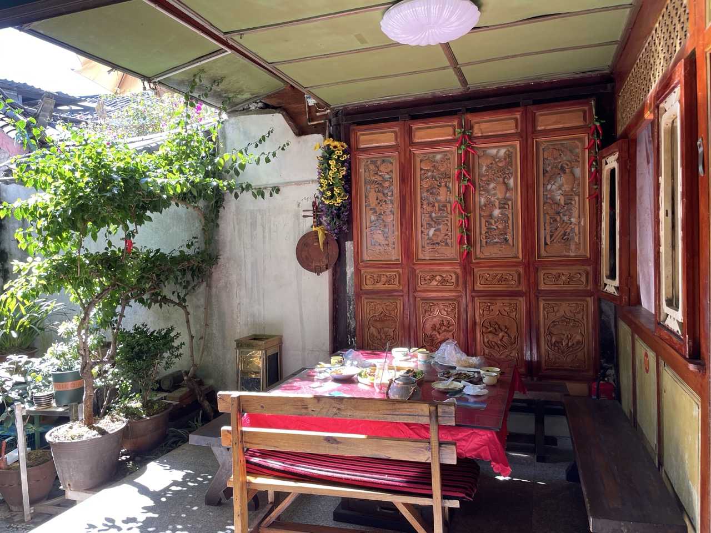

谢谢《孤独的星球》，我们在古城尝试了其中推荐的 3 家餐厅：心园小吃、正花土鸡米线、老丽江餐厅，都非常满意。

按照 2014年版的《孤独的星球：云南》寻找餐厅，给我们意想不到的收获。这是因为 2014 版中提到的很多丽江餐厅现在都歇业了。这 3 家是其中仅存的几家。从 2014 到 2024，已经 10 年了，其中还经历了疫情 3 年。路遥知马力。我们发现：这些经历了这10年的考验还不倒的餐厅，对她们的事业有着真正的热爱。

## ⼼园⼩吃/心园餐厅

《孤独的星球》上对⼼园⼩吃/心园餐厅的介绍是：当地⼈聚餐的餐馆，丽江家常菜。主菜可点鸡、鱼，其他的就可钻进厨房，见菜点菜了。这种点菜方法，让我十分新奇。

餐厅离忠义夜市不远。我们去了两次。

第一次是晚上。我们走进餐厅，看到整个餐厅只有一个包厢里有客人。迎面而来的大姐对我们说：随便坐。我们就坐在院子里。如下图：

看了看挂在厨房前面的大火腿，想：难道要指着这个火腿点菜？

大姐问我们：吃点什么？我说：我们吃过晚饭了，只是过来看看。大姐说：哦，那你们坐。我然后就听见她和厨房里的同事说我们吃过了，只是过来看看。

我们坐下，看到桌上有关于竹筒饭的卡片，如下图：

看起来很诱人。《孤独的星球》上说：⽵筒饭是云南十大美食之一，最初是傣族和哈尼族的美⾷。它将糯⽶放在⽵节内，加⽔后，放在⽔中煮熟或在⽕塘中焖熟，然后把⽵筒砍开吃。砍开后，⽶饭包着⼀层⽩⾊⽵瓤，并有⽵⼦的清杳，充满野趣。如上图所示，心园的竹筒饭里加的是野生菌和土鸡。

我们就点了一个咸味的竹筒饭。过了大约10分钟，它端上来后的样子如下图：

快吃完了，才想起来应该拍照。此时米饭的样子如下图：

饭很粘、香，味道浓郁。和它比较起来，我们在北京吃的就太寡淡了。啊，这才是竹筒饭！明白了。

吃了竹筒饭，我们坐了一个小时，因为我要腾讯会议和学生开这一年最后一次组会。

中间另一个大姐走过来问：要不要给你们喝点茶？我们说：不用。大姐就走了。

出来时，和大姐告别。大姐说：明天再来？我们说：好！

一诺千金，第二天中午，我们又去了。大姐看到我们就说：来了？坐这里吧，有阳光。就把我们领到下图这个位子：

于是，我们就在这样的阳光下、花丛中、纳西族的小院子里，吃了一顿午饭。

首先是吃到了四十五年来最好吃的土豆，如下图：

然后是鸡豆凉粉。《孤独的星球》上介绍说鸡⾖凉粉也是云南十大小吃之一。它也叫鸡豌⾖凉粉，是丽江⼩吃。由丽江特产鸡豌⾖磨碎、煮熟再凝固⽽成，颜⾊灰⽩。夏天拌上各种作料吃凉的，冬季则油煎了热吃。心园的做法应该是夏天的做法，如下图：

吃起来非常清爽、有味道，很开胃。

然后，是牛肝菌炒腊肉，如下图：

牛肝菌厚实、入味，腊肉一丝一丝的，很劲道，越嚼越香。

最后是纳西手抓饭。如下图：

它包括 6 种配料。大姐提醒我们：别混着吃，而是一种配料一种配料的吃。第一种配料是烤肉，如下图：

第二种配料是鱼腥草。如下图：

第三种配料是自制的过油干蘑菇。如下图：

第四种配料是洋葱拌鸡肉。如下图：

我正在犹豫，家人们已经带上手套，开始动手了。我鼓起勇气，也戴上手套，抓了一点饭，放上几片烤肉，狼狈地塞入口里。

我一直不习惯吃手抓饭，觉得太狼狈。即使是在日本，接过日料师傅用手捏出来的饭团，我都感觉到一些不适。因此，每次碰到手抓饭，我总是用勺。

可这次，当我开始咀嚼用手塞入口里的烤肉和饭，就被深深地震撼了。我发现几十年来阻碍我手抓饭的不适感消失了。我愿意成为一个用手抓饭的人。我明白了为什么要用手抓着这些饭吃，因为只有这样，最符合它原始、强烈的滋味。于是我开始自得地整个用手吃完了这顿饭。我懂得了优不优雅没什么重要，最重要的是做舌尖上的自己。

结帐后，发现这样美好的一顿饭仅130多元。而这样的餐厅，整个中午，只有我们2桌5个人。

这是我在丽江得到的第一个震撼。我发现这家历经疫情还活着的几十年老店，她们是认真的。

离开时，我又看了看院子里吊着的那些火腿，如下图：

明白了它们存在的意义。

离开时，我还注意到旁边餐厅墙上的一些话，如下画所示：

如上图所示，它们都是关于读书的内容。我感到新奇：为什么餐厅里都是这种读书的内容？

后来，在徐霞客纪念馆了解到木府土司对读书的热爱，在木府了解到古城最著名的牌坊“天雨流芳”这四个字的纳西族语含义是“读书去”，在束河古镇另一个餐馆（后文介绍）里看到老板的书房以及她们给孩子的题字后，我明白了：丽江人已把对读书的热爱深入了骨髓。这是我在丽江得到的第二个震撼。这时我之前没有想到的。这让我对丽江认真起来。

走出门，我回头给餐厅留影，如下图：

此时，看到大姐送一家外国人出门。这家人手里拎着一大包菜。走在路上，我听到他们说：太好了，买这么多菜，才这么一点钱。

看来这家餐厅还取得海外人士的信任。这让我对它的评价又增加了几分。

## 正花土鸡米线

“吃米线前，要喝一口汤。”这是我在等餐时从正花土鸡米线店墙上的文章中学会的。文章如下图：

于是，我就到准备米线的窗口看大姐正在搅和的那桶鸡汤，发现汤色极为浓郁，很香。她看到我们三个人点了两份大份的米线，就指着房间外面的一叠碗，对我说：要碗自己拿。我看了看摆在旁边的一叠不锈钢双层碗，发现它们被洗得锃亮，心里很高兴。

米线上来之后，如下图：

我真的像墙上文章介绍的那样，首先喝了一口汤，然后真的像文中说的那样，感觉就满足了，米线都可以不吃了。

墙上还贴着土鸡的照片，如下图：

我忍不住指着其中那两只因为打架一飞冲天的鸡对家人说：看，应该要这么锻炼的土鸡，才能练出这样的鲜味。

这时一个姑娘走进来，娴熟地点了一份小碗米线，一份鸡胃，坐在旁边的座位上一个人吃。家人说：看来应该像这位当地人这样吃。

我看了看墙上的菜单，如下图：

如上图所示，除了米线，鸡杂也很多。但我当时没有反应过来，就没有再加。回北京后，看到网络上的朋友点评，说鸡肝和煎蛋到味道也非常好。看来后面还得再去。

出门后，我回头拍了一张小店的照片。如下图：

如上图所示，这家店的招牌和店面是传统的。这和旁边新开的店形成了对比。而且，它的顾客并不多。旁边不远处一家装饰新颖、新开的米线店，人似乎还多一些。这让我有点遗憾。

然后我看到备餐的大姐，正静静地坐在狭窄的准备米线的房间里。看起来，她就是墙上照片里的那位大姐。我感到她有一种独特的尊严。

## 老丽江餐厅

我们也去了两次老丽江餐厅。第一次去，正好有位子。第二次去，座位都满了。我们进去转了一圈，想在一个角落里凑合着坐。老板坚决不让，说这样不舒服，等一等，一会就给我们安排。于是我们就在门外等。

这时一位先生风风火火地走进来了，很熟络地和老板打招呼：今天我的位子还在吗？老板遗憾地摇了摇头，说：都满了。先生说：我都连续在你这吃了5天了，你帮我留一个位子吧？老板说：稍等一下，就给你安排。先生说：那我们再去街上逛一会，马上回来。位子有了，你给我留着啊。老板没有说话。先生就又兴高采烈地走了。

这时一个位子空出来了。老板就招呼我们进去坐。

刚点了三个菜，点菜的大姐就说：你们点的肯定够了，就果断地把菜单收走了。

我们吃的第一个菜是薄荷炸排骨，如下图：

排骨极新鲜，薄荷炸得极脆。两者一起送入口中，它们的香味融合，产生完美的滋味。我吃完后，也感叹，这样新鲜的嫩排骨，是我在北京无法买到的。这就决定了只能在这里吃到。回到北京后，就只能变成梦了。

第二个菜是水性杨花。如下图：

菜很嫩，炒得很香，是我喜欢的。吃着吃着，一个看起来也是外地过来的、皮肤白净的小伙子走过来，指着这个菜说：这是什么？我们说这是水性杨花。他高兴地就也去点这个菜了。

第三个菜是黑三剁。如下图：

如上图所示，菜里面的肉末非常多。吃起来鲜香扑鼻，滋味浓郁，让我无法自拔。

离开丽江前，我们又来了第二次。这次我们体验了红三剁，如下图：

如上图所示，红三剁和黑三剁的区别是红三剁用的是西红柿，而黑三剁用的是黑木耳。

我满满地乘了两勺，放到了米饭上，如下图：

如上图所示，浓浓的西红柿肉末汤汁慢慢渗入洁白的米饭中。我勺一半米饭、一半红三剁送入嘴中，然后咀嚼。那一刻，一生何求。

我定了定神，对家人说：这和意大利西西里本地人用当地食材做的西红柿肉酱面是异曲同工的。最新鲜的食材，最简单的烹饪，获得最浓烈的味道。

我们吃的第四个菜是土豆丝饼，如下图：

如上图所示，土豆丝被切得极细，然后炸得外表酥脆，内里绵密。

我夹起一块，沾一点中间放置的辣椒粉，放到嘴中。那么香，那么入味。

《孤独的星球》上对老丽江餐馆的介绍是：地道的丽江餐馆，⾷客多是本地⼈，⽣意⾮常好，⽤餐时间很难找到空位。现实也确实如此。餐厅当时的场景如下图：

上图分别对应餐馆的两个入口。第一张是餐馆面向一个小商品市场的入口，第二张是通向七星街上一个大型购物中心的入口。因此，到达这里，非常方便。人也非常多。

从第二张图中还可以看出：右边一半座位的桌子和凳子比左边的桌凳矮一半。我想这是因为丽江本地人习惯了围着火塘吃饭，而火塘边的桌子和凳子要矮一些的缘故。因此餐馆里确实很多本地人。

下面是餐厅菜谱的一角：

《孤独的星球》推荐的是酸菜炒⼟⾖，红烧肘⼦。这次我们没有点这些菜。但这个推荐是非常地道的，因为我们后来在昆明，当地好友特意要我们尝尝酸菜炒⼟⾖。这说明这确实是云南很具特色的一个菜。

## 小结

和这些店的老板和店员接触后，我感到她们有一个共同的特点，就是这份工作的“热爱”。我发现她们是真的在乎自己的这个店，她们也真的觉得这个店被这个世界需要。她们从中感觉到自己的意义。这种意义让她们能够和自己的店每日相处、荣辱与共。每次和这些店主告别，我都在她们身上感受到一种独特的尊严。

这种尊重的后面，是她们的淳朴和善良。第一次去老丽江餐厅，是一位学生模样的服务员接待我们。她的眼神，让我想起我在实务学堂的学生。看到她，我就觉得非常踏实。第二次去，遇到的收走我们菜单的大姐也是如此。我问她：要忙到几点？她朝我笑笑，说：要到晚上十点多。

三联书店的《孤独的星球》2010年版的开头，作者之一易晓春也写到自己遇到的这种淳朴和善良。他写了自己徒步虎跳峡的经历。他说：“⼀个⼈在⼭间迷了路，幸好遇见⼀牵马的当地孩⼦下⼭驮粮⾷，由此有了向导，亦步亦趋地跟着。孩⼦仅12岁，辍学在家帮忙⼲农活，⽤他的话讲，在这荒僻之地，活着已不易，哪还有闲钱读书。下⼭途中，马蹄磕着路⾯，会扬起⼤团的尘⼟，⼈随后只有披⼠吃灰的份⼉。孩⼦每每都会让我⾛在前⾯，他在后⾯指点路径，⼭⾥⼈腿快路熟，时⽽会抄⼩径快步下到前去，也会在路口停住，让我先⾏，继续下⼀段的路程。就这样⾛⾛停停，孩⼦⼀路护送我下到公路，临别还不忘嘱咐天⾊已暗快些赶路。在云南，时时会碰见这样淳朴善良的⼈，⼀⾯之缘甚⾄不知姓名，但却永⽣难忘。”

丽江本地人对这些老店也充满了尊重。比如2024年12月18日《丽江读本》上的文章《[找到了！丽江这家开了三十多年的汤圆店，还在！](https://www.163.com/dy/article/JJN89RUE0550O1ED.html?spss=dy_author)》，说的就是丽江人在寻找忠义市场里的一个汤圆铺。

因此，一个好店的后面一定不仅有好的老板和店员，而且有一个好的社区和一群好的顾客。这两者是相辅相成的。一家好店之所以历久弥新，光芒不坠，经历时间的考验，是因为它和所在的本地社区在气质上的相合和互相之间的牵挂。这就是生态。

我希望这些店能够和它们所在的社区，继续相依相伴，越来越好。加油！

 

|[Index](./) | [Previous](17-hutiaoxia)| [Next](23-star)|
