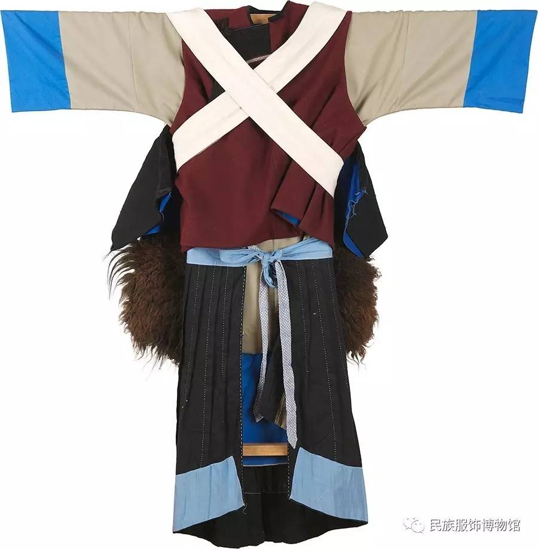
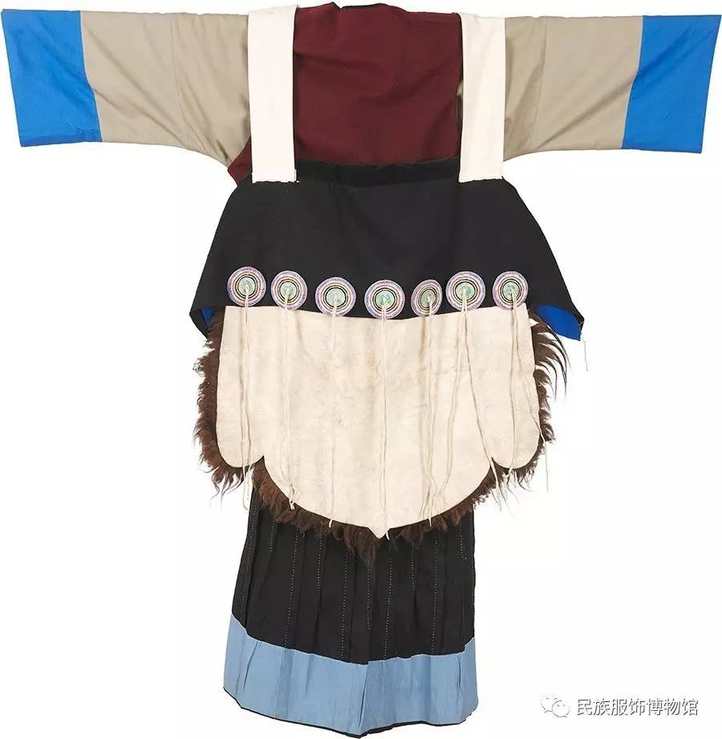

在木府的纳西族姑娘房间的陈设中，有一件纳西族女性常用的“披星戴月”羊皮披肩，如下图所示：

“披星戴月”羊皮披肩是一个理解纳西人民，特别是女士的窗口，很有意思。

中国服装学院民族服饰博物馆对纳西族女性传统服饰的介绍如下：

纳西族聚居的地方位于中国云南省西北部和四川省西南部的横断山区，背靠雄伟的青藏高原，面向壮丽的云贵高原，属于典型的山地民族。

各地纳西服饰有较大区别，云南丽江地区的纳西族女子穿前短后长右衽大褂，宽腰大袖，外加红或深蓝色毛织氆氇坎肩，用黑色锦绒镶饰衽边，系百褶围腰，下着阔腿长裤，船型绣花鞋，系深色多褶围裙，背上披一块七星和日月图案羊毛披肩，这是纳西族服饰最有特色之处，"披星戴月"便是由此而来。

我们下面依次来看博物馆介绍的披肩、坎肩、大褂和围腰。

## 披肩

我们首先看披肩。下面是博物馆提供的披肩图。下图为正视图：

如上图所示，披肩的白色羊皮上部被裁剪成四方形，底边剪裁成蛙体形状。整个造形呈四方形，裁剪精练、简洁、实用。

羊皮光面上部横镶一道长方形的粗毛呢布，盖住了约三分之一的羊皮光面，纳西语称为“优轭简”，即羊皮颈。

采用羊皮和呢布材料反映了披肩的本质。它们让披肩非常厚重、扎实，能够抵御高原的严寒，适合劳作。其中，粗毛呢是用粗羊毛织成的织物，防皱耐磨，手感柔软，富有弹性，保暖性强。而羊皮选用全羊皮，仅去羊头皮、四肢，留其余及尾部。

在羊皮颈的下部，缀以七盘直径约为7厘米、丝绣彩色描花图案圆盘饰物。代表北斗七星。绣盘通常用青红黄白黑五色线绣成，代表金木水火土五行。每一圆盘的中心各垂两条皮细线，共十四条，称“优轭崩”，即羊皮须，表示星宿的光芒。如下图所示：

看木府的披肩的照片，会发现它比民族服饰博物馆的披肩在肩部还多了两个大圆盘。它们分别代表太阳和月亮。

因此，整件披肩有着非常美好的含义。9个圆盘代表日月星辰。它们既象征了纳西妇女“肩负日月，背负繁星”的勤劳美德，又是她们的护身符，能够保佑她们。

总之，纳西妇女的“羊皮披肩”是纳西民族服饰的一个主要标记。它既美丽、精巧，又实用、耐寒，象征着纳西族妇女日出而作，日落而息的勤劳。纳西族因此被称为“披星戴月的民族”。

下图为背视图：

如上图所示，羊皮颈的上边沿缝有一对生白布长带，用作将羊皮系于妇女身上的带子，称“优轭货”，即羊皮背带。

白布长带的一端绣着蝴蝶图案，如下图所示：

做工十分精巧。

我就想近距离看看这样一块披肩，可是《孤独的星球》上介绍的，在五⼀街兴仁上段99号制作披肩的老奶奶已经不在了。在网上搜到的丽江古城民族服装批发市场也没来得及赶到。在淘宝上也没有搜到这种披肩，说明它确实已经变得非常小众了。希望以后有幸还能见到。

## 坎肩

博物馆介绍说，纳西族女性平常还穿一种坎肩，如下图所示：

非常简洁、大方、实用。

## 大褂

在坎肩下面，穿大褂，如下图所示：

这件卡其色无领右衽夹层大褂，宽长袖，前短后长，纳西语叫“巴纳可舍”（意为“脚长的衣服”），妇女穿上后，前幅及膝，后幅及胫。大褂的衽边用黑色锦绒布镶饰，并在衽边钉上布纽扣，大褂袖长至前臂中部，袖口处有10厘米的翻卷边装饰。

博物馆介绍说：在参加盛大节日时，纳西族妇女会穿出不同颜色的大褂多达二三件，一般在衣服的后摆处从里至外一件比一件短约1厘米，以此显示富裕之意。

此件大褂为棉布材质。传统丽江地区的服装面料主要是由手工织布和半机械化纺织而成的麻布、土布、棉布等相对单一材质。主结构为肩线无破缝的类大中华“十字型”平面结构，左右袖分别于14.1cm和16.1cm处接袖缝，前后中均破缝，外衫为卡其布色，内衬为浅湖蓝色。大褂衣身两侧开衩处用黑色棉布镶饰，右衽盘扣制作工艺精良。

## 百褶围腰

在大褂前，穿围腰。如下图所示：

上图为纳西族黑色百褶长围腰，纳西语称作“卡达”。黑色布作底料，浅蓝布镶边饰，围腰裙体部分褶裥与省道相间构成，省道两边短中间长成扇形。

纳西族妇女的“卡达”为全手工一针一线缝制，做工精细，针脚均匀，堪称一绝，因此百褶围腰也是纳西族妇女智慧勤劳的象征。

## 完整形象

整套如下图所示。正视图：

背视图：

1920年，访问丽江的约瑟夫.洛克就拍过穿着上述服装的纳西女士的照片，如下：

下图是网友拍摄的近代穿着上述服装的纳西奶奶的照片：

端正、简朴、尊严。

现在在丽江旅游，可能会遇到穿着下图所示服装的女士：

如上图所示，中间女士穿的还是上面介绍的传统服饰，而旁边两位女士的服装则加入了更多现代元素，特别是头饰也镶有七星盘，与服装相呼应，这样更能出片，也非常漂亮。

## 丽江民族服饰博物馆

这次错过了2024年末开馆的丽江市民族服饰博物馆。据报道，博物馆主理人杨媖老师，因为热爱，退休后整理了这个博物馆。杨媖老师的老家在玉龙县塔城乡十八寨沟，她的奶奶长年从事传统藏服制作。在那里，奶奶制作的藏毛呢如今依然受欢迎，羊毛与麻的质感粗粝坚韧，融进了村里人日复一日的朴素生活中。在丽江市民族服饰博物馆里，收藏了一套杨媖的奶奶制作的藏服。每每看见这件藏服，杨媖仿佛还能看到奶奶穿着它开心跳起锅庄舞的样子。因为民族习俗及服饰本身的特殊性，古旧服饰很难保存。为此，在前期收集展品的过程中，杨媖花了很多心思。但在杨媖看来，这是一件有意义的事情。“除了少数古旧的服饰，馆里收藏的服饰很多是非遗传承人一件件复原出来的。”杨媖说。开馆之后，杨媖每天忙碌在这个纳西族小院里，把关于每一件服饰的故事说给来参观的游客听。“这只是一个开始，服饰的研究空间太大了，循着历史脉络去研究，这是一个漫长的过程。之后也会在馆里组织开展研讨活动，通过服饰去了解、展示更多的民族文化。”杨媖说。丽江市民族服饰博物馆位于丽江古城五一街兴仁中段57号，开放时间为9：00至18：00。希望以后有机会再去。

## 展览

喜欢民族服装的朋友，北京服装学院民族服饰博物馆最近也举办了“华彩云衣——云南民族服饰文化展”，时间是从2024年11月22日到2025年3月30日，博物馆开放日期是周二、周四 8:30 - 11:30 & 13:30 - 16:30；周六 13:30 - 16:30；周一、周三、周五、周日闭馆。后面准备再去看。

## 小结

衣食住行，是我们日常生活中的文化。我很喜欢“披星戴月”的设计和寓意。愿它保佑穿着它的人们，健康平安。

## 参考文献：

- 【服饰文化】“披星戴月”—— 纳西族服饰，2017-5-16，[网页](https://www.sohu.com/a/140996668_526635)，[博物馆资料网页](http://www.biftmuseum.com/nation/detail/27)
- Mulan、林夕，雪山脚下的回响，GLASS Official 2025年01月17日，[微信公众号网页](https://mp.weixin.qq.com/s/JhC4inKXY_Lj6WD-dUls7Q)
- “打卡”丽江市民族服饰博物馆，2024-10-25，云南网，[网页](https://www.sohu.com/a/820146407_121620820)
- “华彩云衣——云南民族服饰文化展”，北京服装学院民族服饰博物馆，[网页](https://art.icity.ly/events/0iac2u6)
- 高丹丹，胡小妹，“五彩锦簇——中华服饰文化展”隆重推出线上展览，民族服饰博物馆，2025年01月01日，[微信公众号网页](https://mp.weixin.qq.com/s?__biz=MzAxNzQwOTczMg==&mid=2651128207&idx=1&sn=d396e2bd0af36577238e1523f8487b5f&chksm=81cce706f7f4eb763190bc133987abc39a19457d41f1af33cb54ff378467fc90210feb07e095&scene=126&sessionid=1739333395#rd)

 

|[Index](./) | [Previous](21-food)| [Next](31-qita)|
