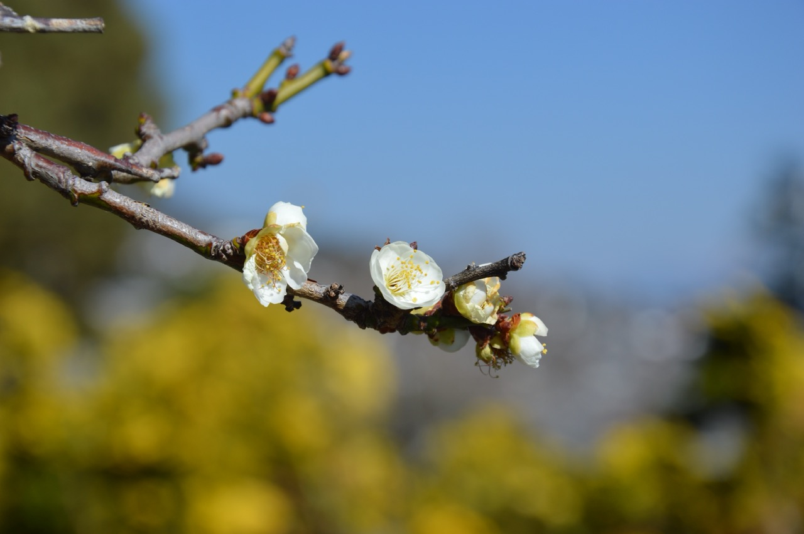

木府是上世纪90年代重建的明代木氏土司府衙。我发现它的重建相当有诚意、布置和服务也很用心，因此，我从木府出来，感到很高兴。

如木府官方介绍所说，它的建筑和植物是两个亮点。此外，我还发现三个我感兴趣的地方：读书楼、木氏家训和阿勒邱。因为感受到它重建的诚意，我还特地研究了它重建背后的故事。这些故事很有意思。我们下面一一来看这些方面。

## 建筑

在木府，我看到以下对其建筑的介绍。看完后，我觉得这些描述简洁有力，非常贴切，照录如下：

丽江古城是中国历史文化名城，世界文化遗产，而木府是丽江古城之“大观园”。纳西族首领木氏自元代世袭丽江土司府以来，历经元、明、清三代22世470年，在西南诸土司中以“知诗书好礼守义”而著称于世。木府位于古城西南隅，明代其建筑气象万千，徐霞客曾叹木府曰：“宫室之丽，拟于王者”。可惜大部分建筑毀于清末兵火，幸存的石牌坊也毁于“文革”。1996年大地震后，世界银行慧眼识宝，贷巨款相助重建木府，丽江俊杰精心设计施工，经三年艰辛备至的努力，使木府如“凤凰涅槃”般再现于世。

木府占地46亩，中轴线长369米，整个建筑群体座西朝东，“迎旭日而得木气”。木府由四个部分组成：第一部分为衙署区，包括石牌坊、仪门、议事厅、万卷楼、护法殿等建筑；第二部分为玉花园，包括光壁楼、玉音楼、三清殿；第三部分为生活区，包括木家院和木府一条街；第四部分为祭祀区，朱能恢复。建筑共计十五幢，大大小小计一百六十二间。木府充分体现了纳西人广纳博采多元文化的开放精神。木府也是一座辉煌的建筑艺术之苑，它充分反映了明代中原建筑的风采气质，同时又保留了唐宋中原建筑的古朴粗犷，而其玉沟纵横、活水长流的布局，则又见纳西传统文化之精神。

### 天雨流芳

在木府的外面，有一个木牌坊，上书“天雨流芳”四字，如下图所示：

天雨流芳可作双语解释：汉语之义是“天降芳雨，润泽百姓”，纳西语是“读书去”的谐音。它体现了纳西人推崇知识的买心慧性。人们从“天雨流芳”木牌坊下经过时，无不心生去读书、读好书，不断增强自身文明素养，努力开创人生发展新篇章的无限感慨。

我特别喜欢其纳西语“读书去”的含义。这让我想到心园餐厅墙上鼓励孩子读书的壁画，还有呆呆妈妈私房菜店主鼓励孩子读书的话。原来它们的源流在这里。我很高兴。

### 忠义牌坊

木府大门口的石牌坊，通体皆石，结构三层，是国内石建筑的精品。如下图所示：

上面两个字是“忠义”，很有一点武将气息。这和“天雨流芳”的“读书去”形成鲜明对比，说明木府的主人试图文武兼修，这种安排，我又十分喜欢。

### 议事厅

进门后，是议事厅。该建筑及其前面的院子，很像故宫的太和殿及前面的广场，只是小一号。端庄宽故，气势恢宏，是土司议政之殿。

走进去，披着虎皮的土司交椅如下图所示：

旁边列放着各代土司从中央政府获得的各种称号。其中最大的是元朝时获得的金紫光禄大夫。如下图所示：

旁边却挂着木增的两首诗，以突出木增的文采，很有意思。如下图所示：

看来布置者总是放不下“读书去”这个概念。

### 万卷楼

议事厅后是万卷楼。这是土司读书的地方。如下图所示。

如上图所示，万卷楼一共有三层，外观雄伟，是整个府中最高大的建筑。木府把最高的建筑用作读书的地方，可见他们把读书这个事看作是重中之重。北京的故宫都没有这样布置。这就让我刮目相看了：我没有想到，在所谓诸葛亮七擒孟获的蛮荒之道，后面竟有着比中原更执着的读书的理念，神奇。

丽江府志中记载了万卷楼中曾经的藏书，如下图所示。

如上图所示，楼中原来存有宋明古籍善本数万册。相当震撼。以前比较熟悉的是江浙一带的藏书楼，比如天一阁。没有想到这里也有。

其中一些遗留下来的残本如下图所示：

看着这些劫后余生的古籍，想到更多的典籍，在后来的战火、动乱中被屠戮、消散，我很感慨。

在万卷楼的二层，有《纳西东巴古籍译注全集》。这是由位于黑龙潭的东巴文化研究所，聘请东巴老人，与一群纳西学者一起，独守寂寞，殚精竭虑，释读东巴文化经典。寒暑20余载，翻译了1000多卷经籍，汇成的。一共100卷，让我肃然起敬。

二层也陈列有木公作品集，如下图所示：

在木增的住房里，我还看到他的这首诗：《文笔凌云》

东壁图书照丽阳，湖边文笔碧霄翔。峰常绚彩何须梦，天自书云为纪祥。列岫层峦皆儿案，行云流水尽文章。巨灵千载题春雪，始信如椽出大方。

他的房中挂的中堂和对联，如下图所示：

中堂的草书，据说是他的字。

这些，让我对他有了很深的印象。我很难想象：他作为一方诸侯，每天有那么多上上下下的事情要处理，怎么还能有这么多时间写作？要就是当时还不太卷，要就是他有一个凝聚力特别强、信得过的团队能够分担。然后，他对写作是真的热爱，因此他一有时间就写作。

在楼的三层，有一扇窗。窗外的景象如下图所示。

看着窗外的玉龙雪山，我忍不住感叹了一句：绝景啊。在这样的地方读书，真是一种幸福。

### 护法殿

护法殿又称后议事厅，是土司议家事之殿；

在护法殿，我见到木氏家训，如下图所示：

从这些家训中，我发现木氏作为一个家族，已通过一代代的积累，把自己的家教策略，系统地总结和固定，形成了一套体系，来教育自己的孩子。木增就是这套教育体系的产物。这让我想到杭州的钱氏家族也是如此。这些家族，在数十代家族的家教传承中，凝练出了自己的家训，让自己后代应对危险，避免失误，取得成果，有所凭借，避免了“富不过三代”的宿命，也给丽江和杭州带来了深远的影响。这些家训并不是一些陈词滥调，而是家族智慧的结晶，值得珍惜。

### 玉花园

光碧楼乃后花园门楼，史称其建筑 “称甲滇西”。

玉音楼是接圣旨之所和歌舞宴乐之地，如下图所示。

三清殿是木氏土司推崇道家精神的产物。站在三清殿门口，看到的场景如下图所示：

三清殿后，狮山古柏的深处，还有木氏土司祭天、祭祖、祭大自然神“署”的本土著居民宗教活动场所，充分体现了纳西人广采博纳、多元文化的开放精神。

### 建筑部分小结

木府对其建筑的特点总结如下：木府是一座辉煌的建筑艺术之苑，它充分反映了明代中原建筑的风采气质，同时保留了唐宋中原建筑古朴粗犷的流风余韵，而其座西朝东，府内玉沟纵横，活水长流的布局，则又见纳西传统文化之精神。

## 植物

木府的植物也让我印象非常深刻。木府对其植物的介绍如下。

丽江古城博物院（木府）的园林艺术

木府是纳西古王国名木古树、奇花异草汇集一所的园林。1999年3月14日，到丽江古城考察的苏州园林管理局副局长、花卉盆景协会会长黄敬如参现木府时，称木府的园林模式是一种新的构思和创意。它是介于皇家园林和私家园林之间，其园林建筑风格与艺术表现手法值得探讨。

木府里的名木古树众多。圆柏（300多年）、梧桐（200多年）、桂花（300多年）、夜合花（400多年）、玉兰（200多年）、紫薇（300多年），还有诸多的盆景、奇花异草，把木府装点成花的海洋。而位于木家院的柽柳，其“枯木逢春”的奇特之处吸引了众人；玉花园黄山古柏是木府园林中独特的一道风景线，也是丽江的十二景之一。

木府的园林艺术丰富多彩。在2001年，举办了以“古城无处不飞花”为主题的大型金秋菊花展，展出了50个品种、2000多盆菊花，并于每年都培育和裹出菊花。同时，为了弘扬丽江的兰花文化，丰富丽江古城的文化内涵和品味，先后于2002年2月举办了首届中国丽江名兰精品博览会，2007年2月举办了古城区首届新春兰花书画摄影展。此后诸年，都精心培育独具匠心的园林艺术，绿树成荫、花海如潮，极大的丰富了丽江古城的文化内涵。

可以说，木府是纳西古王国名木古树，奇花异草汇聚一所的园林，将天地山川的清雅之气与王宫的典雅富丽皆融为了一体。巍巍木府，得雪域之灵气，玉水之精瑰，一游木府，纳西古国之秘境，尽收眼底。

下面是我从山顶往下发现的美丽的植物：

首先，是三清殿门口的梅花盆景。如下图所示：

它们在蓝天的映衬下，那么美。香味也沁人心脾。

往下走一点点，从三清殿前的花园看整个木府的场景，如下图所示：

如上图所示，左边的玉兰花和右边的建筑非常和谐，显示了重建者们的用心。

走到山下，回头看山上的柏树，感觉到它的雄伟。如下图所示：

此时，山下的一颗柏树露出了头，如下图所示：

这棵树非常像梵高在他生命尽头时画的柏树。它弯曲，扭动，象利箭，伸向天空。它显示出一种顽强的精神，给我强烈震撼。它不能不让我联想到木府的重建。我感到一种精神，一种我在梵高作品中看到的精神。这种精神让我们穿过毁灭，看到生命。

然后我在院子里，为下面这些玉兰花的完美而不忍离去。如下图所示：

这些玉兰花让我感到：木府的运营者是爱木府的。有一种感觉：他们把木府像花一样，捧在手心。即使有一颗灰尘落到她的身上，他们也会把它轻轻地吹落。

最后我来到了下图所示的柳树前面。

这颗柳树，已经6百多岁，本已枯死。但丽江大地震后，竟奇迹般地活了过来，证明了枯木逢春不是一个传说，让我惊奇。

## 阿勒邱

在木府的生活区，我看到了画家想象中的阿勒邱肖像。阿勒邱是木增的妻子。传说中，她心灵手巧、精明能干，通情达理，能够很好地处理各种内外事务，甚至能够上阵杀敌，是纳西族妇女崇拜的对象。

曾经，“阿勒邱”是精明能干的纳西族妇女的代名词。在1950年代，古城居民还有很多纳西专用词用于平时的交流中，“阿勒邱"就是其中的一个词语，使用频率很高，在老一辈人的表述中，要极致地表达对一个纳西妇女的赞赏，就用“阿勒邱“这个词。比如丽江古城里居住的纳西奶奶，就普遍地用“阿勒邱尼尼！”这个词称赞她的儿媳，意思是她的这位儿媳，宛若丽江士司木增的妻子“阿勒邱”。在今天的纳西族民间，还经常可以听到“像阿勒邱”或如“阿勒邱一般”这样的形容用语，来称赞办事干练、麻利的妇女。

现在丽江的大街小巷里，就布满了穿着电视剧《木府风云》女主角阿勒邱装扮的女孩。这得益于这部非常棒的电视剧对阿勒邱形象的塑造。这些年轻人被电视剧中善良、勇敢、智慧的阿勒邱所感动，希望自己成为她。我衷心地祝愿她们成功。

木府也把她的讲解员称为阿勒邱。在木府的参观中，我对为我们讲解的解说员留下了深刻的印象。和我一路的一个小男孩一步不离地紧跟着这位解说员。他的妈妈非常惊奇，对这位解说员说：你讲得太好了，我这个孩子以前出来玩，从来不听的，这次跟着你，听得津津有味。我也听得津津有味。最后，我本来想冒昧地上前，问一下这个解说员的名字，但她突然被另一位解说员叫住开始说话了，我就不好意思打搅了，但后来看了2024年11月18日丽江读本的报道《[丽江木府的这七个“阿勒邱”，你遇到过吗？](https://www.163.com/dy/article/JH9UNA3I0550O1ED.html)》，感觉特别像其中一位解说员，就理解了，原来她是阿勒邱！这是一句玩笑，但从文中可以看出，对木府讲解员的素质和讲解水平留下深刻印象的，不仅是我一个人。比如这篇文章中介绍说：有的听众还被讲解得哭了。非常赞叹。

## 木府重建

木府大部分建筑在清末毁于战乱。1996年，丽江发生大地震。以此为契机，当地政府在世界银行的资金支持下进行了重建，并将其设为丽江古城博物院。1999年竣工。

因为对木府重建以及管理水平的深刻印象，所以离开木府后，我又进一步研究木府的资料，发现在木府重建和发展、影视剧《木府传奇》创作的过程中的一些有趣的故事。我看到丽江的有识之士们，一方面把木府从废墟中建立起来，另一方面通过《木府传奇》建立木府的IP（知识产权），显示了远见、视野和实干精神，令我钦佩。比如黄乃镇先生于 2019 年出版的《木府通论》，杨福泉老师于2001年发表于《云南文史资料选辑》第57辑的《[丽江“木府”重建记](https://www.163.com/dy/article/I4MME1IJ05438Q4K.html)》，云南省财政厅涉外处于2010年发表于中国财政部网站的《[世行的援手，古城的清流](https://www.mof.gov.cn/zhuantihuigu/cw30/ZWC/201009/t20100906_337551.htm)》报告，读起来都很有意思。开放的中国，需要与世界建立连接，这样我们中国可以变得更好。

## 小结

从木府出来，我觉得木府对自己的如下介绍是恰当的：巍巍木府，历史文化深厚、园林艺术美轮美奂。丽江古城博物院（木府）自成立以来，以浓郁的建筑特色、深厚的文化底蕴和历史所赋予的种种魅力，成功接待了来自世界各地的游客，成为人人向往的旅游景点。木府又是纳西古王国名木古树，奇花异草汇聚一所的园林，将天地山川的清雅之气与王宫的典雅富丽皆融为了一体。巍巍木府，得雪域之灵气，玉水之精瑰，一游木府，纳西古国之秘境，尽收眼底。

从明洪武十五年（1382年）建立，到2019年黄乃镇先生出版《木府通论》，已经过去637年。以20年一代来计算，这意味着是 637/20 = 32 代人。人生苦短，有志向的人都希望给后代留下点什么。在丽江，我看到木增希望留下的是丽江人民的安居乐业、子女的成长（包括写作）和自己的作品；重建丽江的同仁们希望留下的是丽江和纳西文化的传统和传奇；而木府的讲解员阿勒邱们每天都在向来自这个国家和世界的人们（包括孩子）讲述这些文化和传奇。在这些背后，我看到一种坚韧、责任和信仰。正是他们的这种坚韧、责任和信仰，让木府能够经历6百多年沧桑巨变之后，能够从废墟中重生。枯木逢春，应该是大雪山听到了，看到了，给丽江的回答。这不能不说是一个奇迹。

感谢！

 

|[Index](./) | [Previous](1-chenshi)| [Next](5-xuxiak)|
