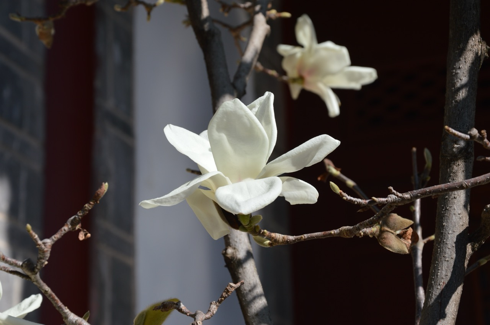

木府是明代木氏土司的府衙，清末毁于战火，上世纪 90 年代重建。站在门前，我注意到它的石牌坊、恢宏的中轴线和整洁的院落，感觉到重建它的人们的用心。

如木府官方介绍所说，它的建筑和植物是两个亮点。此外，我还发现三个我感兴趣的地方：读书楼、木氏家训和阿勒邱。下面一起来看看。

## 阿勒邱

在木府的生活区，我看到了画家想象中的阿勒邱肖像。

阿勒邱是木增的妻子。传说中，她心灵手巧、精明能干，通情达理，能够很好地处理各种内外事务，甚至能够上阵杀敌，是纳西族妇女崇拜的对象。

“阿勒邱”是精明能干的纳西族妇女的代名词。在 1950 年代，古城居民还有很多纳西专用词用于平时的交流中，“阿勒邱"就是其中的一个词语，使用频率很高。在老一辈人的表述中，要极致地表达对一个纳西妇女的赞赏，就用“阿勒邱“这个词。比如丽江古城里居住的纳西奶奶，就普遍地用“阿勒邱尼尼！”这个词称赞她的儿媳，意思是她的这位儿媳，宛若丽江士司木增的妻子“阿勒邱”。在今天的纳西族民间，还经常可以听到“像阿勒邱”或如“阿勒邱一般”这样的形容用语，来称赞办事干练、麻利的妇女。

现在丽江的大街小巷里，就布满了穿着电视剧《木府风云》女主角阿勒邱装扮的女孩。这得益于这部广受欢迎的电视剧对阿勒邱形象的塑造。这些年轻人被电视剧中善良、勇敢、智慧的阿勒邱所感动，希望自己成为她。我衷心地祝愿她们成功。

木府也把她的讲解员称为阿勒邱。在木府的参观中，和我一路的一个小男孩一步不离地紧跟着这位解说员。他的妈妈非常惊奇，对这位解说员说：你讲得太好了，我这个孩子以前出来玩，从来不听的，这次跟着你，听得津津有味。我也听得津津有味。后来看了 2024 年 11 月 18 日丽江读本的报道《[丽江木府的这七个“阿勒邱”，你遇到过吗？](https://www.163.com/dy/article/JH9UNA3I0550O1ED.html)》，感觉特别像其中一位解说员，就理解了，原来她是阿勒邱！这是一句玩笑，但从文中可以看出，对木府讲解员的素质和讲解水平留下深刻印象的，不仅是我一个人。比如这篇文章中介绍说：有的听众还被讲解得哭了。

## 木府重建

纳西族首领木氏自元代世袭丽江土司府以来，历经元、明、清三代 22 世 470 年，在西南诸土司中以“知诗书好礼守义”而著称于世。木府位于古城西南隅，明代其建筑气象万千，徐霞客曾叹木府曰：“宫室之丽，拟于王者”。

木府大部分建筑毀于清末兵火，幸存的石牌坊也毁于“文革”。1996 年，丽江发生大地震。以此为契机，当地政府在世界银行的资金支持下进行了重建，并将其设为丽江古城博物院。1999 年竣工。在木府重建和发展、影视剧《木府传奇》创作的过程中都有一些有趣的故事，详见后面的参考文献。开放的中国，需要与世界建立连接，这样我们中国可以变得更好。

木府建筑群体座西朝东，“迎旭日而得木气”。由四个部分组成：第一部分为衙署区，包括石牌坊、仪门、议事厅、万卷楼、护法殿等建筑；第二部分为玉花园，包括光壁楼、玉音楼、三清殿；第三部分为生活区，包括木家院和木府一条街；第四部分为祭祀区，未能恢复。建筑共计十五幢，大大小小计一百六十二间。

木府建筑反映了明代中原建筑的风采气质，同时又保留了唐宋中原建筑的古朴粗犷，而其玉沟纵横、活水长流的布局，则又见纳西传统文化之精神。

## 天雨流芳牌坊

在木府的外面，有一个木牌坊，上书“天雨流芳”四字，如下图所示：

‘天雨流芳’在汉语中意为‘天降芳雨’，在纳西语中却是‘读书去’的谐音。它像一条隐形的指令，将‘知识’置于这座府邸的正中央。

我特别喜欢其纳西语“读书去”的含义。后来，我在各个餐厅墙上看到鼓励孩子读书的画像、题词，知道是这个题词的流传。

## 忠义牌坊

木府大门口的石牌坊，通体皆石，结构三层。如下图所示：

石坊上‘忠义’两字遒劲有力，与牌坊背后的万卷楼‘读书去’形成文武对照。这说明木府主人文武兼修的理想。看历史，很多木府的土司牺牲在战场，因此他们是懂得武力的重要性的。

## 万卷楼

议事厅后是万卷楼。这是土司藏书和读书的地方，如下图所示。

如上图所示，万卷楼一共有三层，外观雄伟，是整个府中最高大的建筑。中原皇宫里，最高的殿宇通常属于权力，而在这里，它属于书。丽江，这座位于西南边地的小城，把‘读书’放在最高处。

丽江府志中记载了万卷楼中曾经的藏书，如下图所示。

如上图所示，楼中原来存有宋明古籍善本数万册。以前我比较熟知的是江浙一带的藏书楼，比如天一阁。没有想到这里也有。

其中一些遗留下来的残本如下图所示：

细心的家人指出，上图中最右边的一本书是徐霞客的《游记》。这本书在《木府传奇》的镜头中出现过。

看着这些劫后余生的古籍，想到更多的典籍，在战火、动乱中被屠戮、消散，我很感慨。

在万卷楼的二层，有《纳西东巴古籍译注全集》。这是位于黑龙潭的东巴文化研究所，聘请东巴老人，与一群纳西学者一起，独守寂寞，殚精竭虑，释读东巴文化经典。寒暑 20 余载，翻译了 1000 多卷经籍，汇成的。一共 100 卷，让我肃然起敬。

二层也陈列有木公作品集，如下图所示：

看来他确实喜欢写作。

在木增的住房里，我还看到他这首诗：《文笔凌云》

东壁图书照丽阳，湖边文笔碧霄翔。峰常绚彩何须梦，天自书云为纪祥。列岫层峦皆儿案，行云流水尽文章。巨灵千载题春雪，始信如椽出大方。

他房中挂的中堂和对联，如下图所示：

中堂的草书，据说是他的字。

我很难想象：作为一方诸侯，每天有那么多事情要处理，他怎么还能有这么多时间写作？要就是当时还不太卷，要就是他有一个凝聚力强、信得过的团队能够帮他分担。如果是后者，那么这是他领导力的一种体现。但毋庸置疑的是：他对写作是真的热爱，因此一有时间就写作。

在楼的三层，有一扇窗。窗外的景象如下图所示。

我站在那里，看着窗外的玉龙雪山，忍不住感叹了一句：绝景啊。在这样的地方读书，确实是一种幸福。

## 护法殿

万卷楼后面是护法殿，又称后议事厅，是土司议家事之殿；

在护法殿，我见到木氏家训，如下图所示：

这些家训显示：木氏作为一个家族，已通过一代代的积累，把自己的家教策略，系统地总结和固定，形成了一套体系，来教育自己的孩子。木增就是这套教育体系的产物。这让我想到杭州的钱氏家族也是如此。这些家族，在数十代家族的家教传承中，凝练出了自己的家训，让自己后代能够应对危险，避免失误，取得成果，避免“富不过三代”的宿命，也给丽江和杭州带来了深远的影响。所以这些家训并不是陈词滥调，而是家族智慧的结晶。

## 议事厅

进门后，是议事厅。该建筑及其前面的院子，很像故宫的太和殿及前广场，只是小一号。气势恢宏，是土司议政之殿。

走进去，披着虎皮的土司交椅如下图所示：

旁边列放着各代土司从中央政府获得的各种称号。其中最大的是元朝时获得的金紫光禄大夫。如下图所示：

旁边却挂着木增的两首诗，如下图所示：

看来布置者总是放不下“读书去”这个概念。

## 玉花园

木府后院是玉花园。光碧楼乃后花园门楼，史称其建筑 “称甲滇西”。玉音楼是接圣旨之所和歌舞宴乐之地，如下图所示。

三清殿是木氏土司推崇道家精神的产物。站在三清殿门口，看到的场景如下图所示：

三清殿后，狮山古柏的深处，还有木氏土司祭天、祭祖、祭大自然神“署”的本土居民宗教活动场所。

这些都充分体现了纳西人广采博纳、多元文化的开放精神。

## 植物

木府里的名木古树众多。圆柏（300多年）、梧桐（200多年）、桂花（300多年）、夜合花（400多年）、玉兰（200多年）、紫薇（300多年），还有诸多的盆景、奇花异草，把木府装点成花的海洋。而位于木家院的柽柳，其“枯木逢春”的奇特之处吸引了众人；玉花园黄山古柏是木府园林中独特的一道风景线，也是丽江的十二景之一。

下面是我从山顶往下发现的美丽的植物：

首先，是三清殿门口的梅花盆景。如下图所示：

在蓝天的映衬下，很美，香味沁人心脾。

往下走一点点，从三清殿前的花园看到的场景，如下图所示：

如上图所示，左边的玉兰花和右边的建筑非常和谐，显示了重建者们的用心。

走到山下，回头看山上的柏树，感觉到它的雄伟。如下图所示：

山下的一株柏树，扭曲着枝干伸向天空。它的形态让我想起梵高晚年的画作——一种在毁灭之后仍然向上的力量。如下图所示：

院落里的玉兰盛开，白色的花瓣映着青瓦。木府的园丁显然在用心维系着这份秩序，如下图所示：

最后我来到下图所示的柳树前。

这颗柳树，已6百多岁，本已枯死。但丽江大地震后，竟奇迹般地活了过来，证明了枯木逢春不是一个传说。

## 小结

从明洪武十五年（1382年）建立到现在，已经过去六百多年了。以20年一代来计算，这意味着是 600/20 = 30 代人。人生苦短，有志向的人都希望给后代留下点什么。在丽江，我看到木增希望留下的是丽江人民的安居乐业、子女的成长（包括写作）和自己的作品；重建丽江的同仁们希望留下的是丽江和纳西文化的传统和传奇；而木府的讲解员阿勒邱们每天都在向来自这个国家和世界的人们（包括孩子）讲述这些文化和传奇。

 

|[Index](./) | [Previous](1-chenshi)| [Next](5-xuxiak)|
